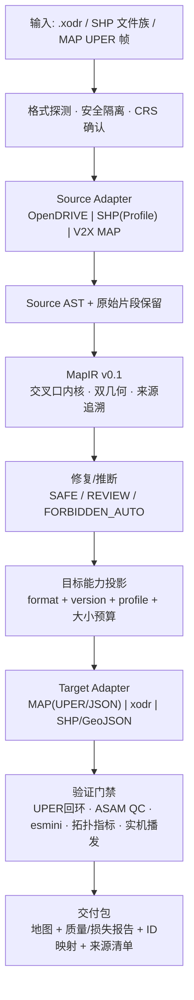

# 地图格式转换工厂：首批 OpenDRIVE / SHP / V2X MAP 落地方案

> **2026-09-17 连续来源域与七路编译（当前入口）**：[本轮实现](L01-E2连续来源域与七路内存编译-2026-09-17.md)。目标普通尾段/via按原件截面唯一正向交点划分，71有向最大误差数值界，旧图36物理分区6项超限；不改变原分配域。七路完整XML仅在内存装配/解析回读/XSD，测试状态接续失败、派生来源元数据/持久化回执仍待完，禁止导出。零优化/新地图文件，205绑定，旧FAIL/原限速/原件/九处角色不变。主版本v1.74和分开验收口径不变，SHP/MAP/整图未交付。

> **2026-09-17 七路E2检查实施（当前入口）**：[共同原件/形状检查与面域复核](L01-E2七路共同检查与面域复核-2026-09-17.md)。完整via/普通尾段分开保真、主路连续区间误差、全图可见/driving面域及35width＋9offset片段回读已接共同状态；143相关测试、193绑定，已看叠图。5个既有短记录核实为长多项式重表达，仍非完整writer验收；旧鼓包/5项尾段FAIL未消除，零优化/新地图。剩余目标所有权/误差界、完整形状/面域判据、七路实际写出准入后才登记联合求解。主版本v1.74、分开验收、原件/限速/九处角色不变，SHP/MAP/整图未交付。

> **2026-09-17 七路共同修形补充（当前入口）**：[新范围接口实现](L01-E2七路联动契约与长曲线状态-2026-09-17.md)。用户已批准主路和106–111一起处理；固定口部坐标/断面、共享可变导数、其他道路不改。新146维状态接通，六路五长原语/五横断面区间，无半端段短结点；只做接口探针，真实形状及实际XML仍未准入，零优化/新图。预测保留5个既有短语义width重表达，未冒称全部记录均长。124相关回归，154绑定，主版本v1.74/分开验收/九处角色/源速度/旧FAIL不变；下一步完整原件与形状/面域/写出契约后一次共同候选，MAP/整图未完成。

> **2026-09-17 E2固定依赖冲突（当前入口）**：[实际文件证据与范围提案](L01-E2整段形状设计与固定转向冲突-2026-09-17.md)。六路12侧中的四路五个固定点超普通尾段0.35m预算，111明确见证0.554103m；仅编辑road11不改变这些点，不能满足当前完整来源条件。建议确认把106–111长曲线/横断面与主路事件共同处理，先不移动口部；未授权范围变化、未求解/生成新地图。主版本v1.74、分开验收及原数据/限速/九处角色/旧FAIL不变，142绑定，已看真实尾段对照；SHP/MAP/整图未完成。

> **2026-09-17 E1来源对应补充（当前入口）**：[39项来源接续](L01-E1来源接续与有限端点绑定-2026-09-17.md)已接实际XML：35区间＋4有限端点观测；原件接触重编译一致，既有九处角色原样回放。来源对应不等于完整区间覆盖/形状准入，0.556834m区间边界偏差及旧111尾段约0.573245m仍在。下一步E2完整事件形状/表示设计并闭合E1锚点条件，不直接求解、不重扫来源。83相关测试、136绑定，零新地图/Web变动，主版本v1.74、分开验收、原件/限速/旧FAIL不变，MAP及整图仍未完成。

> **2026-09-17 E1实施补充（当前入口）**：[完整事件来源与端部准入](L01-完整事件E1来源与端部准入-2026-09-17.md)已实装并对实际r6回读。尾段有显式归属、六路24接触通过，但完整来源39区间未分配、111外缘尾段仍约0.573m采样偏差；E1仍BLOCKED，没有新修形或地图放行。下一步原节点/物理接触/movement来源支持闭合，不重跑R2；70相关测试、127绑定不变，旧FAIL/原件/速度/九处角色/Web不改。主版本v1.74及分开验收口径不变。

> **2026-09-17 v0.6评审补充（当前入口）**：用户已同意[完整分合流事件范围与形状意图评审](L01-完整分合流事件修形评审-v0.6-2026-09-17.md)。建议road11约150m、五边界/两出生共同建模；六转向依赖全验、口部首阶段固定。117只读绑定不变、已看范围图，零拟合/零新地图。下一步E1完整来源域/锚点/依赖准入，再E2形状与表示准入，未通过不登记新的共同求解；旧R2已停止，不继续尾部补丁。原件/九处角色/限速/旧FAIL不变，主版本v1.74和分开验收口径不变，MAP及整图未完成。

> **2026-09-17 R2结果补充（当前继续点）**：[同一完整目标单次拒绝及条件冲突复核](L01-完整目标R2拒绝与条件冲突-2026-09-17.md)。两维局部表示已实算，6迭代/15检查，位置准确但仍鼓包，四项研究形状护栏FAIL；无新XODR/未进入R3或Web。浮点代数复核定位该固定契约的反向量与曲率必要条件冲突，不能靠增加迭代解决，也不宣称一般地图无解。下一步须确认完整分合流事件的编辑范围/形状意图评审；不自动扩范围、加第二结点或删除护栏。原件/九处角色/速度/旧FAIL保持不变；主版本v1.74、分开验收口径及L01→L04优先级不变，MAP/整图未完成。

> **2026-09-17 R1实施补充（当前继续点）**：[原XML局部增量与定向writer](L01-局部增量与定向写出-R1-2026-09-17.md)已实现；固定编译微扰实际写出width +2，其他结构不增加，1.5M XSD/esmini2076位置通过。106相关测试、90绑定不变；这只验证写出一致性，测试件仍有研究反向量FAIL，不是修复地图。真实目标尚未求解，下一步先登记R2新表示的单次有限检查；旧S2不重开、源/形状阈值不放宽，原件/九处角色/速度/旧动态FAIL及Web会话不动。主版本v1.74和分开验收决策保持不变。

> **2026-09-17 表示变更设计补充（当前继续点）**：[全局修形子方案v0.5](全局重建与约束式交互修形方案.md)已完成本次用户确认的设计评审。保持同一范围和邻边，只建议一个长结点（7.10m＋7.10m），使精确位置之外多一个形状自由度；[实算与实施步骤](L01-保形长区间增自由度设计评审-2026-09-17.md)。排除会产生1.27m width记录的前区间插入。79绑定不变、10项新增测试，零非零修形/优化/新XODR；不是合格地图。下一步R1原形及两邻车道定向写出，R1验收后才登记新表示的有限目标试验，不重跑原S2。主版本v1.74、既有阈值、九处角色、原件/原速度、旧FAIL和分开验收口径不变。

> **2026-09-15 S2停止补充（当前继续点）**：[固定范围唯一目标已检查并拒绝](L01-唯一目标检查与停止裁决-2026-09-15.md)。目标位置、原件0.75m包络、邻边冻结和宽度通过，选中边界四项既有形状不退步研究护栏失败；叠图仍有约0.460m鼓包，后段下凹。一个候选、零优化迭代、无新XODR/无Web，不使用剩余预算继续试。68项相关测试不是地图通过。下一步需用户确认是否进入保形长区间增自由度设计，不自动插结点/扩范围或删除护栏；主版本v1.74、原件/原速度/九处角色、旧FAIL和分开验收决策均不变。

> **2026-09-15 S1实施补充（当前继续点）**：[局部编辑范围与能力准入](L01-局部编辑范围与能力准入-2026-09-15.md)已实现；整段冻结、派生车道、显式事件依赖和控制秩准入经44项相关测试与真实node4检查。约44.10m位置请求仅1自由度，位置用尽后无额外形状自由度；约38.10m无自由度及独立双控制等请求准确拒绝。本次无源拟合/优化/新XODR落盘、未接Web；L01仍未修复。下一步按v0.4仅S2固定范围完整目标/唯一形状检查，不继续布局或权重扫描。主版本v1.74、运行门槛、九处角色、原速度/原件与分开验收决策不变，MAP/整图未完成。

> **2026-09-15结构性修订补充（当前执行入口）**：[全局重建与约束式交互修形方案v0.4](全局重建与约束式交互修形方案.md)明确采用原形精确恢复、未编辑整段冻结、显式依赖范围及可行性优先的编辑契约；已有共同模型不再作为下一步重建目标。本次只读秩检查发现当前L01表示在约38m锁端范围没有可编辑自由度，约44m仅一个，不等于目标已可行；零源拟合/零优化/零新XODR。下一步仅S1编辑范围与控制能力准入，未通过不启拟合、不插结点、不接Web；停止布局/权重/种子扫描。主版本v1.74、既有运行门槛、九处角色、原件/速度及分开验收决策不变。旧研究护栏另列来源，不在本次删除或改为PASS；L01、MAP与整图仍未完成。下面历史“下一步”不覆盖本入口。

> **2026-09-15 L01长布局实施补充**：两个保持原独立结点数量且跨度≥6m的布局已实测，均未通过原件/邻边门槛，无新XODR、未接Web。已实现原XML固定基准与零操作原字节回放，投影只作数值初值，不能伪装无损原形迁移；[原形保持、结果与继续点](L01-长区间布局与原形保持-2026-09-15.md)。停止更多布局扫描，下一步先明确未编辑几何保持范围、选中区域支撑及实际自由度，再按可行性优先求解。两布局失败不证明一般无解，研究护栏不升级为用户门槛；主版本/原件/速度/九处角色及分开验收决策不变。

> **2026-09-15 L01最小形变实施补充**：硬位置＋五边界共同最小形变及实际世界曲率/变化率/总变差已实现，保守参数导数代理不再用于新试验；[真实拒绝与下一步](L01-最小形变与真实曲率约束-2026-09-15.md)。完整目标及四步渐进策略均未通过原件/逐边界检查，后者第一步包络0.750838477m>0.75m；无新XODR、未接Web，不借测试通过宣称地图平滑。停止在固定布局内追加种子/权重/轮数，下一步先验证受控长区间布局与编辑影响域调整的来源/原形保持；不增加短段、不擅自改变来源角色或用户验收。研究不退步护栏不升级为标准，失败不等于一般无解。主版本与分开验收口径不变。

> **2026-09-15 L01控制契约补充**：[精确位置与可达范围](L01-精确控制点与可达范围-2026-09-15.md)。控制意图不再只作软拟合目标，区间内实际XML位置严格复验，越界不吸附、预算不足不宣称无解。真实第三边界目标仍拒绝，未开放新Web能力/未修完鼓包；本轮为不退步添加的参数导数护栏是保守试验代理，不等价于实际曲率约束，不是新的用户验收门槛。下一步硬位置＋最小形变和真实世界边缘曲率/变化率共同检查，不将亚毫米交互测试当形状改善。主版本及分开验收口径不变。

> **2026-09-15验收口径已批准补充**：用户明确同意“静态地图保真/平滑”和“明确通行路径＋速度工况动态”分开验收。原限速、原静态门槛、旧G11策略/旧FAIL不改；缺工况仍阻断最终交付，不将源限速当实际车速、不自动降速。具体规则和版本化策略见[验收决策v1](验收决策-静态地图与通行工况分离-v1.md)。此补充优先于下文旧的全中线源限速单一交付口径；不是任何候选通过验收，也不豁免静态鼓包/碎段/空洞。主版本v1.74研究记录保留。

> **2026-09-15阶段归档入口**：[本阶段开发整理](阶段开发归档-2026-09-15.md)、[当前遗留与验收条件](遗留工作-阶段收口-2026-09-15.md)。方案主版本仍v1.74；此次提交是研究检查点，不是平滑地图发布。受限编辑与UI v2已可运行，外缘/口部/MAP和整图验收仍未闭合；后续以根HANDOFF及遗留清单执行，以下逐轮状态作为历史资料保留。

> **2026-09-15 收敛实施补充**：按用户转向可操作人工修形的要求，停止扩大数值研究；ORBIT准入失败后已实现node4本地受限编辑纵切。7个共享分界线长区间手柄，相邻width联动、口部锁定，新增geometry/width为0；真实浏览器完成拖动/撤销/保存重开/候选导出，XSD和esmini修改道路位置读回通过。**本次有新候选XML，但不是合格地图；旧外缘4项内部曲率FAIL保留，源保真/动态/面域/CRS与MAP未完成。** 外缘/口部/轴/拓扑编辑尚未开放，不能称完整E0已完成。此执行路线覆盖下文旧“继续无限自动求解/尚无Web”的继续点，方案主版本仍v1.74。详见[使用与证据](本地修形台-E0受限纵切.md)。

> **2026-09-14 最新动态层补充**：同一5普通道/24转向初值已完成长曲线内部动态检查，924声明区间中591 BOUNDED、333有实算超限见证；不是全源写出域、形式安全证明或地图验收。11条混限速转向仅有最大原限速包络，真实速度区间映射未完，不改原速度/目标。原几何状态完全不变，281哈希不变，零拟合、无新XODR、未交付；下一步实际域/所有权、面域和动态残差接入共同求解器，不再重复差分抽查。见[实现与真实复核记录](实施记录-全路口长曲线动态区间检查-2026-09-14.md)，原版本v1.74与历史门禁仍保留。

> **2026-09-14 最新完整变量与联合步补充，优先于下文旧9列范围**：全部1676自由列已计算，两侧矩阵1724×1676；240列存在左右差分分歧，77列只有一侧在原域内，未宣称光滑Jacobian。实现所有改变父路先更新、再一次性重算24转向的原子共同步；实测5父路＋24转向微扰与整图独立重算全部残差差0。**当前仍507组不等式失败，没有优化、没有新XODR、未交付**。系数加速保留全部原件仿射见证，不固定可变轴/口部/布局、不删约束；278输入哈希不变，172＋3相关测试通过。完整源域/写出区间/动态/面域约束及共同求解器、MAP/CRS/movement/Web仍未完成，不推广CLI，未commit。最新证据`out/node4-whole-joint-step-r2-20260914/`，详见[实施记录](实施记录-全量变量与整图联合步验算-2026-09-14.md)和[HANDOFF](../HANDOFF.md)。

> **2026-09-14 最新全图约束接口与源侧绑定补充**：修复共同模型中Profile SIDE与端口行驶左右串用，24转向按两端原边界身份一致绑定，96源端边缘最大偏差0.020568767m；仅来源对齐，不是连接闭合。修复零长度尾段的原切向证据缺失；全部父路原件约束保留为固定身份的最差余量，507等式/1217组不等式、1676自由列。9列两步长检查仍有102/103中心中位数分歧，未完成完整非线性优化器。**没有优化、没有新XODR、未交付**；275项输入/代码哈希不变，9处批准和源速度不变。最新`out/node4-whole-derivatives-r5-20260914/`，详见[实施记录](实施记录-全图约束残差与求导检查-2026-09-14.md)与[HANDOFF](../HANDOFF.md)。旧r4源侧未归一的路径不得恢复；下文阶段证据不升级为整图/MAP验收。

> **2026-09-14 全路口共同几何状态补充，覆盖下文旧断点**：用户“继续”已仅确认此前明确列出的西2处/南1处，原决策文件和新增3处决定分别保留；9处来源角色全部接通，movement路径完整留待另验，不扩大到其他输入。完整5父路＋24长连接路已在同一1681维状态中实算，参考轴/共享边界/口部及尾段比对同时变化；不是旧双父或固定父路逐条拼装。每条连接路仍为固定5长原语且≥6m，不按源点数量分段。**当前仅评估初值，几何仍失败，没有优化、没有新XODR、未交付。** 最终证据 `out/node4-whole-source-model-r4-20260914/`，123相关回归＋3真实复核通过、271输入/代码哈希不变；不代表地图平滑。下一步固定全局残差/Jacobian结构、完整源域/写出/动态/面域约束，再登记有限候选求解；不直接套旧固定C算法。详见[当前交接](../HANDOFF.md)与[全局执行入口](全局重建与约束式交互修形方案.md)。以下“西2南1待确认”和“缺5父24形状核”均为历史，其他未完门禁仍在。

> **2026-09-14 全图来源角色补充，当前停止点**：北2处/东4处旧批准已按完全相同原件证据继承到5道路/24转向全图输入，不伪造新批准、不扩大范围。西road11两处、南road12一处仍未批准；直接SHP/DBF及原件叠图确认原零宽收合点与车道线端点相距1.566211/1.767185/1.828769m。在“同一物理端点且双方各≤0.35m”前提下角色不相容，不是一般无解。待用户明确这三处是否采用“原边界定义物理道路、完整车道线作通行路径另验”。证据 `out/node4-whole-source-role-binding-20260914/`；源输入61项哈希不变，拟合0、无新XODR。完整形状核/全源域/动态/面域/MAP等仍未完成，批准不等于几何通过。[当前交接](../HANDOFF.md)。

> **2026-09-14 连续坐标层实施补充**：参考轴、源端域相对口部、共享长区间及边界系数已能在同一状态重算，旧固定源约束矩阵不复用；完整端口计算接口拒绝缺父路/转向的模型。真实全接触291要素/77事件，两个已批准组件各5项有限扰动完成，188相关测试通过。**全5父路＋24连接路形状核仍未组装，未拟合、无新XODR、未交付**。[实现与真实检查边界](实施记录-共享可动参考轴与固定结构布局-2026-09-14.md)。不新增角色批准、不把联动检查当几何PASS。

> **2026-09-14 执行顺序修订，优先于下文v1.74历史安排**：停止逐转向补种子；先完整node4结构候选与来源域预检，再做全路口共同验证。[当前实施入口](全局重建与约束式交互修形方案.md)。完整输入5父路/24转向、Line/Arc原件分配与完整来源链已接通；7.526348m多要素源区间仍未分配，完整几何模型尚未就绪。本轮无新XODR，不声明平滑完成、不改原件/限速/角色批准/CRS、不推广CLI。

> 版本 **v1.74（2026-09-14）· 双父路与16条转向共同求解已落地，实际24转向全量复核仍拒绝，未交付**。
>
> 当前实现原件线性硬约束下的有界共同步长、正宽/偏移坐标非退化保护，以及按父路允许斜率空间选择固定长端口模型。首份509维硬来源试验的父路约束虽通过，实际图仍16转向几何失败、全源转角10失败、144esmini接口18失败（最大接缝4.867m）；经原件叠图、两父路及三视图复核，明确不选用。最终证据为`out/node4-north-exit30-stable-source-v174/FINAL-REVIEW-STATUS.json`，实际XML SHA fdce07be271006fa8309b7351ffa71fcbc56cb4b8cd56e8d84e690ea7d1218a4。v1.71保留件也不是合格地图。
>
> 修复旧20格图表漏检，最终验收必须覆盖实际XODR的全部24条movement，而非旧20/22并集。初始化失败、构造失败、独立文件失败分别留痕，数值误差缩小不能替代原件保真和世界曲率。参考仍最多5长原语、每段≥6m，不按原件点数量生成短段；来源优先阶段尚未运行。最新端口/闭合校正试验状态以[交接v1.74](../HANDOFF.md)为准，不能把单元测试或初始化通过当成整图平滑。
>
> 两父源动态仍FAIL；11/12、全幅来源与面域、MAP、CRS、movement通行路径、Web未完成。保留原件/源速度/批准范围，北2东4不重问、西2南1不扩大；不推广CLI、未commit。[实现边界与原始文献](实施计划-整路联动重建与编辑闭环.md)。以下均为历史。

> **v1.74 最后实测补充**：新端口模型＋有效初值的563变量共同求解已结束，仍失败。实际图`out/node4-north-exit30-regular-domain-v174/node4-joint-diagnostic.xodr`（SHA 8864c17b9a2a5f9aa3de27162405ecd655c05aac98cae4f2042abf5446e701dd）已完整封存拒绝；24条中16几何失败、19全源转角失败、144接口18失败，最大接缝0.321296m，内部曲率跳变20.498706/m。只有第一步被接受，不是共同优化完成。仍4–5长参考原语、每段≥6m，不靠短段；但“不用短段”不等于“已经平滑”。下一步先诊断活动非线性约束下拒步原因，再改可行性恢复，不能靠增加次数或忽略内部曲率/反弯过关。未替换v1.71研究件。

> 版本 **v1.73（2026-09-14）· 真正的父路—转向共享变量已实跑，但整图仍拒绝；双父16依赖输入已准备**。
>
> 北152＋转向205＝357变量共同可行性求解已实现，不再是固定主路的分别重算。5次求值后严格构造仍失败；实际20转向几何11失败、全源转角5失败、esmini144接口8失败（最大位置差4.482mm，但曲率差仍超门槛）。来源优先优化尚未运行，不以约束残差下降或位置接近零宣称平滑。原件叠图和三视图已看，蓝缝仍在。新件SHA efe9d228997108283b03c71d4ab0b50f4639a50077dcfe102e8947f79a5cee69封存REJECTED，不选用；v1.71仍只是保留研究件。
>
> 新查明固定road30端口距原边界约0.578m，超过原尾段0.35m预算，已加入求解前矛盾检查；只在该端点固定条件下证明不相容，不是一般无解。road30的无角色冲突原件已直接编译成1条90.967794m Arc、16个宽度区间≥5.648099m，源双向最大0.213918/0.210902m、内部G2/XSD通过，原60km/h动态近似PASS但jerk警告。仅两条明确源车道域的孤立研究件，外部原件范围与全幅不能据此视为完成。
>
> 北＋road30两份源状态共209父路独立变量，**16条依赖的输入**已准备、固定端口未再检出同类冲突；尚未对16条共同求解。下一步完整长模型初始化→共同可行性→来源优先→同XML完整22转向并集/两父全源/面域/源动态/esmini复核，不得冻结road30只改104/105。无冲突接入不伪造批准或扩张北2东4角色，西2南1仍未获批准。MAP/CRS/11/12/全幅/动态/movement/Web未完成，不改源/限速、不推广CLI、未commit。见[当前交接v1.73](../HANDOFF.md)及[实施计划](实施计划-整路联动重建与编辑闭环.md)。以下版本均为历史。

> 版本 **v1.72（2026-09-14）· 北侧真实长参考线重建已读回，固定新父路的全依赖试验失败；整图仍未交付**。
>
> 北侧独立件使用1条96.702154m Arc、16个宽度区间≥5.513318m；完整源双向采样最大约0.350000/0.349679m，内部G2及99源速度条目通过，但动态仍FAIL。取消历史口部`t'=0`只是研究对照，不是标准要求，更不是所有问题已解决。
>
> 新父路的12条依赖全部尝试后，20条北/东转向并集的实际XML几何仍5条失败，全源转角8条失败；东侧边界反向误差0.455387m超0.35m，esmini接口最大偏差2.347225m。已实际看原件图及esmini三视图，蓝缝/凸起未消除。诊断`out/node4-north-source-dependents-v172/node4-diagnostic.xodr`（SHA f1c9eb9405339855e980978617dfc4f06f11f69374f97d27d42e7aa5d7b31d51）已封存**REJECTED_NOT_DELIVERY，不选用**；保留v1.71研究件也不等于交付。
>
> 当前实现的是依赖闭合的分别重算，**不是父路与转向参数同时优化**。下一步须原件约束下共同优化共享端口/长参考线/横断面，并保真优先；不能继续把一次主路拟合结果冻结后盲试。输入重建与旧批准角色迁移已可重放，未扩大北2/东4授权，不改原件或速度、不推广CLI。MAP/CRS/11/12/整幅面域/动态/movement/Web未完成。完整断点见[交接v1.72](../HANDOFF.md)、[实施计划](实施计划-整路联动重建与编辑闭环.md)。以下版本均为历史。

> 版本 **v1.71（2026-09-14）· 全源反弯和普通道路尾段约束纳入联合求解；仍不是整图交付**。
>
> 新研究件`out/node4-all-source-tail-readback-v171/node4-review.xodr`，SHA **e05dcb85db2c913081cfb1de29d88a918c4e2df019c79684f9553ad02d27a5b0**。同父状态只改100/109/116，全源转角报警12→9，旧4条改善保持；三条各4长参考原语≥6m、7宽度区间≥3m，不逐点拼线。原道路尾段继续服从0.35m严格来源域，不能套via的宽松门槛；东侧完整来源组合最大正向0.348917m、反向0.348945m。
>
> 100/116虽然通过当前几何与反弯检查，P95由0.274/0.208增至0.727/0.715m，**保真退步，不能称全面优化完成**。全源转角仍9条报警，122几何失败，11/12内部边缘和整幅面域未过；已看实际叠图及esmini三视图，蓝缝仍在。端口代数消元、固定评估网格和受限SQP改善求解稳定性，不是全局可行性或自动驾驶认证。
>
> 122原边界/北侧父路端口存在约7.34°方向差的诊断线索；下一步原件约束下联动父端口与全部关联转向，并修正来源与光顺目标的优先关系。不得单点挪路、降容差/改速度/新增短段。西2南1角色未扩大，MAP/CRS/源动态/movement/Web未完成，未推广CLI。完整证据与拒绝试验见[当前交接](../HANDOFF.md)，[实施约束](实施计划-整路联动重建与编辑闭环.md)。以下为历史。

> 版本 **v1.70（2026-09-14）· 世界曲率光顺已进入联合求解，局部改善已写出；全图仍拒绝**。
>
> 当前研究件`out/node4-world-fair-five-readback-v170/node4-review.xodr`（SHA 3564339af5221cd56871878bc06805a618781fafec2e76566495afa00e3e3fba）只替换5条同父转向，不改源/限速/ID。104/106/117/123在既有几何和全源转角补充复核中通过；116只通过旧单转弯适用范围，右边缘全源转角仍失败。20转向既有几何19通过，122仍失败。不得把原S弯或复合形状“不适用旧反弯判别”当作通过；全源补充检查仍12条超额转角，不能宣称五条完整平滑完成。
>
> 世界曲率变化能量、原单转弯的反弯预算、完整来源/端口/G2/正宽/防折返已共同构造；数值求根和积分仅求值，不按原点增写几何。改动转向3–4参考原语≥6m，6–7宽度区间≥3m。已查看原件同尺度叠图与esmini近景，蓝缝和其他外缘问题仍在；XSD/144接口/原零宽与源速度事件通过也不构成整图验收。122五长原语是对照研究，非已选用输出。[当前证据和复跑](../HANDOFF.md)，[算法范围与未完成项](实施计划-整路联动重建与编辑闭环.md)。
>
> 西侧2处、南侧1处新角色决定仍待明确确认；不自动扩大此前六处批准。MAP、源速度动态、CRS、movement和Web状态未升级。以下为历史。

> 版本 **v1.69（2026-09-14）· 新候选通过误差/G2但反弯更差，明确拒绝；四向原件已查全**。
>
> 122联合求解与精确端口投影后，20关联转向通过既有保真/G2子项，参考仍4原语≥6m；实际看图及XML航向检查检出104/106/116/117/122/123共6条额外反弯。122右侧新件约70.720°（原源约0°、旧件10.600°）。新目录`out/node4-fixed-parent-v169-final/`含final字样也**不代表通过，最终REJECTED_NOT_DELIVERY，不选用、不推广CLI**。不能用P95/接缝过关替代实际平滑。下一步将真实边缘/中心的曲率光顺与来源/端口放进同一求解，[方法与原始文献](实施计划-整路联动重建与编辑闭环.md)。
>
> node4四向120源车道/240端点一次查全：9处零宽，北2/东4旧批准不重问；新增仅西2、南1，原路径端点距边界收合点1.566/1.767/1.829m，待精确角色决定，不自动套旧例外。原件/速度/MAP角色/CRS状态不变，road11/12/面域、源动态、MAP、movement、Web仍未完成。[原件清查](资料盘点-金凤示范区数据与标准资料.md)，[全部拒绝证据](../HANDOFF.md)。以下均为历史版本。

> 版本 **v1.68（2026-09-13）· 东侧不齐端部已写出及联合来源复核，20关联转向19条通过；整图仍拒绝**。
>
> 实现真实单侧源域，共享laneOffset不跳锚；road13一条190.409591m Line参考线，33个宽度区间≥5.552347m，不按原点拼参考线。原两方向外端差24.667293m得到保留，口部原尾段由原TOPO连接路接管，所有原点继续参加最终组合检查。新增来源角色为0，原40/60限速保留。
>
> 同一北/东父路状态的20转向完整重建，独立文件复核19通过；122右边界反向P95仍0.906917m>0.75m。东侧完整原边界/物理中心源→组合文件最大0.348917160m，同一原边界族反向0.348917886m，0.1m采样检查、非连续证书；四movement另验。1.5M XSD和esmini144接口通过，但road11/12内部边缘仍失败，截图仍有其他方向口部缝隙，整幅面域、源动态、MAP、CRS与Web未完成。
>
> 当前复核件`out/node4-east-north-dependents-v168/node4-review.xodr`，SHA **9110dda090c9a97c7e57e1361b43cfa34927d5623f0a35877d3844c995dc95c4**，不替换默认CLI或正式输出。下一步是122及11/12完整原件/全部依赖与整幅路面，不再等待东侧四处角色批准或重复共同端面试验。单Arc替代122的对照更差并拒绝，不能以原语少代替保真/G2。[实际文件、失败项与复跑](../HANDOFF.md)，[实施计划](实施计划-整路联动重建与编辑闭环.md)。下面保留历史状态。

> 版本 **v1.67（2026-09-13）· 东侧四处零宽角色已批准，完整共享源形状可解；不齐端部写出未完成**。
>
> 角色资格检查从TOPO事件内部移为每条保留源车道首末端全查；本包57车道/114端点共4处明确零宽，补获用户对`2023061915261945676/start`的单项批准，前三处不变。原件均保留，原车道线另列通行路径验收，其他车道/MAP没有授权。新决策为`profiles/repair/node4-east-zero-width-source-roles-v2.yaml`。
>
> 东侧完整共享三次状态已求解：最终Line方案1参考原语、289系数、宽度区间最短5.552347m，完整源边界同轴上界0.35m、29物理中心来源上界0.172898m；四movement另验。另补齐外端零宽的物理G2约束传递，直接读系数重算四处世界位置/航向/曲率收合4/4通过。不是逐点短线，也不是合格XODR。此前Line/Arc诊断未含这处G2，不当最终平滑成果。写出器仍强制共同端面/双向齐长；真实外端差约24.6m，Line共同口部截断约0.928m源边界，写出仍拒绝，不删除原尾段过关。
>
> 相关测试及当前模型复算通过（最终计数见HANDOFF），源40/60速度事件已接入共享模型和写出单测，未生成新真实XODR验证速度；没有新esmini验收。下一步实现真实单侧源域与口部来源在普通路/连接路间的联合覆盖，重建全部依赖后验整图，不再等四ID批准，也不重复局部凑初值。保留v1.65的11/12复核件，整图/面域/源动态/MAP/CRS/Web未完成。[当前文件与复跑](../HANDOFF.md)，[端部表达依据及实施边界](实施计划-整路联动重建与编辑闭环.md)。以下均为历史记录。

> 版本 **v1.66（2026-09-12）· 东侧完整原件复核，3处新增源角色待裁决；无新XODR**。
>
> road13及12依赖转向的完整输入已展开：57源车道、85边界、142要素/3178原点，原路口24转向TOPO核对MATCH。直接重读SHP/DBF与原SIDE/端节点确认3处零宽端点：`2023041111113051690`起端、`2023041111104112823`起端、`2023041810460339677`末端，原车道线端点与实测边界收合点分别相距1.768531/2.343632/1.757130m。
>
> 这3处不在北侧已批准两处角色例外内。仅在同一零宽点同时约束为原车道线端点和原边界收合点的条件下，双方各0.35m不相容；不是普遍无解证明，也不认定原料哪层错误。**不得自动扩大movement角色、删点、改宽度或放宽预算。** 原件近景已查看，独立证据及下一步裁决见[HANDOFF](../HANDOFF.md)和[资料盘点第九节](资料盘点-金凤示范区数据与标准资料.md)。
>
> 尚未进入东侧联合数值求解，无新XODR或默认管线推广；保留v1.65的11/12复核件与全部失败状态。129相关回归通过不是整图完成。几何优先、源速度原样、MAP待定等既有边界不变。下文为历史版本记录。

> 版本 **v1.65（2026-09-11）· 世界边缘约束、防折返及同父状态12转向重建；整图未完成**。
>
> 完整源边界/中心参与固定基底拟合；不再把横向斜率强制归零当作世界平滑的唯一做法。内层加入非负宽及防折返连续界，写出后用独立多项式极值、全部原点/原段及esmini复查。参考线/宽度共用精确站位，避免浮点往返制造微区间。没有逐点补短线或放宽保真门槛。
>
> 当前保留`out/node4-world-g2-regular-shared-parent/node4-review.xodr`（SHA 65796005fd40644c296282bd902ba46753a2370219da35fedbdc8f2cc3e370d8）。同一共享北侧道路状态下，全部12关联转向重新写出；3–4参考原语、最短6m，6–7宽度区间、最短3m。XSD、ID/link、144个esmini接口及相关内部边缘/非负宽/防折返子项通过；**完整来源门槛11/12**，不是每点≤0.35m。122右边界反向P95 0.870733m仍超过0.75m，最大0.945610m，保持拒绝。
>
> 最终文件北侧源读回最大0.350000m、反向边界0.349812m；保留源60km/h，动态FAIL。其余road11/12/13内部曲率、可见空隙和整体形状仍未完成，截图已查。32变量连接路联合求解器也已试跑，尚未解决122；**不是整幅路网联合求解完成**。下一步联动road13源边界及共享口部，不能再凭连接局部重试或渲染填色称闭环。MAP/Web不在本轮完成范围。113相关测试通过，源料/旧输出不改，未commit。[最终证据及复跑](../HANDOFF.md)，[约束与实施细节](实施计划-整路联动重建与编辑闭环.md)。以下为历史记录。

> 版本 **v1.64（2026-09-11）· 几何优先实施；已写出北侧道路，整图未完成**。
>
> 用户已同意先闭合单个真实路口几何，将源限速与恒速动态测试分列，不自动降速。新直接三次共享边界编译器写出一条96.702154m Arc参考线，车道宽度仍有16个共同区间、最短5.513318m（显式研究复杂度，不称“完全不分段”）。它不是五次曲线密采样，也不是每两点一条road。原TOPO、边界身份、原材料均保留，未推广默认转换。
>
> 已修统一断面裁掉源端点（完整文件误差1.020597→0.350000m）、延长道路后端口仍用旧源记录（多计约6m走廊）、连接横断面线性方程的消减误差。原始边界/物理中心到文件含全部端点的采样检查≤0.35m，反向边界≤0.349679m；采样审计不当连续双向证书。旧候选连接路曾降速，新复核件12条关联连接路按原SHP恢复60并验属性；不是保留旧低速字段就叫保源。
>
> `out/node4-geometry-cut-aligned-long-widths/node4-source-speed-review.xodr`的XSD、esmini144接口（最大3.823mm）通过；北侧184内部边缘接缝通过。**整图仍拒绝**：5条连接贴源失败，其余方向11/12/13内部曲率跳变失败、路面空隙/尖角仍可见、真实源速度动态FAIL。连接“几何候选”仍用原median/P95/max三级门槛，不冒充每个点≤0.35m。另试共同零斜率端口整组变差，已拒绝，不跨候选拼成功路段。
>
> 几何优先只是阶段划分，**不是取消动态、CRS、原始来源或整幅路面门禁**；不以接口或86项单元回归PASS宣布自动驾驶可用。MAP名义宽语义没有新批准，两movement/全路口同状态求解/其余三方向/七路口/Web仍待办。最终文件、截图、SHA、复跑与下一断点见[HANDOFF当前记录](../HANDOFF.md)。下列v1.63及更早为历史，旧“无新XODR、等待速度才能实施”不再表示当前工作状态。

> 版本 **v1.63（2026-09-11）· 完整中心观测与斜切端部预算；目标未完成**。
>
> **当前目标状态：BLOCKED，等待验收/来源约定确认。** 本次从当前原件重建路径图与必要条件方程，10组数值证书复核通过，三条分合流在现0.35m/恒速60kmh/ay≤2.5/jerk≤1组合下的冲突未变。源端部覆盖已补齐，不能继续以同条件重复调参代替工况确认。MAP名义宽解释另待确认；不改源限速、容差、宽度或既有角色批准。没有新XODR、没有新增算法版本；确认后共享整路写出/全部连接/独立闭环仍需实施。详见HANDOFF当前状态，下面为实现及历史证据。
>
> 原14条中心端域未验收问题已接入真实共享求解：内部按原TOPO连续路径对应，外端扣除纵向误差后约束同一0.35m二维预算，不延长源边界、不删点、不补短段。23条物理中心的完整原点/原段来源子项通过；2条movement观测仍需单独验收，反向/面域/整图尚未通过。
>
> 仍156系数、41长区间、最短18.13m；动态改进后完整中心对应上界0.35m、原边界0.35m、宽度数值零、C2通过，但原60kmh的2cm ay4.228166/jerk6.511206仍FAIL，无新XODR。原件重放204输入hash一致、137相关测试通过；叠图及端部近景已看，仍有波动。设计工况和MAP宽度待确认，可写出整路/全连接/旧负宽/CRS/Web未完成。[完整证据与复跑](复核补充-完整中心观测与斜切端部预算-2026-09-11.md)。以下为历史记录。

> 版本 **v1.62（2026-09-11）· 原始车道路径与设计工况冲突复核；目标未完成**。
>
> 新来源级必要检查去掉曲线基底、边界中点和分叉接触限制，保留完整原中心折线0.35m预算、允许端点移动。node4北侧5条普通路径中，3条在恒速60kmh、ay≤2.5、jerk≤1的当前合同下冲突，jerk必要下界分别4.286744/1.638832/1.295434m/s³；不是某条生成曲线峰值，不证明一般地图无解。仅移动事件或更换原语不能绕过同一来源合同。
>
> 修复原始近站位导致LP丢弃极小系数的数值问题，以正数等价行缩放和原始方程的原/对偶证书校验处理，不删点不造短段。199输入hash及10证书独立重放通过，源图逐条查看；128相关测试通过不是地图PASS。没有新XODR，默认主线未推广。
>
> 下一步需确认普通分合流的设计工况或可信源修正，原限速保持60；专家将2.5/1.0明确为工程初值，不能假定所有来源限速都是该工况要求，也不能自动降速过关。MAP宽度/旧负宽/完整源端域/连接/CRS/整图/Web未闭合。[完整推导、原ID、论文、限制与复跑](复核补充-原始车道路径与设计工况冲突-2026-09-11.md)。以下为历史记录。

> 版本 **v1.61（2026-09-11）· 原接触过渡带补检与必要条件修正；目标未完成**。
>
> 已修复逐源记录共同范围遗漏过渡带的问题：node4北侧18处、按车道累计1.584827m、最长0.389847m，全部接入共享宽度约束/动力学优化及2cm复算；新增几何段与变量为0，原速度/身份/源数据不变。两个生长事件不自动变通行laneLink。
>
> 旧自由站值解在新增882约束中210项超限；补齐后无样条基底的必要模型也数值冲突0.000395714253，不能再以v1.59“自由检查可行”支持只换基底。是固定图/接触/源包络/物理中线条件的诊断，不证明所有道路表示无解。旧长曲线正常区间jerk至少6.66636，仍FAIL；另9.49233为近重合结点诊断，单独记录，不当可靠道路区间指标。
>
> 无新XODR或esmini，123相关回归只验证本轮实现；源叠图和导数图已看，仍不合格。下一步处理来源支持内事件/相对展宽及中线模型，不再盲加同模型迭代；MAP宽度待确认、旧负宽/原60kmh/端域/全连接/CRS/Web不变。[完整修复与真实证据](复核补充-源接触过渡带覆盖与必要条件修正-2026-09-11.md)。以下为历史记录。

> 版本 **v1.60（2026-09-11）· 弯曲参考轴与可写出三次边界内核；目标未完成**。
>
> 已实现原始线段在Line/Arc参考轴中的精确投影和整段来源包络，误差全部计入同一0.35m预算。一个参考原语、全局长分界和共享三次系数，不把五次拆成短width；实际幂基换算已测试，完整源端域/道路编译及全部连接未完成。
>
> node4北侧原25车道/33边界/11族，连续航向/曲率＋共享系数变量投影24求值/22状态，21来源拒绝/1数值ERROR；最短15.10879m，仍无新XODR。最低已访问完整模型额外松弛0.77261m，不能批准放宽容差或称地图误差达标。只查原顶点会通过，补完整原段/中心/宽度必要见证后仍冲突0.768405m；显示检查点列端点不足，不是源数据全局无解证明。
>
> 全源/两近景已看，红色是拒绝诊断，有波动，非修复或esmini成果。88相关回归、194输入hash及参数读回只验证研究实现；MAP宽度待确认、原60km/h/旧负宽/绝对CRS/整图/Web仍未闭合。下一步针对相对展宽和合法事件/端域，继续少原语轴、世界G2共享断面及全部连接同状态，不再仅对单Arc加试验次数。[完整实现与证据](复核补充-弯曲参考轴与可写出三次边界-2026-09-11.md)。以下版本为历史记录。

> 版本 **v1.59（2026-09-11）· SHP必要条件与源事件长基底；目标未完成**。
>
> 新必要条件模型不要求特定样条基底，以完整源边界包络、中值定理/精确曲率关系及Taylor余项检查联合接触；有限站值/导数通过不等于存在可写出曲线。自由检查站模型未排除可行性，限制到原均匀长五次基底后数值冲突，因此不把原优化停滞当源数据全局无解，也不继续仅换同一模型初值。
>
> 已实装源物理三叉事件对齐：25源车道/33边界/11长族不变，171→156变量、46→41长区间，最短18.13m，无逐点原语。原60km/h下2cm复算最大ay由7.219降至4.226、jerk由16.285降至6.505，**仍不合格**；全边界0.35m/非负宽/G2子块通过，图中直段波动仍在。新基底也有必要条件数值冲突，须继续可写出解析参考轴/边界/合法事件及全部连接联合；五次不能直接导出为三次width。
>
> 本轮推导曾漏乘三阶导上界度量因子，已修复并以45°圆弧反例回归，早期必要条件结果弃用。最终70相关测试、191原件/配置/实现hash与参数独立读回通过，不是地图通过。无新XODR/esmini，MAP宽度解释仍待确认、门禁未变，SHP旧104负宽/原60工况、CRS、整图/Web未闭合。[证据、公式、文献、失败及复跑](复核补充-SHP必要条件与源事件长基底-2026-09-11.md)。以下为历史实现记录。

> 版本 **v1.58（2026-09-11）· 联合初始化与MAP宽度语义证据；目标未完成**。
>
> 新联合入口取消“每条固定轴普通路先通过”的前置条件，普通路结构投影、连续轴及全部连接在同一恢复状态中处理；仅搜索中暂存来源残差，完整最终约束不放宽，不增加逐点原语。NODE5/node16/node13三案已实跑到联合恢复，仍拒绝，无最终XODR；node13负宽初值问题已修复，后续数值子问题失败不证明全局无解。
>
> 重新读取消息层送审稿并对照原MAP/原SHP：node13南侧一个350cm字段原点距原SHP候选中心0.000083m，关联边界截宽约6.3515m。候选身份未批准，但足以说明“固定t宽差=实际失真”结论不充分。**修正v1.57对旧node13宽度失真的无条件概括，不恢复完整保真PASS。** 标量宽度作为名义值还是严格保宽待明确选择，当前门禁不放松，SHP不成为MAP转换隐藏输入。
>
> 三个重建包各154、两个原件对照包各166项输入/实现hash已核对；122项互不重叠相关回归通过，两张原件观测图已查看。研究几何未推广；事件站位、物理宽度度量、SHP可写出编译/原60kmh、CRS与Web仍未完成。[完整实现、来源证据、失败结果与复跑](复核补充-联合初始化与MAP宽度语义证据-2026-09-11.md)。以下是历史记录，旧PASS不能提升为当前整图合格。

> 版本 **v1.57（2026-09-11）· 连续参考轴与MAP显式宽度门禁；目标未完成**。
>
> 四条普通道路参考轴已与共享边界和全部连接连续联合求解；修复并列最差源约束的联合导数错误，保持长边界/三回旋线，不新增逐点原语。NODE5中心/动态/66个esmini接口曾通过，但独立宽度审计和截图发现车道被压到约1.59m（原字段3.5m），该候选不合格；旧v1.55/v1.56 node13也存在最大2.694m显式宽度差，**撤回任何“完整保真已通过”的概括**，历史文件不覆盖。
>
> 已新增必需`MAP-explicit-width`交付门禁和求解硬约束。当前按显式标量在原点支持内常宽保留，是保守转换合同，不声称标准保证实际全域等宽。当前完整宽度约束复跑NODE5/node16/node13均被普通路初始化拒绝，无新最终XODR。只保留原点的诊断模型使前两案线性可行，node13南侧仍拒绝：应重审点间观测/宽度/结构模型，不能靠取消整段检查宣布闭环。
>
> 连续轴仅限单Line、事件站位仍固定；当前初始化仍先固定轴求解，尚非完整联合可行性入口。默认几何未推广，但MAP交付门禁已加强；SHP、原60km/h失败、绝对CRS、整图及Web未完成。[实现、旧结论纠正、真实证据与复跑](复核补充-连续参考轴与MAP显式宽度门禁-2026-09-11.md)。以下为历史记录，其PASS仅指当时覆盖范围。

> 版本 **v1.56（2026-09-11）· 联合可行性恢复与来源参考轴；目标未完成**。
>
> 已补齐全共享状态的弹性恢复：来源/宽度/结构保持硬约束，搜索中的端点及动态超限必须归零后才允许进入写出。零空间消元与近端平顺QP解决初始LP/数值尺度问题，原始残差检查不放宽。研究选项从原进口末段Lane.points估计单Line轴方向，仍保留全部原件支持，不增加逐点原语。
>
> NODE5、node16真实来源轴试验最大归一化残差分别停在0.000833035、0.107975341，均拒绝且无最终XODR；不当作原地图全局无解。node13对照复现v1.55同一SHA，来源/动态及esmini90接口通过，但仍BLOCKED研究候选、连接15km/h缺省工况，不是整图60km/h通过。
>
> 三个当前证据包各149来源/配置/代码hash复核一致，126相关测试通过，源叠图及三视角重新查看。尚未把参考轴/事件站位作为连续联合变量；node4/SHP、全部地图与Web未完成，默认转换未推广。[实现、文献、失败定位和复跑](复核补充-联合可行性恢复与来源参考轴-2026-09-11.md)。以下为历史记录。

> 版本 **v1.55（2026-09-11）· MAP 整路边界与全部连接共享状态同步求解；目标未完成**。
>
> 新联合模型把 node13 的4条完整普通道路/235共享边界系数与15条三回旋线连接/75参数放入同一状态，端点位置由父道路推导。保持绝对0.35 m来源、原限速、最短5 m/三原语及普通转弯不反摆；修正直行横向错位的一次S形过渡分类与±π掉头分支，冻结写出先核完整依赖及内部G2再原子更新。
>
> 最终 `out/map-joint-v155-verified/` 七案：node13 新研究候选的来源/限速/XSD/G8/G11/内部边缘及90个esmini中心/边缘接口PASS；2cm ay最大2.496807、jerk0.999000，原始顶点最大0.349999738 m。**连接按既有15 km/h缺省研究工况，不是整图60 km/h通过。** NODE5/node16/node3共享子问题拒绝，node4/17普通模型拒绝，node18异常原点阻断，均无最终XODR。
>
> 这是固定Line坐标轴/事件站位下的实际同步求解，不是自由参考轴/事件/全路网全局最优。接近门槛、绝对CRS及推断出口/路缘仍待复核，交付BLOCKED，不推广默认；SHP/Web未完成。完整方法、形状分类、最终SHA、截图、149输入hash/案及复跑见[本轮复核](复核补充-MAP共享整路与全部连接同步求解-2026-09-11.md)。以下为历史记录。

> 版本 **v1.54（2026-09-11）· MAP 整路来源包络、远端覆盖及不反摆少原语连接；目标未完成**。
>
> 从七份原 XML 实跑整路—全部连接事务；独立绝对 0.35 m 原始线段包络、不继承旧拟合误差，修复稀疏区间漏约束与远端支持不足。2 m 是证书检查区间，不增加几何自由度；普通道路长三次边界跨度至少 15 m，连接最多三条解析回旋线，最终最短 5 m，普通零端曲率转弯不反摆。
>
> 最终 NODE5/node13/node16 三份研究候选：原始顶点误差约 ≤0.35 m，XSD/来源/限速/内部边缘 PASS，esmini 中心及左右边缘 **234/234 接缝 PASS**；但转弯动态仍分别有 2/1/4 条失败。node3/node4/node17 模型拒绝，node18 异常原点阻断，没有最终地图。初版 node13 曾数值通过，但含 3 m 端部反摆，已推翻，不作为合格成果。
>
> 当前是整路拟合后联动重建全部连接，**不是所有参考轴/共享口部/连接同时求出的全局最优解**；完整来源证书范围、限定空间必要界、最终 SHA、截图与复跑见[本轮复核](复核补充-MAP整路源约束与不反摆连接-2026-09-11.md)。研究产物 `out/map-joint-v154-fair/` 未推广默认转换，SHP 联合重建和 Web 仍未完成。以下为历史记录。

> 版本 **v1.53（2026-09-11）· 移除转换主线自动降速，双源真实读回仍拒绝；目标未完成**。
>
> 复核专家原文后明确分开：来源/写出限速、movement设计速度、曲线支持速度。SHP与MAP主线不再根据待验几何回写较低限速；有来源照抄，没有就保持缺失。`v_supported`只作报告，不参与自证通过。G11按正确速度单位及sOffset区间计算，显式movement设计工况绑定地图revision/车道/断面，待审提案不能批准交付，普通道路工况不受该提案影响。
>
> 原件重转node4：SHP核对309个车道断面限速，MAP核对457个（301个有源身份）；两份XSD/G8 PASS，但G11和esmini接口FAIL。SHP接口最大约0.299m，MAP约0.067m；普通路动态失败仍在。连接road分别最多4/3个解析原语、最短6.0/8.16m，**少段不等于平滑合格**。源叠图及esmini三视角已看，口部小突起和局部偏形仍在。
>
> 新`out/source-speed-v153-shp-node4/`、`out/source-speed-v153-map-node4/`是明确BLOCKED的诊断XODR，不是v1.52五次目标的写出、不是新合格地图；旧v1.45及正式输出未覆盖。完整复跑、证据和限制见[来源限速与设计工况复核](复核补充-来源限速与设计工况分离-2026-09-11.md)。下一步仍是可写出参考轴/边界/全部关联连接联立，不靠降速、更多小段或铺面遮盖关闭问题。以下为历史记录。

> 版本 **v1.52（2026-09-11）· 物理延续分类、长五次共享边界与实际车道动态联合优化；目标未完成**。
>
> 原TOPO/SIDE证据已区分普通边界延续和零宽渐变接触；两处分叉分别为1条普通延续+1条渐变接触、2条普通延续，保留项目G2要求，不把零宽通行关系直接写成普通laneLink。原件和两处已确认角色不变。
>
> 同一北侧33边界/11长族，在**相同46个长区间**上由三次改为五次、保持区间间C2，171共享系数，最短区间仍16.1206m。真实联立块已可满足整段边界≤0.35m、非负宽和G2接触；这只是**中间几何模型**，五次不能直接写成OpenDRIVE width，也不是11条planView原语。
>
> 同一共享系数上的动态minimax和第二层平顺优化已运行；原60km/h密集复算仍ay=7.2188m/s²、jerk=16.2851m/s³，超过2.5/1.0门槛，直线形状保护也未完成。最终`out/source-boundary-network-v152-final/`为BLOCKED研究候选，**没有新XODR**；参考轴/全部12连接/完整源端部/MAP/Web未闭合。219项相关回归及9项随后定点测试不是地图验收。详情见[实施计划](实施计划-整路联动重建与编辑闭环.md)，以下为历史记录。

> 版本 **v1.51（2026-09-11）· 两处源角色裁决落实、源边界联立模型开始运行；目标未完成**。
>
> 用户确认两处零宽SHP支路以原左右边界为物理道路依据、原车道线保留为通行路径观测；已保存精确绑定原件版本的`profiles/repair/node4-zero-width-source-roles-v1.yaml`。仅作用于两条已复核源ID，不改原点、源TOPO、速度、MAP或默认转换器。
>
> 新源边界联合块覆盖北侧25源车道/33边界要素，基于原接触组成11个长边界族、79变量，最短独立跨度16.1206m。原件切分不生成曲线结点，2m区间只用于误差包络检查，不增加几何自由度。全体边界/宽度/C2接触进入同一约束组，**尚未加入参考轴变量和全部12条连接的联合求解**。
>
> 真实固定轴/固定结点模型拒绝；去掉宽度、中心和动力学后，1653个源边界采样的必要条件仍需在0.35m外增加0.8252669m松弛。不能用加密包络或两处源角色解释这个拒绝，更不是全局无解。最终`out/source-boundary-block-v151-final/`只有角色记录、约束诊断及红色拒绝图，**没有新XODR，201项相关回归不代表地图验收**。详情与下一步见[实施计划](实施计划-整路联动重建与编辑闭环.md)；以下v1.50及更早为历史。

> 版本 **v1.50（2026-09-11）· 完整原件支持与源端点接触编译；目标未完成**。
>
> 新`source_contacts.py`在原TOPO、明确映射的原端点ID和坐标同时吻合时建立物理边界接触，不按最近距离编关系。node4北侧20个源事件（18延续、2零宽出生）、40对边界接触；118要素/3009顶点完整保留。原件段数不是拟合原语数，不新增逐点曲线或laneSection。
>
> 旧切口留下的15.7846729m累计源线现分为14.6670047m包内源接触、1.1176682m包外原件接触；**这是残余来源解释，不是道路补洞或几何覆盖完成**。原区间账本仍UNRESOLVED，外部原件只读，不自动扩范围。
>
> 两条显式零起宽支路的路径首点与边界汇合点分别相距1.748232m、2.176391m。只有在强制两者表示同一物理端点的假设下，0.35m双源约束必然冲突；不能推断全局无解，更不能静默删点、改角色或放宽精度。须明确源角色/权威依据后继续联合建模。
>
> 本轮最终证据在C盘`mapforge-source-contacts-v150/final`（完整路径、校验和复跑见[实施计划](实施计划-整路联动重建与编辑闭环.md)）；重新读取原件重放一致。**仍无联合几何求解、无新XODR，J0-2部分完成，J1/J2/MAP/Web未完成**。旧负宽、边缘及60km/h失败未修复。以下v1.49及更早为历史记录。

> 版本 **v1.49（2026-09-11）· 原TOPO独立枚举与源区间核对；目标未完成**。
>
> node4原件声明16条进口/8条出口车道，原TOPO独立得到24条完整连接，旧图24条逐路径匹配。删除104和对应junction记录的真实内存负例可正确报漏，不能只核旧图内部自洽或via数量。多内链合法分支按完整路径匹配，多解/断链/环/预算截断明确拒绝。
>
> 北侧作用域118个唯一中心/边界要素、3009原顶点逐part记账；普通路、连接路、固定上下文使用原件弧长区间。旧断面切口仍留下**15.7846729m累计源线未分配**（中心6.52171594m、边界9.26295697m，最大单段1.2655565m），不等于道路短缺/横向误差，不删除、不降精度；共享接触和源事件位置仍待建模。新图`interval-review.png`仅是原件区间诊断，不是地图效果图。
>
> 最新`out/joint-source-domain-v149-final/`，主包v2绑定补充源域、fresh reader重放、38输入hash复核。**没有联合几何求解，没有新XODR；仍BLOCKED。** J0-2部分完成，J1/J2、MAP及Web未完成，旧动力学/负宽等失败未消除。实现、限制及复跑见[实施计划](实施计划-整路联动重建与编辑闭环.md)。
>
> 以下v1.48及更早为历史记录。

> 版本 **v1.48（2026-09-11）· 整路联动输入契约开始落地；尚未联合求解，目标未完成**。
>
> [实施计划与当前完成范围](实施计划-整路联动重建与编辑闭环.md)将工作拆为J0原件身份/作用域、J1共享求解、J2独立闭环、M1 MAP扩展、E0约束编辑。J0-1已跑通node4北侧：47源车道、71边界ID、12条既有依赖连接；原件重读一致。跨层同ID显式Profile保留、Multipart不跨接、未申报端口/速度/拓扑变化拒绝。
>
> **没有新XODR或几何优化。** J0-2源区间分配/从原TOPO发现旧图漏连未实现；J1/J2、MAP整图和Web未完成。v1.47分合流60km/h动力学失败及旧地图缺陷仍有效，不能用准备包入场代替地图验收。最新证据`out/joint-reconstruction-input-v148-final/`，研究入场通过、交付状态BLOCKED。
>
> 以下v1.47及更早为历史记录。

> 版本 **v1.47（2026-09-11）· 完整源路径少原语与直线保护；目标未完成**。
>
> 新增Line优先、自由1/3/5段G2及长直线保护原型，直接约束完整同身份SHP路径，不沿用旧width导数。真实97.19m直行可用1条Line、最大偏源0.0344m；两处分合流使用Line—3Spiral—Line，消除自由模型的额外波浪、双向来源上界<0.35m，但原60km/h动力学仍失败，不能替换正式地图。速度诊断不改限速；最短曲线约12/13.5m，不沿源点拼碎段。
>
> 103项相关回归通过；仅参数读回/原件TOPO与速度核对，没有新XODR或esmini验收。未完成普通路、边界及全部依赖连接的联合求解，MAP及Web不扩展完成口径。详见[模型、真实对照、限制及复跑](复核补充-完整源路径少原语与直线保护-2026-09-11.md)。
>
> 以下v1.46及更早为历史记录。
>
> 版本 **v1.46（2026-09-11）· 共享口部依赖与整路可行性预检查；目标未完成**。
>
> 已实现共用边界影响相邻两车道/全部连接的依赖图、失败原子回退和旧revision拒绝；普通路源约束拆成可释放口部的变量块。road10右侧边界3的闭包为103/104/105，不能只改104。整路与连接的联合非线性求解尚未拼接，Web仍仅设计。
>
> 真实预检查发现30m窗口切口旧误差1.103m；释放口部后，现有直线轴/≥15m三次曲线族在左右两处分合流仍无法同时满足0.35m来源及C2。C0/C1仅作反事实诊断，不降级导出、不宣称全局无解。本轮没有新XODR，没有覆盖原件/正式输出或修改限速；82相关测试通过不等于地图通过。详见[真实证据、代码及复跑](复核补充-共享口部依赖与整路可行性预检查-2026-09-11.md)。
>
> 以下v1.45及更早为历史记录。
>
> 版本 **v1.45（2026-09-10）· 共享断面子模型与全局重构/约束式编辑方案；整体目标未完成**。
>
> **当前变化**：新增共享断面方向子模型及 Bernstein 正宽约束，同区间数量释放横向自由度；联合参考与横断面后，SHP122原始via最大偏差0.245m、最小宽3.343m、15km/h附加复算jerk0.982，独立局部PASS；5参考段最短6m、7横断面记录最短3m，不能称完全满足非碎段要求。144 esmini接口及XSD通过，整图G11-D仍FAIL；104等普通路/连接/铺面问题仍在，MAP本轮未重转，默认转换器未推广。69项相关回归通过，不是整图验收。
>
> **全局方法与GUI范围**：落实论文检索和代码约束诊断，将“先固定普通路端，再逐条补连接”改为拟实施的共享约束图路线；旧“禁止任何自研几何修形”限制由受约束的本地Web编辑设计取代。只允许意图层修改、依赖联动、失败回退、同内核导出读回；Web尚未实现。详见[全局重建与约束式交互修形方案](全局重建与约束式交互修形方案.md)、[真实试验与复跑证据](复核补充-共享断面自由度与全局路线-2026-09-10.md)。
>
> 以下v1.44及更早是历史记录。
>
> 版本 v1.44（2026-09-10）· 来源口部联动与少段连接复核版；整体目标未完成。
>
> **本轮真实进展**：SHP node4两处30m普通口部在完整源边界约束下重建，并重建全部24连接。17条通过独立局部复核，7条仍失败；110/111各3参考原语、最短6m，其余3～5原语。横断面固定5～7条记录、最短仍可3m，不能泛称所有记录都是长段。144处独立esmini中心/边缘接口及1.5M XSD通过，已修正试验road追加到junction后的格式错误。
>
> **仍不可交付**：104负宽-2.812m、自交及5.524m来源偏差仍在；122等转弯仍失真。已看完整源叠图和esmini三机位，口部细缝、外缘台阶和西侧间隙仍可见；全图G11-D失败。80项相关回归通过，不是整图或14份通过。普通口部保持60km/h；连接15km/h附加设计检查不代表源60km/h通过。所有原型均BLOCKED，正式文件未覆盖，MAP既有未完成项不变。详见[来源、端接续、失败图与复跑命令](复核补充-来源口部联动与少段连接复核-2026-09-10.md)。
>
> 以下v1.43及更早为历史记录。
>
> 版本 v1.43（2026-09-10）· 实测连接共享断面与结构口部试验版；整体目标未完成。
>
> **最新进展**：SHP实测via参与五原语参考线与固定七区间横断面联合构造，普通路与连接路共享最终车道断面端状态。最新road108原件中心最大误差0.1932m、边缘最大0.2876m，15km/h附加设计2cm jerk0.19446m/s³，内部边缘及6项esmini中心/边缘接续通过；5参考段最短6m、width记录最短3m，不泛称全部为长段。
>
> **不能交付**：结构口部外移6m的24条历史诊断经当前独立完整原件/双向误差/正宽/内外接头/动力学复核，仅14条局部通过、10条失败。原95项esmini接口失败降为12项，但其中某条“两端通过”的连接内部竟有负宽与自交；三机位截图已看，整图明确FAIL。没有改源停止线/ID/TOPO/文件限速；15km/h检查不等于源60km/h转弯通过。批次旧元数据传播未完成，新代码未全批重跑，所有文件均BLOCKED。53项相关回归通过，不是全14图闭环。正式输出不覆盖，MAP本轮未重转。详见[本轮证据、失败图与复跑命令](复核补充-实测连接路共享断面与结构口部-2026-09-10.md)。
>
> 以下v1.42及更早为历史记录。
>
> 版本 v1.42（2026-09-10）· 物理边界图与严格来源约束试验版；整体目标未完成。
>
> **本轮改动**：渐变分合流的物理边界延续已与通行laneLink分开建图（隔离原型）；新SHP试验入口默认绝对来源容差及保留口部端状态。修复了单独平行化进口、却保留实测via造成的12项新增中心接头失败；未修完原有接头。43项相关回归通过，非全图验收。
>
> **真实结果**：node4严格0.35m几何诊断在481个边界采样满足误差，但保留60km/h的2cm复算jerk48.188m/s³，全图G11/边缘仍FAIL；完整动力学六组试验全部拒绝。参考轴虽仅1个97.138m Line，仍有10section/213width记录，6m独立边界跨度只作诊断，不声称满足用户少段要求。原件叠图与esmini三机位已看，路口仍有台阶。不能以局部求解失败推断全局不可能、也不能继承旧误差/降速/删点过门禁。详见[最新证据、限制及复跑](复核补充-物理边界图与严格来源约束-2026-09-10.md)。全部候选BLOCKED，正式14份未覆盖，MAP既有候选范围未扩大。
>
> 以下v1.41及更早为历史记录。
>
> 版本 v1.41（2026-09-10）· 源分合流与错误零宽修复版；整体目标未完成。
>
> **本轮确定性修复**：SHP显式零端宽不再被当作缺失；一分二/二合一的TOPO主延续不再仅按中心距离配对。node4北侧原4350mm继续车道被误收到0.0001m的问题已修复，默认完整重跑读回4.355400m并接正确前驱；源0宽支路保持出生。源数据不变，候选选择留痕。50项相关回归通过；另一次真实SHP直接门禁仍在最终G11处失败，保留失败。
>
> **当前结果与下一步**：隔离SHP长轴/共享边界试验仅road12/30通过2cm动力学，road10/11/13及路口边缘仍失败；已看原件叠图和esmini三机位，仍有波动和台阶。物理边界延续不能直接复用车道通行TOPO，尤其新分界线不一定从内侧边界出生，应优先分开建图。MAP node4原始Lane2点间另有跨SHP车道链疑点；精确可行性恢复试验仍拒绝，不删点/改ID/降速。全部候选BLOCKED，正式14份未覆盖。详见[本轮原始数据证据、修复及复跑命令](复核补充-源车道分合流与错误零宽修复-2026-09-10.md)。
>
> 以下v1.40及更早为历史记录；node16等既有候选的通过范围未扩大。
>
> 版本 v1.40（2026-09-10）· 真实出口完整覆盖与坐标轴联合候选版；整体目标未完成。
>
> **当前状态**：默认MAP先匹配原始真实出口，再由双向全部车道补参考支撑，修复node4/18出口远端截断；不再以参考轴t正负丢掉node17真实车道。原XML门禁独立推导可用邻居来源，禁止漏上下文后伪称无出口。新增隔离候选`out/map-coordinate-review-v140/node16.xodr`完整9条来源，G8 P95 .310m/max .714m；全图G11、口部及内部边缘、2cm动力学、XSD、78处esmini中心/边缘均PASS，原件对比和三机位已查看。普通road各1长原语，连接各3spiral（最短5.358m），普通边界独立跨度≥15.036m；连接固定C2宽度记录最短2.190m，不能泛称所有记录都长于15m。
>
> **未完成**：node4/node17完整来源G8已通过但平滑约束仍失败；第二QP求解器仅用于诊断，不放宽阈值、不把线性化失败当全局无解。node18原始北Lane1第二点偏离邻点弦约1.72km，完整门禁如实FAIL，未删改原点。SHP、全批默认推广、缺测区语义、辅助面AD资格和绝对CRS仍未完成，全部候选BLOCKED。详见[本轮证据、文献与复跑命令](复核补充-MAP真实出口覆盖与坐标轴联合候选-2026-09-10.md)。
>
> 以下v1.39及更早为历史记录。
>
> 版本 v1.39（2026-09-10）· 完整原件覆盖与长参考轴候选版；整体目标未完成。
>
> **最新状态**：NODE5北/南长Lane被短Link截断的问题已修复：默认来源manifest保留完整原始点，增加原XML独立完整性必需门禁，Link首端可从合法车道前缀补参考支撑。隔离候选`out/map-full-source-review-v139/NODE5.xodr`进一步用单长参考轴+整路共享边界族+联合口部求解，8条原始车道完整参与G8，P95 0.303m/max 0.472m；独立原始顶点最大0.473m。普通road各1原语，连接各3段（最短6.406m），普通边界独立控制跨度≥15.052m；G8原件完整性/G8/G11/口部与内部边缘/2cm动力学/XSD/66处esmini中心边缘均PASS，完整范围及远端、路口截图已亲自检查。未降基线速度，未覆盖正式输出，仍BLOCKED。
>
> **不能扩大结论**：缺观测区的展宽/镜像及贴边标线仍有推断成分，辅助铺面不是AD严格路网，绝对CRS未核验。旧7份MAP来源清单独立回查为2 PASS/5 FAIL（含真实出口被裁）；完整出口范围及node16整路冲突、SHP及其余MAP、默认策略推广仍未完成。详见[完整原件覆盖复核、限制和查看命令](复核补充-MAP完整原件覆盖与长参考轴-2026-09-10.md)。
>
> 以下v1.38及更早为历史记录，不能代替完整原件门禁。
>
> 版本 v1.38（2026-09-10）· **路口断面联合求解；三份MAP隔离候选通过新增中心与边缘检查，整体目标未完成**。
>
> **最新完整性缺陷**：从原始XML重画来源图发现NODE5北/南lane1远端未导出，最远顶点距同身份目标198.769m/161.421m。旧G8的PASS仅覆盖manifest中裁后的支持范围；已另加原件顶点复核与BLOCKED原因。下一步首先补完整来源长度/端点/覆盖门禁及MAP道路长度建模，不得用共同支持域统计掩盖截断。
>
> **v1.38 当前状态**：在保持普通道路参考线、源停止线、编号/拓扑和基线速度不变的条件下，对来源约束内的普通道路边界族与连接路口部联合求解；连接仍为三段回旋线，变宽以固定C2函数置于一个原语内部，避免κ′接头造成边缘曲率跳变。`out/map-joint-review-v138/`的node3/NODE5/node13通过G8、G11、口部/内部边缘、2cm driving动力学、XSD及228处独立esmini中心/边缘检查，多机位截图已逐张复核。每条连接宽度最多五条记录、最短记录跨度2.529m（非参考线碎段）；来源G8 P95仍0.385～0.510m，不宣称完全复原。node16整路约束冲突，node3另有原始remote等于upstream的8条语义疑点。新策略未提升默认，SHP与其余MAP未完成；所有候选与正式14份仍BLOCKED。见[联合断面复核与查看命令](复核补充-路口断面联合求解与三份MAP验证-2026-09-10.md)。
>
> 以下v1.37及更早为历史记录，不能替代最新边缘与来源审计。
>
> 版本 v1.37（2026-09-10）· **MAP铺面斜切与边缘接头复核；历史状态**。
>
> **v1.37 当前状态**：已修复正常MAP生成中连接路误用名义宽度的问题，改读两端最终车道宽度并用固定三跨度C2过渡，中心/速度/拓扑不变。四份隔离候选`out/map-surface-review-v137/`采用解析圆角带及内部包含性受限铺面，消除大斜切角；没有把米级铺面采样当作曲线输出。四份G8/G11/全图2cm driving动力学/XSD/esmini中心接头通过，但新增内外缘检查仍有3.9～14.7cm错位；必需交付门禁增加G11-edge-contacts，失败/异常即BLOCKED。铺面算法尚未提升默认，辅助restricted面不等于自动驾驶路网。正式14份XODR未覆盖，全部继续阻断；SHP及其余MAP仍未完成。48项相关测试通过，详细证据见[铺面斜切与边缘接头复核](复核补充-MAP铺面斜切与车道边缘接头-2026-09-10.md)。
>
> 以下 v1.36 及更早记录是历史状态，不能替代新增边缘接触条件。
>
> 版本 v1.36（2026-09-10）· **MAP端状态与少段候选版；以下为历史状态**。
>
> **v1.36 当前状态**：MAP连接路改为读取最终车道中心的完整端状态（含laneOffset/width/border导数），不再沿用参考线航向和常偏移曲率；G11-C补齐所有显式junction laneLink两端位置/航向/曲率。正式14份旧XODR未覆盖，最新门禁为 **0/14 PASS**，质量/裁决全BLOCKED。四份隔离MAP候选（node3、NODE5、node13、node16）采用每条普通road单个长原语，后三份另对一条road按真实Lane中心联合边界求解、严格同leg镜像、独立控制跨度≥16m，不降低基线速度；G8/G11/全图2cm动力学与102个独立esmini接缝通过，但截图仍见路口铺面台阶/折角，未推广或认定用户目标完成。SHP仍无整图通过，新较广回归保留node4的G11失败。所有来源资格及例外保留。详见[本轮复核及候选命令](复核补充-MAP车道端状态与少段候选-2026-09-10.md)。
>
> 以下 v1.35 及更早记录是历史状态，不能替代上方最新结论。
>
> 版本 v1.35（2026-09-10）· **局部保真与路口外缘修正版；技术门禁与来源完全复原分开判定**。
>
> **同日最后复核**：G11-D新增所有驾驶车道在参考线/横断面/section接头的单侧世界曲率检查，正式文件现在为 **MAP1/7 PASS（仅NODE5）、SHP0/7，总1/14**。参考线G2与横断面C2不能直接推出实际车道G2，固定网格曾漏掉k'变化导致的曲率跳变。新整路联合候选只修改node18 road13，2cm采样jerk0.9800003、162接缝0超限，仍保持原3段参考线；其他道路未完成，整图FAIL。源码收口现要求G8+G11，异常亦阻断。详见[世界曲率接缝与整路联合求解](复核补充-世界曲率接缝与整路联合求解-2026-09-10.md)。下方2/14等为同日较早记录。
>
> **同日最新更正**：G11-D不能用任何来源标签豁免已写出的 driving 车道，包括 `source-support-too-short`、`lane-transition-taper`、`physical-edge-fill`。取消残余豁免后正式14文件为 **MAP2/7 PASS、SHP0/7 PASS，总2/14**（MAP通过NODE5、node3）；旧14/14、8/14均已失效。node18少控制点联合边界候选改善了保真与曲率尖峰，但全驾驶车道动力学仍失败，不能提升默认。详见[共享边界拟合与免检漏洞复核](复核补充-共享边界拟合与驾驶车道免检漏洞-2026-09-10.md)。restricted不等于跨消费者禁行，辅助铺面仅限sim档，AD strict禁止。原始数据和正式XODR未改，本次失败增多来自审计覆盖恢复。
>
> **v1.35 变更**：重新核对 MAP `Link.points` 为方向道路参考中心、`Lane.points` 为车道中心；用连续线段距离修复横断面平滑候选选择。SHP 固定真实外缘、共同支持范围对拍，并优先在严格来源容差内选最多五段且各段≥6m的连接解；三条重点可比 via 的 P95 降至 0.208/0.226/0.306m，均为四段长回旋线。MAP 路口圆角改用最终 written 外缘的真实切线/曲率（含 width/laneOffset 导数）。原 52 条弦方向差误分类已恢复 G8 验收，14 文件技术门禁仍全通过；**正式 SHP 仍有 30 条拟合 fallback，另按未裁剪原件与明确 laneLink 行车链复核有 59/189 条超出 P95≤0.75m/max≤1.50m 的严格复核线。189 条原始 via 的前后端点全部在 1cm 内闭合，不能归因于源拓扑断裂。** 来源包络入口候选在 node18 取得 36/36 原件复核通过、road135 三段 15.340/7.761/8.388m、P95 0.398m，但新入口铺面 G9 未通过，未提升到默认路径。技术 PASS 不等于全部来源准确复原。详细证据和后续工程见 [v1.35 复核报告](复核报告-源几何保真与路口平滑-v1.35.md)，绝对 CRS 阻断独立保留。
>
> 版本 v1.34（2026-08-22）· 以下为历史技术闭环记录，其 PASS 不表示来源例外已清零。
>
> **v1.34 变更（落实 v1.33 专家意见并完成真实数据闭环）**：① 新增 `validate/g11.py` 与版本化候选 policy，G11-A～E 同时审计 planView 少段结构、laneOffset/width/laneSection 复杂度、构造式连续、最终车道/边缘动力学、provenance 与消费端兼容性；`<5m` 仅作风险信号，`<0.5m`、`<3%`、滑窗密度、可合并性和动力学共同裁决。② SHP 实测 connecting road 不再用“两端桥+逐点碎段链”，而在端点位姿/曲率、来源偏差、正长度、曲率/锐度和最多五段硬约束内，从少段 G2 模板中择优；MAP 推断连接固定为三段 G2 候选。正式 7 路口结果：SHP 189 条连接路共 602 段、每路最多 5 段、最短 1.039m、中位 11.585m；MAP 95 条连接路共 285 段、每路恒不超过 3 段、最短 3.715m、中位 13.383m。③ 普通道路按物理双侧横断面建立共享 reference line，非对称证据允许方向性 carriageway；SHP 31 条普通 road 仅 41 段、每路最多 3 段、最短 17.265m、中位 115.397m，MAP 28 条普通 road 仅 37 段、每路最多 4 段、最短 17.669m、中位 89.011m。④ SHP 中心/边界证据先在绝对共享边界域联合求解，再精确物化为相邻边界之差的标准 `lane.width`，不增加 planView/laneSection；解决 esmini 3.6 不求值 `lane.border` 导致道路塌缩的问题。⑤ G10 的 SHP 外缘门禁改用精确点到折线段投影，显式区分可比实测边界与 source-extension/短支撑等不可比修复带；7 路口双向 P95 全部 ≤0.65m（最坏 node3：0.646/0.561m），逐张叠图确认 node17 弯边、NODE5 窄幅和 node3 中央分隔带均来自源 SHP，而非生成器摆动或空洞。⑥ 源限速与短距离车道生灭几何不自洽时不挪动真实边缘，按最终车道中心曲率/锐度计算显式 `v_supported` 安全上限，原限速、上限与依据写入 provenance；G11-D FAIL 阈值仍为 `ay≤2.5m/s²、jy≤1.0m/s³`。⑦ 7 SHP + 7 MAP 共 14 文件已重新生成并通过 G1～G11、XSD、路面零孔洞、换乘 0.0cm、esmini 独立加载/穿越与零跳变；全量 pytest 84/84 PASS；14 张统一四机位拼图及 7 张 SHP/XODR 精确叠图已逐张复核。证据：`out/closed-loop-report.json`、`out/g11-opendrive-assessment.json`、`out/preview/sweep-final/`。本结论限于金凤固定回归集；G11 policy 仍为候选，跨城市/第二图商和 `odr15-ad-strict`/`odr15-sim` 显式 Profile 分层仍属正式化工作。金凤绝对 CRS 未核验，生产交付继续 BLOCKED，与几何平滑闭环无冲突。
>
> 版本 v1.33（2026-08-21）· **少段平滑专家意见整合版，以下为实施前历史状态**。
>
> **v1.33 变更（专家对 v1.32 评审结论“有条件通过，重大修改后实施”）**：采纳七项核心修正。① 最少段从 `wN·N+误差` 加权目标改为“硬约束可行集 + 字典序模型选择”：先满足拓扑、来源误差、G0/G1/G2、正宽/边界不交叉、movement-specific 动力学和消费端白名单，再依次最小化 planView 段数、laneOffset/width/laneSection 复杂度、短段/退化段、曲率变化率、拟合误差和数值敏感性。② 三 clothoid 仅为通用三段候选；单段、`spiral-arc-spiral` 与至多五段模板共同参与选择，五段内无解即失败/显式例外，不再回落米级短段链。③ G11 扩为 A～E：参考线结构、横断面结构、构造式数值连续、实际车道/边缘动力学、来源/例外/消费兼容；`<5m` 只触发风险，结合 20/25m 滑窗、相对长度（`<0.5m` 或 `<3%` 退化失败）、可合并性、条件数和动力学裁决。④ junction 从道路分别拟合升级为车道级口部状态 `(x,y,heading,curvature,confidence)` 与受限局部联合优化，禁止移动停止线和大范围改主体。⑤ 单一共享 reference line 由绝对规则改为默认候选，非对称/宽隔离道路允许两个方向性 carriageway，并把横断面复杂度纳入模型选择。⑥ 输出分 `odr15-ad-strict`、`odr15-sim` 和指定消费者 Profile：自动驾驶默认关闭 `paramPoly3`、省略 auxiliary paving road；仿真 Profile 可保留但必须 restricted、无拓扑、不可路由。⑦ 测试扩为合成真值、跨区域真实黄金和压力集，当前金凤 14 份只做固定回归。动力学首版候选为 WARNING `ay=1.5m/s²,jy=0.5m/s³`、FAIL `ay=2.5m/s²,jy=1.0m/s³`，按 movement 速度计算 `v_supported`，仅作为定速平面线形代理。完整落实与专家裁决矩阵见 [专家评审稿-OpenDRIVE少段平滑重构方案.md](专家评审稿-OpenDRIVE少段平滑重构方案.md) v0.2。
>
> 版本 v1.32（2026-08-21）· **少段平滑重构提案，待专家评审，尚未实施**。
>
> **v1.32 变更（用户明确“不接受依靠细小段拼接实现平滑”后的验收口径纠偏）**：对 v1.31 的 14 份正式输出重新审计 `<planView><geometry>` 后确认：v1.31 已证明位置/航向/曲率连续、车道边缘保真、路面无洞和 esmini 可消费，但没有证明参数段足够简洁；旧 G7 明确允许 connecting road 最短 1m、中位 2m。真实结果中，SHP 全部 1607 个 geometry，路口连接/附属道路最短 1.20m、中位 2.72m、76.7% 小于 5m、单 road 最多 17 段，**不符合新的反碎片化要求**；MAP 全部 399 段，最短 3.73m、中位 13.84m、3.8% 小于 5m，明显较好但仍须通过新门禁后才能声明完成。v1.31 因此降格为“连续性与保真基线”，不得表述为“无碎段完美版本”。拟议 v1.32：输入点列只作测量约束，不逐点插值；按物理道路建立共享 reference line；通过航向域识别、动态规划和全局非线性优化，在误差约束内最小化 line/arc/spiral 段数；推断连接路原则上采用固定三段 G2 clothoid，有实测几何时最多五段，`paramPoly3` 仅显式兜底；新增 G11 反碎片化与设计速度动力学门禁。完整背景、数据证据、候选阈值和 9 项专家裁决问题见 [专家评审稿-OpenDRIVE少段平滑重构方案.md](专家评审稿-OpenDRIVE少段平滑重构方案.md)。在专家确认 G11 阈值且实现完成前，现有 `out/direct_xodr/*.xodr` 与 `out/m2x/*.xodr` 仅作为 v1.31 基线样本。
>
> 版本 v1.31（2026-08-21）· 见下方 v1.31 变更；以下为历史记录。
>
> **v1.31 变更（用户再次以 odrviewer/叠图指出“边缘蛇形、各处不像源 SHP”后的最终世界边缘闭环）**：旧门禁能证明参考线 G2、车道中心保真和路面无洞，却仍可能放过“laneSection 端点位置相同、导数不同”或“参考线直但 width/laneOffset 在 section 内鼓包”的假连续，用户质疑成立。修复分四层：① SHP 物理 leg 从 ROADLINK 一对一配对升级为**一对多同向分组**，同一方向的并行出口 Link 合并进一条双向 road；较长对向几何只用刚体平移补足缺测参考线，异常零宽/超宽 transition 不再被放大为蛇形；road 接触端覆盖同 leg 全部进出口车道口部，修复 node18 短尾。② MAP 横断面不再逐 laneSection 独立 `fc_clamp`；整条 road 的内缘和每条车道宽度使用形态保持 PCHIP 求**唯一共享站点导数**，再累加回边界，保证 laneOffset、width 和最终世界边缘跨 section C1；node4/node18 原最坏边缘切向跳变约 6.46°/12.55°，修复后分别约 0.0006°/0.0004°。③ 新增正式 **G10 最终世界边缘形态门禁**：解析 `r(s)+t(s)n(s)` 的世界曲率，审计全部边缘横向一/二阶变化、外缘曲率换向、section 边缘切向跳变；故障注入证明参考线完全笔直且端点完全闭合的 5m 蛇形宽度仍会被拒绝。④ SHP 侧额外按 `mapforge.source_lane` 身份将真实 `LANE_BOUNDARY` 与目标最外缘双向对拍，禁止全图最近边缘掩盖绑错。真实金凤终态：固定 7 路口 × SHP/MAP 共 14 文件 **G1–G10 + esmini 14/14 PASS**，pytest **75/75 PASS**；70 个 odrviewer 机位逐张复核无蛇形、孤立单边 road、孔洞或 section 裂缝。node4 外缘对拍：source→target 中位 **0.208m**/P95 **0.418m**，target→source 中位 **0.206m**/P95 **0.400m**。证据：`out/closed-loop-report.json`、`out/preview/sweep_edge_v38/`、`node4_shp_xodr_overlay.{png,json}`。依据：[ASAM reference line 无 gap/kink](https://publications.pages.asam.net/standards/ASAM_OpenDRIVE/ASAM_OpenDRIVE_Specification/v1.9.0/specification/09_geometries/09_02_road_reference_line.html)、[ASAM Annex D lane smoothness](https://publications.pages.asam.net/standards/ASAM_OpenDRIVE/ASAM_OpenDRIVE_Specification/v1.8.1/specification/16_annexes/smoothness_of_lanes/top_ter_smoothness_of_lanes.html)、[ASAM lane geometry](https://publications.pages.asam.net/standards/ASAM_OpenDRIVE/ASAM_OpenDRIVE_Specification/1.8.0/specification/11_lanes/11_06_lane_geometry.html)、[Pai 等 MMS→OpenDRIVE](https://doi.org/10.5194/isprs-archives-XLIII-B1-2022-263-2022)。生产交付仍受金凤 CRS 绝对坐标未核验阻断。
>
> 版本 v1.30（2026-08-21）· 见下方 v1.30 变更；以下为历史记录。
>
> **v1.30 变更（用户用 odrviewer 标出“仍有缝隙和不平滑”后的路面级闭环）**：此前门禁证明了车道路径 G2 连续，却没有证明渲染出来的**路面并集**连续，用户质疑成立。根因有二：① 单条 OpenDRIVE road 本质上是一条参考线及其横断面带，无法在十字路口两组互相垂直的口部同时保持正则横断面，单轴扫掠会在另一轴形成尖点/奇异截面；② 每米新建一个 `laneSection` 会让 odrviewer 分段封口和三角化，即使宽度数学连续也可能留下像素裂缝。修复为：MAP 相邻口部的 curb-return 使用 `pyclothoids.SolveG2` 构造两端零曲率的 G2 回旋线链；MAP 与 SHP 路口面均用**两条近正交、同 junction、互相重叠的 auxiliary paving roads**表达二维路口面；每条铺面 road 只写一个 `laneSection`，在其中使用多条 `laneOffset`/`width` 记录；铺面沿轴端额外延伸，与每条外部 leg 形成面积重叠而非浮点相切。该建模与 ASAM 的“connecting road 是普通 road、缺失 junction boundary 可由 additional roads 闭合”规则一致，并参考 StreetGen 的 buffer/union/curb-arc 道路面构造和 FHWA 的复合 curb-return 曲线。新增正式 **G9 路面连续性门禁**：逐 road 重建二维外轮廓，要求每条铺面及其并集单连通、面积大于 1cm² 的孔洞为 0、每个口部重叠面积 ≥0.2m²。真实金凤 14 文件终态：MAP 最小重叠 0.439m²，SHP 最小 0.243m²，全部 1 个连通分量、0 孔洞；G1–G9 与 esmini 14/14 PASS，换乘 0.0cm、行驶 0 跳变，pytest **71/71 PASS**。同用户机位截图：`out/preview/sweep_surface_v129/m2x_node4_user_camera.png`、`direct_node4_user_camera.png`；MAP 图中用户箭头所指蓝缝和尖角已消失。参考：[ASAM connecting roads](https://publications.pages.asam.net/standards/ASAM_OpenDRIVE/ASAM_OpenDRIVE_Specification/v1.8.1/specification/12_junctions/12_04_connecting_roads.html)、[ASAM junction boundary](https://publications.pages.asam.net/standards/ASAM_OpenDRIVE/ASAM_OpenDRIVE_Specification/v1.8.1/specification/12_junctions/12_10_junction_boundary.html)、[ASAM close_gap_with_new_roads](https://publications.pages.asam.net/standards/ASAM_OpenDRIVE/ASAM_OpenDRIVE_Specification/v1.8.1/specification/16_annexes/map_rules.html)、[StreetGen/ISPRS](https://doi.org/10.5194/isprsannals-II-3-W5-409-2015)、[FHWA curb-return guidance](https://highways.dot.gov/safety/other/older-road-user/desk-reference-handbook-designing-roadways-aging-population/chapter-2)。生产交付仍受金凤 CRS 绝对坐标未核验阻断。
>
> 版本 v1.29（2026-08-21）· 见下方 v1.29 变更；以下为历史记录。
>
> **v1.29 变更（用户指出 SHP 叠加图四处道路外缘失真）**：SHP→OpenDRIVE 横断面不再以“车道中心±字段宽度”替代真实道路轮廓。① `ProfileSource.lane_boundary_geometries` 正式向转换器提供 `LANE_BOUNDARY_REL` 关联的实测边界；点列连续投影到参考线段，消除最近采样点的 s 量化与端点堆叠；每 10m 增加真实横断面控制站。② 外侧物理边界作为断面锚点，从外向内反解共享边界以保持每条来源车道中心；laneOffset、median、width 采用同一边界栈和逐站公共导数缩放，禁止各多项式独立限幅后产生累计横移。③ 车道生灭零宽收口若把驾驶车道堆叠外缘拉进物理边界以内，增加 provenance=`physical-edge-fill` 的非驾驶 shoulder 补齐道路表面，不改驾驶车道 ID、中心、拓扑和连接。④ G8 支持域按最终写出中心误差裁剪，合成收口影响区明确记 `APPROXIMATED`；叠加工具只比较 source-id 配对的物理最外缘及共同支持域，并新增东西南北四处局部放大。node4 最终外缘误差：SHP→xodr 中位 **0.144m**、P95 **0.440m**、最大 **1.403m**；xodr→SHP 中位 **0.142m**、P95 **0.363m**、最大 **1.266m**。真实数据最终验收：pytest **71/71 PASS**；7 SHP + 7 MAP 共 14 文件 **G1–G9 全 PASS**；esmini 全部加载/穿越 PASS、换乘缝隙 0.0cm、跳变 0。证据：`out/direct_xodr/node4_shp_xodr_overlay_final.{png,json}`、`out/closed-loop-report.json`。生产交付仍受金凤绝对 CRS 未核验阻断。
>
> 版本 v1.28（2026-08-21）· 见下方 v1.28 变更；以下为历史记录。
>
> **v1.28 变更（用户指出“路口中心有问题”后的实机渲染修复）**：MAP→OpenDRIVE 的 junction 铺面不再由“全部连接路点的凸包 + buffer”生成。旧算法会得到过大的八边形补丁，斜切道路口部，并且近方形多边形的 PCA 扫掠轴可能随机落在对角线，形成生硬直边。现改为：① 从每条 leg 在路口端的真实左右外缘构造四个道路开口；② 相邻开口之间以三次 Bézier curb-return 曲线连接，同一道路左右角点保持完整开口；③ 铺面宽度与 laneOffset 使用 1m 站距的 PCHIP 三次轮廓，消除折线横断面；④ 扫掠轴锁定到最远的一对对向道路口部，把不可避免的首末直边藏进道路开口。该铺面继续使用 `restricted`、不入 topology、不参与寻路，只负责补齐 MAP 缺失的路口面；实际转向仍由 16 条 G2 connecting road 承担，未发明拓扑。node4 真实 MAP 重新生成并由 odrviewer 截图复核：四个角均为圆滑路缘、无蓝色孔洞、无八边形斜切；XSD 1.5M PASS，48 个几何接头 0 违例（最坏位置误差 0.126mm、航向误差 0），16 对 junction 换乘缝隙 0.0cm，esmini 48 次穿越/0 跳变，全量 pytest **71/71 PASS**。截图：`out/manual_g0_map_test/node4_odrviewer_fixed_center.png`。生产交付仍受金凤 CRS 绝对坐标未核验阻断。
>
> 版本 v1.27（2026-08-21）· 见下方 v1.27 变更；以下为历史记录。
>
> **v1.27 变更（用户裁决“MAP 缺出口就是左右镜像即可”与 SHP/XODR 边缘叠画复核）**：① MAP 单节点帧缺出口几何时，兜底从“同 leg 左侧按进口中位宽堆叠”收紧为**同一进口全断面的严格左右镜像**：镜像轴取该 leg 进口车道组内边界；逐 laneSection 镜像全部进口车道的边界、宽度、变宽斜率和生灭轮廓，出口车道数也严格等于该 leg 进口车道数，不再按 `connectsTo` 最大目标车道号裁少/补多，不按路口中心复制；缺失目标号只在连接映射时回落到最近镜像车道，并继续标 `INFERRED/mirror-no-source-geometry`。node4 真实 MAP 重跑：全部镜像 laneSection 的左右宽度多项式系数机器精度一致，XSD PASS、全网 G2 结点曲率差 0、junction 接缝与 esmini 行驶继续受门禁。② SHP→xodr 首次把 `IBD_LANE_BOUNDARY` 源边界与 xodr 按文件语义求出的车道边缘同图叠画并双向量化：全部配对边缘 source→target 中位 0.077m/P95 0.505m、target→source 中位 0.074m/P95 0.399m；道路最外缘 source→target 中位 0.077m/P95 0.569m、1.5m 内覆盖率 97.6%。局部最大约 4.98m 集中在边界尾段、Link 分界、车道生灭/锥形和拓扑桥支持域交界，不代表整条道路横移；明细落 `out/manual_g0_shp_test/node4_edge_comparison.json`，叠画落同目录 PNG。生产交付仍受金凤 CRS 绝对坐标未核验阻断。
>
> 版本 v1.26（2026-08-14）· 见下方 v1.26 变更；以下为历史记录。
>
> **v1.26 变更（同日，正式 G8 双向车道保真闭环）**：① 新增来源 lane manifest、目标 occurrence/component、结构化 gate result、版本化 policy、sidecar、交付决策与机械校准流程；G8 使用 provenance 显式对应来源/目标 lane，并同时审计 source→target、target→source、端点、停止线、覆盖率与离群点，禁止相邻车道用“全局最近面”掩盖绑错。② 修复 MAP 跨 region 出口串绑、端点支持域压缩、SHP 非等距采样漂移、via G2 apron 冒充实测、taper 不可比区间、跨 span 错配、稀疏折线相对弯曲参考线的错误线性 `d(s)` 等真实缺陷；所有不可比区间显式 exclusion，来源 lane 仍进入完整 manifest 分母。③ 机械校准由 1298 项违规收敛到 0；calibration 8 文件/449 lanes 与 locked-validation 6 文件/320 lanes 均零 ceiling 违规，未提高或临时覆写阈值。候选 policy 经语义审查后激活为 version 1.0，语义 SHA256=`3409f658101c7550ffa1481a12f5ceade5173ac8d60a249f312b5caa71d58b15`。④ **终态实测**：金凤 7 路口 × MAP/SHP 两管道共 14 文件 G1–G8 与 esmini 全部 PASS；pytest 66/66；14 张统一视角拼图人工检查通过。⑤ 三轴状态严格分离：本版本完成的是技术门禁闭环；金凤 CRS 仍仅为 `internally-consistent`，因此 14 个样本的生产交付决策继续以 `crs_not_absolutely_verified` 为由 BLOCKED，禁止把 G8 PASS 等同于交付放行。⑥ **发布后独立复验与补正（同日）**：重跑 pytest、`closed_loop.py`、`closed_loop.py --no-regen` 与校准脚本，结论与上述一致（14/14 G1–G8 + esmini PASS、双 split 各 0 违规、56 个 sidecar 严格 JSON 且 policy hash 全一致、CLI 非 DELIVERABLE 退出码 2）。复验暴露 `scripts/calibrate_g8.py` 两个流程缺陷并已修复：policy 提升为 active 后该脚本会误报 `source_policy_not_draft` 且**删除候选证据文件**；现区分 `calibrate`/`verify` 两种模式，verify 模式对 active policy 做只读复验、绝不写删候选，且回归仍会 FAIL（新增 2 项测试，pytest 66→68）。draft policy 未入库但可从 active 无损复原（去 `calibration.promotion`、`lifecycle=draft`、`version=1.0-draft`），复原 SHA256 与 `promotion.source_policy_sha256` 实测一致。
>
> 版本 v1.25（2026-08-14）· 见下方 v1.25 变更；以下为历史记录。
>
> **v1.25 变更（同日，用户要求先解决“不能靠极小段拼接完成平滑”）**：v1.22 的 G7 仍有漏洞——它只约束段长中位、曲率翻转与宽松 jerk，实测仍放过普通道路 0.667m 的几何段；`fit_leg_refline` 的半成品 fallback 在无合格解时还会返回“相对最好但仍超限”的候选。现改为：① **普通 leg 最短段硬门禁 ≥3m**，紧凑 junction connecting road 也不得 <1m；同时 leg 约束来源顶点偏差 ≤1.5m、|κ|≤0.04（R≥25m）、|dκ/ds|≤0.0045、曲率变化符号翻转 ≤8 次/100m；② 候选搜索只有同时通过全部硬条件才允许停止，最终再次执行后置检查；无可行解抛 `ReflineFitError` 阻断，fallback 仅用于诊断，禁止交付；③ 修正 SHP 同名 ROADLINK 拼链的连接端切向计算，并以**完整 ROADLINK 为单位**识别是否绕过街角；删除最多静默裁 25m 源线的 `_trim_far_spikes`，不再通过删点“修漂亮”；node13 的坏尾段因此在 ROADLINK 边界停止，而不是裁源几何；④ G7 直接审计最终 xodr 的最短段、sharpness、flip 与 jerk；⑤ writer 为车道写入 `mapforge.source_lane` provenance，新增按来源 lane 对应比较的保真诊断及绑错故障注入测试，替代“到全路面最近距离”掩盖相邻车道错误的做法；⑥ Profile 对拍从脆弱的“XML 差异数 ≤8”改为语义契约：只允许救回源 `WIDTH=0`，已有宽度不得改写，边界传播只能落在受影响/相邻 section。**实测结果**：14/14 文件通过 XSD、planView、全网 G2、断面、换乘、新 G7 与 esmini；普通道路各文件最短段均 ≥3m（全局最坏约 3.2m），全量 pytest **44/44 PASS**。
>
> 版本 v1.24（2026-08-14）· 见下方 v1.24 变更；以下为历史记录。
>
> **v1.24 变更（同日，用户"全连接/默认连接填满空隙，路口需要支持这种模式，因为地图本来可能就有问题"）**：**转向补全模式 `--connect-mode`**（`ops/junction_fill.py`，两管道 + CLI 共用）。动机成立且有实锤：源车道拓扑确实会缺录/失配（IBD TOPO 上游缺录、MAP connectsTo 引用不存在的 node——NODE5 west lane2→20701 至今 skip=1），此时路口会缺转向、内部留空。三档：① **`data`（默认）**——仅源数据，"不发明拓扑"仍是默认立场，不改变既有交付行为；② **`default`**——按车道在断面中的位置补它**应有而缺失**的转向（最左→左转、最右→右转、其余→直行）；判"已有转向"用**几何分类**而非数据字段（字段正是可疑的那个）；③ **`full`**——全连接，每条进口车道 → 每个非掉头出口腿的每条车道，治整片缺录并把路口铺满行车带。补出的连接一律标 INFERRED（`stats.conn_filled`），几何走与数据连接**同一套** G2 回旋链，并受**曲率守卫**约束（|κ|>0.125 即 R<8m 判为不可行转向，丢弃并计 `conn_fill_skipped`）；掉头默认排除（`--allow-uturn` 打开）。**全量实测（14 文件）**：default 补 12 条 / 拒 7 条，full 补 759 条 / 拒 77 条，**两档门禁零降级**（XSD/planView/κ=0/断面台阶/换乘 0.0cm 全过）；esmini 独立行驶抽检 4 文件全 PASS（96–116 对换乘缝隙 0.0cm、零跳变）。pytest 升 37 项（新增三档行为门禁：data 档 conn_filled 必须为 0）。
>
> 版本 v1.23（2026-08-14）· 见下方 v1.23 变更。
>
> **v1.23 变更（同日，用户"补齐为啥不是路/验收和道路不一样"）**：**路口铺面材质与验收统一**。① **lane type 渲染逐类型隔离实测**（此前在一张拼图里目测，结论记反了）：生成 11 个单类型测试文件、顶视截帧、采中心像素——`driving/restricted/shoulder/parking/stop` = 沥青 (83,83,75)；**`none/border` = 浅灰 (125,125,113)**；`curb/sidewalk/biking` = 混凝土 (170,170,154)；`median` = 绿化 (70,139,88)。铺面此前用 `none`，故渲染成浅灰补丁——改用 **`restricted`**（沥青色，且规范语义正是"铺装路面但不可行车"），路口内部与进口道同材质无缝（实测 84,84,76 vs 83,83,75，差值仅光照）。② **铺面纳入验收**：`audit_file` 的断面台阶检查去掉"仅非 junction road"过滤，改为覆盖**所有** road——铺面也是交付路面，不因"不可行车"免检（实测 0.3–0.7cm，达标）；连接路单 section 天然无贡献。③ 关于"全连接/默认连接填满空隙"：**多边形铺面已 100% 覆盖路口内部**（截图实证无空隙），且全连接会**发明数据中不存在的转向**（违反"不发明拓扑"硬约束、下游会读出违法转向），故不采用；如需可行车全连接，另设显式开关并标 INFERRED。终态：七门禁 14/14 PASS、pytest 36 绿。
>
> 版本 v1.22（2026-08-14）· 基于《自动驾驶地图格式转换工厂：调研与落地方案》总体架构收敛而来，聚焦首批三格式的可执行方案。
> 开源/商业选型部分来自 2026-08-13 当日的在线调研，均附来源。
>
> **v1.22 变更（同日，用户质疑"是不是极小段拼接达到平滑？那会影响自动驾驶车辆"）**：**段长与曲率蛇行治理**——质疑成立，实测确认 SHP 侧曾是碎段拼接（中位段长 1.6–1.9m、50.3% 的段 <2m、node18 单路口 684 段）。① **判据先立**（`validate/smoothness.curvature_quality/curvature_audit`）：段长只是辅助指标，真正伤害规划/控制的是 **sharpness(dκ/ds) 高频变号**（方向盘微抖）与**侧向 jerk v³·dκ/ds**；leg 按 60km/h、conn 按 30km/h 计。② **曲率域段精简 + κ 去噪**（`refline_fit.simplify_planview`）：在 (s,κ) 曲线上中值+均值去噪后做 Douglas–Peucker 简化，重建为有物理长度的 line/arc/clothoid；优化目标 **先最少变号、再最少段数**；平滑窗**从小到大够用即止**（大窗优先会把真弯抹平）；短段吸收 `_absorb_short_segs` 每次合并都用对原始顶点偏差兜底——**不能在曲率图上直接删控制点**（那等于改 ∫κ ds，航向随即漂移，实测偏差爆到 30m）。③ **G2 成为无条件承诺**（`weld_g2`）：g2ify 的"解失控保持 G1"分支会留残差，简化时零长度阶跃被原样跳过 ⇒ 断差穿透（实测 8e-3~3.3e-2）；焊平后 14 文件 κ 断差回到 0.00e+00。④ 连接路：桥切口下限 3→8m（切口太小把 SolveG2 三段桥压成 1.6m 碎段）+ 最少段优先（整条转弯若能用一条 3 段 G2 链且偏差 ≤0.5m 就用它）。⑤ **走过但走不通的路**（诚实记档）：曲率剖面直接重建（离散曲率→去噪→RDP→clothoid 链 + Kabsch 刚体配准）——即使关闭短段合并，最好也只有 1.5–2.0m 偏差，因曲率误差经两次积分放大成位置误差；要压下去需非线性最小二乘精修，代码已删除不留死路。**成绩（14 文件全量）**：段数 3752→2089（−44%）、**<1m 段 7.8%→0.0%**、<2m 50.3%→3.1%、中位段长 2.00→4.20m；leg 蛇行 18–24→0–11.5 次/100m、leg jerk 667–1290→0–149。闭环升为**七门禁**（新增 G7 曲率品质）14/14 全 PASS，pytest 36 绿，视觉 14 张目检过。
>
> **v1.21 变更（同日，"MAP XML 转 xodr 也要达到同等效果"）**：**MAP 管道补齐到 SHP 同等横断面**。此前 MAP 侧是"常量宽度 + 单点实测放置 + 单 laneSection"，现改为：① **站点网格多 laneSection**（≈30m；相邻段共享站点边界 ⇒ 断面天然连续，无需事后调和）——金凤实测每路口 8→34 段；② **实测轮廓跟踪**：车道点列沿参考线投影成 (s,d) 轮廓、站点端点局部线性回归取值+斜率、边界=相邻实测中心的中点、宽度/laneOffset/median 全 Hermite + FC 限幅（与 SHP 侧同一套机制，`fc_clamp` 提到 `refline_fit` 共享）；③ 车道 `<speed>` 逐段落盘（node4 由 0→173 条）。**三个由此暴露并修掉的真问题**：（a）**按点列覆盖判定车道存在性**——MAP 车道点列覆盖范围不同（实测：进口 lane1/4 只覆盖近路口 272–336m 段 = 口部展宽车道；出口 lane1 只覆盖远端 0–160m = 下游才加出的车道），此前一律"最近值外推"把只存在于远端的出口车道摆进了路口口部、落进对向幅（重叠 2.9m）；改为覆盖外写 0 宽（相邻站点间自然锥形收放）后重叠降至 0.12m，并识别出 15 条展宽/加出车道；零宽端不写车道衔接（与 SHP 生灭车道同语义）。（b）**出口瞄准必须取 written 链**：median 被钳到 0 时写出堆叠整体外移，连接路瞄准点须跟随写出值而非原始实测（否则错开一个车道宽）；口部零宽的目标车道自动改瞄最近实存车道。（c）**`simplify_planview` 后必须统一 G2**：段精简/短段吸收会留 8e-3~3.3e-2 的 κ 残差（此前只在精简失败时才 G2 化，导致 SHP 侧 7/7 的 G3 回归）——改为精简后 `weld_g2` 焊平（不增段、护住段长中位；用 g2ify 会把 node18 中位段长从 3.9m 压到 2.9m 触发 G7），未精简的大阶跃仍走 g2ify 插过渡段再焊平。另修 esmini 探针起点：口部展宽车道在远端零宽，从零宽处起步会被归到邻道（量到的是探针错误而非地图缺陷），改用 `RM_GetLaneWidthByRoadId` 找到车道真正存在的最小 s 起步。**终态：七道门禁（+G7 曲率品质）14/14 全 PASS、pytest 36 绿、视觉扫描 14 张目检通过**。
>
> **v1.20 变更（同日，/goal"多截图多检查不自以为是"）**：**视觉全扫描协议 + Hermite 单调限幅**。① `scripts/visual_sweep.py`：14 文件 × 4 机位（动态顶视/两对角透视/低位沿路）odrviewer 无窗截帧拼图（out/preview/sweep/），逐张目检为常规验收环节——门禁数字全绿≠视觉合格，两者都过才算数。② 本轮目检结论：7+7 全部无空洞、无锯齿、无合成摆动；NODE5 双黄线 S 弯经源数据叠画核实为**数据本形**（源车道线自身交织换位的借道段）；叠画时发现的"边缘小钩子"经复核为**叠画脚本自身的索引拼接假象**（车道数变化处把不同物理边界按序号硬连），审计一对一匹配与 odrviewer 渲染均无此物——自检工具也要被自检。③ 预防性修复：轮廓 Hermite 全部加 **Fritsch–Carlson 单调限幅**（`_fc`，宽度/laneOffset/median 段内不过冲）。闭环六门禁 14/14 全 PASS、pytest 36 绿保持。
>
> **v1.19 变更（同日，用户"边缘不是道路形状/还有空洞/做到 SHP 的样子"）**：**实测轮廓跟踪横断面 + junction 铺面**。① 横断面从"标量宽度堆叠"（每车道仅 S/E 两值，边缘是合成的）升级为**实测轮廓跟踪**：每车道全程 (s,d) 投影轮廓、每 section 端点**局部线性回归**采样（中位数在扇形段有一阶偏差会撕开边界）、车道边界=相邻实测中心的中点、宽度/laneOffset/median 全 **Hermite（值+斜率）**写出——xodr 边缘逐点贴合 SHP 车道线实测形状（港湾/展宽按真实轮廓呈现）；交界调和（匹配车道两侧端点值/斜率/宽平均）+ 写出层硬连续（下段起值:=上段末值）。**排查中揪出 v1.18 埋的 bug**：衔接坡度上限误伤生车道锥形（born 路径 w0=0 落进钳制分支，3.35m 张开被钳到 0.93 而记账按 3.35 → 下段 2.4m 隐形台阶）——born 独立成支后断面台阶全归 0.000。② **junction 铺面**：esmini 实测 outline `<object>` 不渲染为面（替身盒）→ 改**铺面 road**（参考线沿多边形 PCA 主轴、单条 type=none 车道宽度轮廓逐站扫掠、无标线沥青面、不入拓扑不寻路）；SHP 侧用 **IBD 交叉口面实测多边形**（数据本义），MAP 侧连接路几何凸包 +2.5m（INFERRED）——路口内部不再露底。lane type 渲染实测记档：none/border=沥青、restricted=浅灰、median=绿化带。**闭环跑分六门禁 14/14 全 PASS（断面台阶全 0.000）**；pytest 36 绿（铺面计入路数断言）。
>
> **v1.18 变更（同日，/goal"全流程闭环+平滑达标"）**：**全网 G2 + 闭环跑分门禁全绿**。① `refline_fit.g2ify_planview`：line-arc/G1 spline 结点两侧开窗切除，**SolveG2（Bertolazzi–Frego 三段回旋线）精确重连**——两端位置/航向/曲率全匹配、下游零漂移（端点漂移实测 1e-10 量级）；短段（<1.25m，样条链常见）整段吞入过渡窗、右侧贪心跨段扩展、双趟迭代；挂入 `fit_leg_refline`（两管道 leg）与连接路中段/回退拟合。v1.13 起记档的"line-arc G1 设计点"（Δκ 至 0.1，v²Δκ 侧向加速度阶跃）就此消除——**14 文件参考线结点曲率断差全部 0.00e+00**。② 桥守卫升级：SolveG2 病态"猪尾巴"解（近退化端位姿下 |κ|≈1.8、R=0.55m 小回环，node18 实锤）——桥内 |κ|>0.5 拒绝 + 切口放大重试阶梯（×1/×2/×3）+ 次级纯 G2 合成回退（端点仍精确）。③ **`scripts/closed_loop.py` 闭环跑分**：再生成 14 文件 × 六道门禁（XSD / planView 位姿 / κ 连续 <1e-6 / 断面台阶 <5cm / 换乘 <1cm / esmini RM 独立行驶）——**全部 PASS**；G2 与台阶门禁锁入 pytest（36 绿）。odrviewer 截帧确认 node18 弯道全程顺滑。
>
> **v1.17 变更（同日，odrviewer 实证第二轮"不流畅+有空的"）**：**对向幅覆盖连续化 + median 全程 C1 样条**。诊断手段升级：headless odrviewer 截帧（`--headless --capture_screen`）直接拿 esmini 自家渲染定位——细脖子/轮廓鼓包 = 对向 span 覆盖开天窗（拼链空档、远端漏斗、2m 微 section 陡锥）。修复四件：① 对向 span **内部空档/重叠全部中点缝合**（对向幅物理连续，不得开天窗）；② **两端断面保持外推**（远端补到 s=0、路口端补到 L；`left_extended_m` 记账，APPROXIMATED）；③ **median 从"逐 span 常数+衔接"改为对向内边缘全程单调 C1 样条**（Fritsch–Carlson + Hermite 逐段写出；知识点：用**边缘**不用中心建样条——数据车道链几何连续，中心 d 与宽度在 span 界各自跳而边缘不跳）；④ leave 边界 6m 稀疏化（微 section 会把锥形压成陡坡）。审计器断面匹配先去重零宽车道的重复边界（消幻影台阶）。**终态：金凤 14/14 esmini 全 PASS——换乘缝隙 0.0cm、随机行驶零跳变（node18 也过）、断面台阶全 0**；odrviewer 顶视/透视截帧确认街道全宽连续、双黄+绿化 median、车道线平顺；pytest 36 绿。
>
> **v1.16 变更（同日，用户裁决"严格按 OpenDRIVE 定义，scenariogeneration 不好用就不用"）**：**双侧道路模型 + 自研规范级 writer**。① 道路模型重构为规范做法——一条街一条 leg road：参考线沿进口幅中心，进口车道挂右侧（-1..-n）、对向出口车道按实测横距挂左侧（+1..+n，行车逆 s）、两幅间实测间隙写 **median 车道**（宽可为 0、两端各测沿 s 插值）、中线双黄（solid solid）；进/出口链按端点位姿+方向自动配对成腿，配不上的退化单侧 road（合法形态）；出口连接路接 leg road 的 **END 接触点**。SHP 侧对向链边界投影到进口参考线合并断面（1.5m 吸附/8m 路口侧放宽）；MAP 侧出口（real 实测/mirror 镜像/real 无点列堆叠）并入 leg 左侧。② **弃用 scenariogeneration**（无车道 speed、凭空发空 profile、衔接自动推断冲突），自研 `adapters/opendrive/writer.py`：1.5 语义逐项对照 XSD（lane 子元素序 link→width+→roadMark→speed、左侧 id 降序、rule=RHT、junction/laneLink），**geoReference 落盘 PROJ 管线**（球面 eqc，CRS 硬约束 3），车道限速/标线原生写出，后处理补丁（_strip/_inject）废除。③ 三项消费级修复：**leg 参考线曲率封顶**（|κ|>1/30 的中段折角=数字化噪声——实锤 node4-west 链 s255-298 有 R=10m 级振荡微螺旋，双侧模型下 1−tκ→0 致车道中心驻点/回卷、esmini s 跳 80m；渐进滑动平均重拟合，偏差仍对原始顶点报告）；**衔接坡度上限 0.10 m/m**（断面重划分差量跨 section 传递消化，written 末宽链）；对向覆盖预算对齐进口长度（少留"全幅漏斗"）。④ 验证器/渲染器全面双侧化（smoothness 多段 width+左侧边界+contact-end 换乘、cross_edges_at 全断面、rm_check 车道锥形带豁免——左侧"出生点"逆行到头=并线，非缺陷）。**终态：金凤 14/14 XSD PASS、planView 0 违例、esmini 独立标尺换乘缝隙全 0.0cm、行驶 13/14 零跳变**（node18 出口幅横断面重划分带 ~12m 内横摆 1.1 m/m，面连续无缝，数据本义记档）；pytest 36 全绿。
>
> **v1.15 变更（2026-08-14）**：**odrviewer 实证驱动的表面连续性修复**（用户 esmini 顶视截图暴露"镂空+不平滑"）——① 生/灭车道 20m 锥形收放：数据按 Link 粒度瞬现/瞬失，直写会在外缘留 1.8–4.3m 矩形缺口（金凤 48 处，APPROXIMATED 记账）；② 断面重划分处匹配车道起宽与上段末宽衔接（Σ宽连续，node18 0.65m 外缘台阶闭合）；③ 变宽全部 smoothstep 化（两端零斜率，边缘 C1 无折角）+ laneOffset 样条单调限幅（Fritsch–Carlson，消过冲摆动）；④ 默认标线：中线实黄/车道间虚白/外缘实白（MARK_TYPE 权威枚举未消费前的通行画法，APPROXIMATED；junction 连接路不加）；⑤ 审计器升级多段 `<width>` 求值（旧读法只取第一段、外推报幻影缺口）。**esmini RoadManager 独立验证 14/14 PASS**（对齐 v3.6.0 真实 ABI：id_t=uint32/double 参数/出参取车道 id，旧 float 签名喂垃圾且致 DLL 段错误）：全部换乘缝隙 esmini 自算 0.0cm、随机行驶零跳变；两类非缺陷事件归类为消费策略——junctionSelector"借道"（随机挑中别车道的连接路）与"灭车道并线点"（车道收拢归零无后继，探针不并线按同 ID 硬映射）。新增 `scripts/xodr_topdown.py`（填充俯视渲染）、`scripts/xodr_diag.py`（接缝/斜率/张口/过冲定位）、`scripts/gen_all.py`（7 路口两主线批量再生）。查看建议：odrviewer 加 `--ground_plane`；junction 内部与中央分隔带的露底属车道带模型语义（非缺陷）。
>
> **v1.14 变更（2026-08-13）**：**换乘连续性构造性归零**——SHP 连接路两端 G2 桥精确对接进口/出口车道的文件语义堆叠位姿（中段保留实测几何）；laneOffset 升 C1 三次样条；新增虚拟行车验证器（`route_continuity`，按仿真器消费方式复算换乘路径）。金凤 7/7 实测：**换乘两端位置跳变 0.0cm、航向差 0.00°**（pytest 门禁 <1cm/<0.1°）。
>
> **v1.13 变更（同日）**：**平滑度审计器落地并修三缺陷**（`validate/smoothness.py`：曲率跳变/断面台阶/接缝闭合三层度量）——spline 档近重复顶点退化微回旋线（κ=22）熔断、参考线延伸至车道端点、濒死车道零收口（断面台阶全归 0）。记档两项表达极限：斜停止线 ±1.9m 纵向错位与口部车道扇形分离 ≤1m（xodr 相邻堆叠模型限制，连接路以真实几何吸收）；line-arc 交界为 G1 设计点（与 Town03 基线一致），G2 化列正式化项。
>
> **v1.12 变更（同日）**：**两条 xodr 主线打磨定稿**——方向 5：多 laneSection（同名跨车道数拼链，每源 Link 一段：S/E 线性变宽 + 分段 laneOffset 连续 + 跨段车道一对一衔接；金凤实测进口路 2→4 车道完整演化入模）；两管道逐车道限速写出（SHP MAX_SPEED / MAP vehicleMaxSpeed×0.072）；**CLI 默认 SHP 源切 Profile 引擎**——宽度阶梯实测从边界救回 WIDTH=0 脏数据（超集契约测试固化"引擎优于内置"）。真实数据验收：双向 7/7（+合帧）XSD 全 PASS、连续性 0 违例。
>
> **v1.11 变更（同日）**：**方向 6 出口路两级来源 + 全接缝平滑**——① 多节点 MAP 帧（相邻路口合帧）中，邻居节点"上游=本节点"的 inLink 即本路口**真实出口路**，优先直用（EXACT/TRANSFORMED）；镜像降为单节点帧兜底（INFERRED）。② 平滑：连接路起止位姿取路模型端部（消停止线折角）、SolveG2 传两端车道级曲率（κ/(1−tκ) 修正）——**全接缝 G2，实测曲率差 0.000000**。③ **5.7 拟合器落地 spiral 档**：稀疏链 G1 clothoid 顶点插值（Bertolazzi–Frego G1Hermite），修复抽稀长弦点列上缓和曲线被误拟为直线+圆角链（顶点偏差 1.69→0.00）；择优判据统一为对原始顶点偏差（抽稀保留点=真实路面点，弦垂距不受罚）。
>
> **v1.10 变更（同日）**：**方向 6（MAP→OpenDRIVE）junction 自动脑补落地**（`ops/map_to_xodr.py` 重写）——出口方向 = connectsTo remote 回查进口 upstreamNodeId、出口路 = 进口 Link 左偏镜像（INFERRED）、连接路 = 车道级 G2 clothoid、进口车道实测放置。金凤 7/7 connectsTo 覆盖 95/96（XSD 全 PASS、连续性 0 违例）；唯一 skip 为已知 ID 失配引用——**设计裁决：失配引用诚实 skip，不得用几何猜测掩盖数据错误**。手动 `--connect` 通道退役。
>
> **v1.9 变更（同日）**：**3.2 的 SHP Schema Profile 引擎实装**（`adapters/shp/profile_source.py` + `profiles/shp/*.yaml`）——用户改 YAML 字段映射即接新图商，双几何路线（A 车道中心线+宽度字段 / B 边界线+左右关系合成）、宽度四级阶梯（field→boundaries→spacing→default，非 field 记 APPROXIMATED）、可选层全降级；CLI `profile-init`/`profile-check`/`convert --profile`。证据：IBD YAML 与内置读取器产物去时间戳逐字节全等；边界推宽恒宽误差中位 14mm（变宽车道差异为数据真相）。字段别名词典/推断向导仍待第二家交付。
>
> **v1.8 变更（同日）**：**方向 5（SHP→OpenDRIVE）直转落地并修正一处架构违规**——此前 CLI 把 SHP→xodr 借道 SHP→MAP→xodr 实现（空口消息当中间表示，附录 D 抽稀/单一均宽/无 junction），已改为 `ops/shp_to_xodr.py` 直转：ROADCENTER 中心线同名拼链 + 偏差驱动升级档拟合、laneOffset 按车道实测横向位置、每车道真实宽度、完整 junction + 连接路实测几何 + laneLink + 前驱后继。金凤 7/7 路口 213 条连接路全实测几何，XSD 1.5M 全 PASS、连续性 0 违例。**架构裁决固化：MapNode（空口消息模型）不得客串富格式间的中间表示**；经 MAP 的 xodr 路径仅保留给"源本来就是 MAP"的还原场景。新增《接入指南-新图商SHP数据需求与Profile》（字段差异四步流程 + 数据需求分层表 + 最小可转集）。
>
> **v1.7 变更（同日）**：**定位澄清：mapforge 是纯离线工具**——"RSU 实机播发验证"从工具里程碑验收中移出，重定义为**交付级可选验收**（FusionTest 侧对交付包的消费场景，方案 8.1 门禁⑤/9 节协同项，不阻塞工具里程碑）；M0 验收口径改为离线闭环（UPER 回环 + 现网样例对拍 + 拓扑/连续性/XSD 门禁）——**按此口径 M0 宣告完成**。
>
> **v1.6 变更（同日）**：M0 四项无依赖作业完成（《M0作业报告-ASN编译与数据核验》）——消息层 ASN.1 提取编译通过 + UPER 回环 PASS（原 M0 前置彻底闭环）；7 路口 GeoJSON 落地；ID 台账草案生成（24 失配引用待人工裁决）；**CRS 核验：SHP↔MAP 同源同系（H0 全胜、多路口逐点重合），GCJ02 假设被否定，crs_integrity 升级 internally-consistent**；重要推论：金凤 MAP XML 即由 IBD SHP 生成（SHP→MAP 存量先例实锤）。
>
> **v1.5 变更（同日）**：Spike A/B/C 实施完成（《Spike报告-参考线拟合验证》）——**5.7 拟合路线验证通过**（Town03 真值回拍：类型零漏检、半径误差中位 6–15%；node16 端到端 XSD PASS + 连续性 0 违例；全局位姿优化确认为必需环节）；**重大数据发现：IBD 的 CURVATURE 字段核验不通过**（150 条批量核验与几何不相关），曲率先验降级、字段核验升级为强制门禁步骤；pyclothoids Windows wheel 实测可用。
>
> **v1.4 变更（同日）**：新增 7.5 自动化闭环与人工介入形态——技术闭环全自动成立；交付闭环冷启动仅三个人工决策点（皆为安全/运营红线而非技术欠缺），同站点再生成 100% 无人值守；人工介入按"决策文件契约 → 轻量标注页 → 不自研几何编辑器"三层收敛，人工介入率纳入质量报告。
>
> **v1.3 变更（同日）**：5.7 的实现文献与先例调研落档（《参考文献-参考线拟合与OpenDRIVE生成》，逐条在线验证）——pyclothoids(MIT)/Clothoids(BSD-2) 许可证已核可直接入库；junction 连接路证实 scenariogeneration `CommonJunctionCreator` 内部即 pyclothoids SolveG2→三段 spiral，现成可用；选型增补 JunctionArt(MPL-2.0) 参考实现；"MAP→OpenDRIVE 零先例"经三轮检索再确认（方向 6 首创性）。
>
> **v1.2 变更（同日）**：新增 5.7 参考线拟合与平滑度——解剖 CARLA Town03 确立"平滑"的技术定义（road 内多段参数几何 + G1/G2 连续，而非避免短段），确定两档拟合 Profile、**线形保真约束**（曲率域还原设计线形三元素、逼近样条防噪声假弯、IBD 实测曲率量化验收）与门禁；详见《评审-OpenDRIVE平滑度与参考线拟合路线》。
>
> **v1.1 变更（同日）**：消化 `F:\MapFactory` 新资料后的重新规划——IBD 规格 SHP 真实交付（44 图层，重庆金凤）、消息层标准送审稿 docx、TCI 一致性测试 ASN、7 个真实路口 MAP XML、既有 xml2xodr 内部链路、OpenDRIVE 1.4H/1.5M XSD。事实细节见《资料盘点-金凤示范区数据与标准资料》。主要影响：M0 前置依赖解除并重定义第一批工程作业；SHP Profile v1 落定为 IBD；MAP→OpenDRIVE 由 P2 上调 P1；写出版本策略覆盖 1.5；ID 台账清洗升为紧急作业；黄金测试集改以金凤 7 路口为主。

---

## 0. 摘要（一页结论）

**产品定义**：面向车路协同与自动驾驶的**语义地图编译工厂**——源格式 → 统一中间表示 MapIR → 目标格式/版本/Profile，每次转换强制输出质量报告、损失报告、ID 映射与来源清单。**首批以"交叉口"为第一公民**。

**首批三格式的本质**：这不是随机的三个格式，而是恰好覆盖了三个互不相通的生态：

| 格式 | 所属生态 | 数据模型 | 存在形态 |
|---|---|---|---|
| OpenDRIVE | 仿真 / HD 地图交换 | 参数化连续道路模型（参考线+多项式） | 文件（XML） |
| SHP | 测绘 / 图商交付 / GIS | 分层要素模型（几何+属性表），**无统一 Schema** | 文件族（.shp/.dbf/.prj…） |
| V2X MAP | 路侧广播 / 车路协同运行态 | 以交叉口为中心的 Node-Link-Lane-Connection 消息模型 | **空口消息**（ASN.1 UPER，有大小预算与播发周期） |

**六个转换方向的优先级结论**（详见第 3 节）：

- **P0**：SHP→MAP（量产主线）、OpenDRIVE→MAP（仿真/测试主线）、MAP→GeoJSON/SHP（验证回环+可视化）
- **P1**：OpenDRIVE→SHP（采样导出，简单）、SHP→OpenDRIVE（需曲线拟合，REVIEW 级）、**MAP→OpenDRIVE（v1.1 由 P2 上调：团队既有 xml2xodr"MAP 还原"链路证明业务需求真实存在，且现状产物无 junction/无高程/不可复现，替代价值明确）**
- ~~P2：MAP→OpenDRIVE~~（已上调 P1；"仅能出骨架"的信息量判断不变，定位为仿真可视化/场景底图级产物）

**关键判断**：

1. "SHP" 必须做成 **Schema Profile 机制**（按图商/项目定义映射模板）。~~第一版 Profile 必须基于一份真实交付样例定义，这是当前最大的外部依赖~~（v1.1：样例已在手——IBD 规格 44 图层真实交付，Profile v1 = ibd-smarteditor-v1，该外部依赖解除）。
2. V2X MAP 是唯一以"消息"存在的格式：转换器必须管理 **UPER 编码大小预算、region/node ID 分配台账、与 SPAT 的 phaseId 关联**——其中 phaseId 绑定属于 FORBIDDEN_AUTO（禁止自动推断），必须由配时表输入或人工标注。
3. 本团队独有优势：**FusionTest 已具备 RSU/OBU/MEC 实测能力**，feature 分支的感知消息 `map_location` 已引用 MAP 的 `region_id/node_id/upstream_node/lane_id`——转换工厂产物可以直接进"实机播发→终端解析→融合定位"的 HIL 验证闭环，这是市面上任何转换工具都不具备的交付标准。
4. 技术栈 Python 优先（与 FusionTest 团队栈一致），几何重活复用成熟 C/C++ 库（GDAL/PROJ、libOpenDRIVE/esmini）。
5. 调研双确认（2026-08）：**市面不存在任何 OpenDRIVE/SHP→MAP 的自动转换工具**——开源与商业均无，现有 MAP 制作全靠人工 GUI（美国 ConnectedVCS ISD、Commsignia Central、Yunex Map2x）；"车道级 SHP→OpenDRIVE"同样是开源空白；国内 V2X 厂商也几乎没有公开的 MAP 制作工具产品。**这两个自研模块就是产品的价值主张，且竞品压力小。**
6. **（v1.1）本地资料已到位并完成消化**：① IBD 规格车道级 SHP 真实交付（44 图层，重庆金凤，**含显式车道拓扑表**）——SHP Profile v1 的定义样例（原第一外部依赖解除）；② 消息层标准送审稿 docx（五消息全部 ASN.1 代码块在文中）——原 M0 前置"购买标准正文"解除，改为"从 docx 提取拼装 ASN.1"工程作业；③ 7 个真实路口 MAP XML（XER 风格播发快照，自带现网 phaseId 绑定结果，但 **ID 体系混乱实锤**，须先台账清洗）；④ TCI 一致性测试控制协议 ASN（非消息层本体，作核对参照 + FusionTest 侧资产）；⑤ 既有 xml2xodr 链路的经验与反面教训。**首批开发的外部依赖只剩：配时表获取形态、IBD 字段枚举权威文档。**

---

## 1. 范围与定位

### 1.1 首批范围

| 方向 | 内容 |
|---|---|
| 读 | OpenDRIVE 1.4–1.8（1.9 先保真解析不承诺语义）、SHP（Profile 驱动）、V2X MAP（**UPER 二进制 + XER 风格 XML 明文 + JSON 视图**，v1.1：现网工具链实际流通的是 XML 明文，必须一等公民支持） |
| 写 | V2X MAP（UPER + XML + JSON + GeoJSON 预览）、OpenDRIVE **1.5/1.6/1.7**（按消费者 Profile 选版，v1.1 增补 1.5）、SHP/GeoJSON |
| 暂不做 | Lanelet2、Apollo、SUMO、NDS 等（MapIR 设计时预留，见 4.6） |

> 版本依据（2026-08 调研）：OpenDRIVE 最新正式版为 1.9.0（2026-05 发布），但工具生态实际停留在 1.4–1.8——官方质检器 qc-opendrive 支持 1.5–1.8，RoadRunner 导入/导出 1.4–1.8，Python 写出器 scenariogeneration 对齐 1.7.1，CARLA/SUMO 事实基线 1.4。**输出默认 1.6/1.7，1.9 暂不作目标。**
> （v1.1）本地证据：仓库存有 VIRES 官方 OpenDRIVE 1.4H（2015）/1.5M（2019）XSD，既有 xml2xodr 链路输出 revMinor=5——**团队现有消费端基线是 1.4/1.5**，故写出目标增补 1.5 Profile（scenariogeneration 支持指定版本号；1.5 与 1.6 语义差异集中在 header/junction 细节，写出器按 Profile 降级），两份 XSD 纳入 validate/ 门禁资产。

### 1.2 "V2X MAP" 的定义（v1.1：假设已证实）

V2X MAP 指**中国 C-V2X 应用层标准的 MapData 消息**（T/CSAE 53-2020 / YD/T 3709 体系），UPER 编码，由 RSU 周期广播。v1.0 时为假设，v1.1 已被本地资料直接证实：

- `F:\MapFactory\v2x_map_xml\` 存有《基于LTE的车联网无线通信技术 消息层技术要求》**送审稿 docx**（YD/T 3709 定稿前文本）：MessageFrame 五消息（BSM/MAP/RSM/SPAT/RSI）、全部数据帧/数据元素定义与 ASN.1 代码块齐备，其 DF_Movement 释义明文"相位ID事实上也是MAP消息与SPAT消息的唯一关联"；
- 同目录 7 个重庆金凤真实路口的 MAP 消息 XML（MessageFrame>mapFrame 的 XER 风格单帧快照，region=500）；
- FusionTest feature/20260429 分支中，MEC 感知消息（msg_type 2011）的 `map_location` 字段为 `{lane_id, node:{node_id, region_id}, upstream_node:{node_id, region_id}}`——正是该体系 MAP 的 Link 标识方式；
- 公司业务为国内车路协同设备测试。

（v1.1 新增）**现网方言事实**（v2xmap adapter 的兼容目标，详见《资料盘点》三.3）：点列全部使用 position-LatLon 绝对坐标分支而非偏移编码；高程缺失或为占位值；movements 层可整体缺失；右转 phaseId=0 表示不受灯控；maneuvers 位串值带空白包裹。

标准基座（2026-08 核查）：消息定义在 **T/CSAE 53-2020 与 YD/T 3709-2020**（现行有效、未被代替），RSU 播发行为由 **T/CSAE 159-2020** 约束；消息层未单独国标化，而是被 GB/T 44417-2024（路侧设备）、GB/T 45315-2025（车载系统）以**引用行标**的方式纳入国标体系——暂无"新国标 MapData"重定义风险。

SAE J2735 MAP（最新 J2735_202409）/ ETSI MAPEM（TS 103 301 V2.2.1）作为后续导出 Profile 预留（第 10 节 M3）。三大体系同为 J2735 血统（中国用 phaseId、美欧用 signalGroup 作 MAP↔SPAT 关联键，几何同为"参考点+偏移点列"），**一套 MapIR 可同时导出三种目标**。**若实际还需支持某厂商私有地图消息（如 MEC 内部 hdmap 配置），作为额外 Profile 增补，不影响架构。**

### 1.3 与参考方案的关系

总体沿用参考方案的架构结论：自研 MapIR 内核 + 开源组件做适配与验证 + 商业工具做人工编辑，**不做两两直转**。本方案的增量在于：

- 参考方案几乎未覆盖 V2X MAP 消息——本方案第 2.3/5 节补齐该领域的模型、约束与算法；
- 将 MapIR 收敛为**交叉口优先的最小内核**（v0.1），避免第一阶段就背上全量 HD 地图模型的包袱；
- 给出与 FusionTest 测试体系的协同方式（第 9 节）。

---

## 2. 三种格式深度剖析与语义鸿沟

### 2.1 OpenDRIVE：参数化连续道路模型

- 参考线（line/arc/spiral/poly3/paramPoly3）+ 车道 offset/width 多项式 + laneSection 拓扑 + junction（incoming road → connecting road → laneLink）。
- **对生成 MAP 最有价值的是 junction**：lane-level 连接关系是显式的，`<laneLink from to>` 直接对应 MAP 的 `connectsTo`；signal/controller 元素可辅助 phase 关联（但工程实践中 xodr 里很少填好信号数据）。
- 必须按 `format+version+profile` 三元组管理（CARLA/RoadRunner/Apollo 方言不同）；1.7+ 版本先做"保真解析+扩展区保存"，不急于导出。

### 2.2 SHP：不是一种格式，是一个"规格族"

SHP 只规定了几何+属性表的容器，**车道级语义完全由交付方的图层划分和字段约定决定**。它在国内路侧生态有明确的标准背书（2026-08 调研）：**T/CITSA 25-2022《交通系统高精度地图服务技术规范》明文将 shp 与 xodr、DWG 并列为交付格式**；北京地标 DB11/T 2041-2022 将自动驾驶地图分为道路级路网、车道级路网、交通标志、交通标线、交通设施五个图层组。工程交付常见图层：车道中心线、车道边线、路口面、停止线、人行横道、标志标牌、信号灯（杆）等——**但没有任何图商公开字段级 Schema，交付实为项目制定制**，这正是必须做 Profile 机制的原因。

容器硬限制（影响高保真交付，验证与容错要针对性设计；**v1.1：右列为 IBD 真实交付中的实证**）：

| 硬限制 | IBD 交付实证（重庆金凤，smarteditor 导出） |
|---|---|
| DBF 字段名 ≤10 字符 | ZEBRA 层 `STOPLINE_R`（截断自 STOPLINE_REL）、`PROVINCE_L/R` |
| 无 NULL、类型贫乏 | `UPDOWN_DIR` 数值溢出写成 `****`；字段宽度全部虚标（C,100/150/254），DBF 空格填充导致 IBD_POSITION.dbf 达 470MB |
| .prj 不准是常态 | 全部 .prj 为自定义 WKT（"My geographic coordinate system"），无 EPSG 码，仅声称 WGS84 |
| 图层间引用靠字段外键 | 关系表借壳空几何 PolyLineZ 存纯属性（bbox 全 0） |
| 字段语义项目制约定 | 同名字段 `CENTRE_X/Y` 在 ARROW/SYMBOL/TEXT 层是投影米坐标、在 TRAFFIC_LIGHTS 层是经纬度——**字段语义必须按图层配置，值域探测不可省** |
| 无真曲线（折线） | IBD 的 LANE_POSITION/POSITION 表逐形点带 HEADING/CURVATURE/SLOPE/BANKING（独立密集采样层，~1 m 间距）。**（v1.5 核验）HEADING 与几何吻合可用；CURVATURE 与几何不相关（150 条核验 corr 中位 -0.005）不可作先验**，SLOPE/BANKING 按同等怀疑对待——实测姿态字段一律"逐字段核验通过后方可用"，拟合默认走纯几何路线（Spike-A 已证可行） |

单文件 2GB 上限（城市级分幅）、DBF 编码（GBK/LDID）问题同样在列（IBD 为 LDID=0x57 + GBK 中文）。

**设计结论：SHP 适配器 = 通用读写内核（GDAL/OGR）+ 版本化 Schema Profile（YAML 声明式映射）**。（v1.1）Profile v1 落定为 `ibd-smarteditor-v1`，以真实交付的 44 图层三层结构定义（道路级 ROADLINK/ROADCENTER/POSITION、车道级 LANE_LINK/LANE_TOPO_DETAIL/LANE_BOUNDARY/MARKLINK、对象层 30 个 OBJECT_*），完整字段清单见《资料盘点》二.3。示意（真实字段）：

```yaml
# profiles/shp/ibd-smarteditor-v1.yaml（节选示意，字段名为 IBD 真实字段）
profile: ibd-smarteditor-v1
crs_policy: {declared: "WGS84(度)+正常高(米,未声明)", trust: suspect,   # .prj 自定义 WKT 无 EPSG
             on_suspect: block_production}                              # 核验通过前禁止生产转换
units: {length: mm, speed: km/h, angle: deg}
layers:
  lane_center:   {file: IBD_LANE_LINK.shp, geometry: polyline_z,
                  fields: {lane_id: LANE_PID, link_ref: LINK_PID, seq: SEQ_NUM,
                           width: {field: WIDTH, unit: mm}, width_start: S_WIDTH, width_end: E_WIDTH,
                           max_speed: MAX_SPEED, succ: E_LANE_PID, pred: S_LANE_PID}}
  lane_topo:     {file: IBD_LANE_TOPO_DETAIL.dbf, table_only: true,
                  fields: {from: IN_PID, to: OUT_PID}}                  # 显式车道级拓扑
  junction_lane: {file: IBD_LANE_LINK_MERGE.shp,
                  fields: {junction_in: S_JUN_PID, junction_out: E_JUN_PID}}
  junction_area: {file: IBD_OBJECT_INTERSECTION_SURFACE.shp, geometry: polygon_z,
                  fields: {name: NAME, enter_links: {field: ENTER_ROAD, split: ";"},
                           leave_links: {field: LEAVE_ROAD, split: ";"}}}
  stop_line:     {file: IBD_OBJECT_STOPLINE.shp, fields: {lane_refs: {field: LANE_REL, split: ";"}}}
  signal_head:   {file: IBD_OBJECT_TRAFFIC_LIGHTS.shp,
                  fields: {cross_ref: CROSS_REL, lane_refs: {field: LANE_REL, split: ";"}}}
  arrow:         {file: IBD_OBJECT_ARROW.shp, fields: {maneuver: DIRECTION, lane_refs: LANE_REL}}
  pose_points:   {file: IBD_LANE_POSITION.shp, fields: {heading: HEADING, curvature: CURVATURE,
                           slope: SLOPE, banking: BANKING}}             # 逐形点姿态
```

未识别图层/字段全部进 MapIR 扩展区（PASSTHROUGH），不丢弃。

（v1.1）**IBD 对转换难度的实质影响**：`IBD_LANE_TOPO_DETAIL`（IN→OUT 显式车道接续）+ `IBD_LANE_LINK_MERGE`（路口内虚拟车道，带进出 junction 引用）+ 交叉口面 `ENTER_ROAD/LEAVE_ROAD` + 停止线/信号灯/箭头的车道引用，使 SHP→MAP 的关键环节（交叉口发现、connectsTo、maneuvers、停止线吸附）从"几何推断（INFERRED）"整体升级为"字段直读（EXACT/TRANSFORMED）"，几何推断降级为字段缺失时的兜底路径（见 5.1/5.3 修订）。

### 2.3 V2X MAP：以交叉口为中心的广播消息

消息层级（T/CSAE 53 体系）：

```text
MapData
└─ nodes: Node[]                    # 每个 Node ≈ 一个交叉口/端点
   ├─ id: {region, id}              # 全网唯一性靠运营台账保证
   ├─ refPos: Position3D            # 参考点，经纬度 1e-7°，高程 0.1 m
   └─ inLinks: Link[]               # 进入本节点的路段
      ├─ upstreamNodeId             # Link 由 (上游节点→本节点) 标识
      ├─ speedLimits / linkWidth / points（道路中线点串）
      ├─ movements: {remoteIntersection, phaseId}[]      # 路段级转向→相位
      └─ lanes: Lane[]
         ├─ laneID / laneWidth
         ├─ laneAttributes: {shareWith, laneType(车行/非机动/人行横道…)}
         ├─ maneuvers（转向能力位图）
         ├─ connectsTo: {remoteIntersection, connectingLane{lane, maneuver}, phaseId}[]
         └─ points: PositionOffsetLLV[]   # 相对 refPos 的偏移点串
```

工程约束（这是它区别于"文件格式"的地方）：

1. **坐标 = 参考点 + 偏移量**：refPos 为经纬度绝对位置（1e-7° 分辨率，J2735 同源设计），点列用 PositionOffsetLLV 偏移编码（OffsetLL-B12…B24 多档位宽，另有 position-LatLon 绝对分支），点数直接决定消息大小 → 需要按大小预算做**受控抽稀**（记录 APPROXIMATED + 容差）。（v1.1 实证：金凤 7 路口现网 XML **全部使用绝对坐标分支、无一使用偏移编码**——说明现网工具未做压缩，mapforge 的偏移编码输出是实打实的字节数增量价值；同时 reader 必须兼容绝对坐标方言。单位约定实证：laneWidth/linkWidth 1 cm、speed 0.02 m/s、elevation 0.1 m、经纬 1e-7°。）**T/CSAE 159-2020 附录 D（规范性）已给出抽点判据**：点取车道/路段中心线，Link 首点为上游进入路段的第一点、末点为停止线中心，任意相邻两点弦线与实际中心线的垂距必须小于给定误差——抽稀算法的验收标准现成可用。
2. **大小预算与拆分**：MAP 典型数百字节至 1 KB+，受单包约束；PC5 单帧确切上限无权威公开数值（2026-08 调研未证实），工程惯例是"多 Node 拆分 + 抽稀"处理大路口（美国 Mcity 有 child map 公开样例）。转换器必须把"编码后字节数"当成一等公民指标，预算可配置并用实链路标定。
3. **周期播发**：T/CSAE 159-2020 规定 MAP 播发周期 ≤1 s、优先级 Priority=16（五消息中最高）、AID=3618。MAP 是运行态基础设施，node/lane ID 一旦被 MEC/OBU 侧逻辑引用（如 FusionTest 的 `map_location`），**ID 稳定性就是兼容性**——重新生成地图不能随意重排 ID。
4. **phaseId 把 MAP 和 SPAT 焊在一起**：车道→相位的绑定错了，红绿灯语义全错。地图数据里没有配时信息，**必须外部输入**（中国信号机侧接口标准为 GA/T 1743-2020，见 5.4）。

### 2.4 语义鸿沟总表

| 能力 | OpenDRIVE | SHP（车道级交付） | V2X MAP |
|---|---|---|---|
| 几何精度 | 参数曲线（最高） | 折线（已采样） | 折线+偏移编码（受大小预算约束，最低） |
| 车道拓扑 | laneSection + junction laneLink（显式） | 靠字段外键（置信度取决于交付质量） | connectsTo（显式，但只覆盖路口关联区域） |
| 覆盖范围 | 连续路网 | 连续路网 | **只有交叉口及其进口道**（Link 通常几百米） |
| 交通规则 | signal/object（常缺失） | 标牌/停止线图层 | maneuvers/speedLimits/phaseId（面向运行态） |
| 信号相位 | controller（少见填写） | 无 | **核心字段 phaseId** |
| 高程 | 显式 elevation profile | PolylineZ（常缺失） | 参考点高程+offsetV（常置 0） |

**结论：三者之间不存在字段映射式转换，而是"结构重塑 + 范围裁剪 + 语义推断"。** 转换器的核心工作是第 5 节的几类算法，而不是格式解析本身。

---

## 3. 转换方向矩阵与优先级

| # | 方向 | 优先级 | 核心步骤 | 主要损失/风险点 | 必须人工介入 |
|---|---|---|---|---|---|
| 1 | SHP → MAP | **P0**（量产主线） | Profile 解析 → 交叉口发现 → 进口道归组 → Link/Lane 生成 → connectsTo 生成 → phase 绑定 → 抽稀+编码 | （v1.1）IBD 源大部分环节字段直读（EXACT）；风险集中在**坐标真伪核验**与脏数据容错；接续字段缺失的交付才走几何推断（REVIEW） | phaseId 绑定；node ID 分配确认 |
| 2 | OpenDRIVE → MAP | **P0**（仿真/测试主线） | junction 提取 → incoming/connecting/outgoing 车道链 → 参数曲线采样 → 结构重塑为 Node-Link-Lane → 抽稀+编码 | 范围裁剪（Link 长度截取策略）；xodr 无相位信息 | phaseId 绑定 |
| 3 | MAP → GeoJSON/SHP | **P0**（回环/可视化） | UPER/XML 解码 → 偏移量/绝对坐标还原 → 分层导出 | 基本无损（MAP 信息量最小） | 无 |
| 4 | OpenDRIVE → SHP | P1（**近零成本**） | GDAL ≥3.10 已内置 OpenDRIVE 矢量驱动（基于 libOpenDRIVE），`ogr2ogr` 一步转 SHP/GeoJSON/GPKG；工厂只需包一层图层映射与报告 | 参数曲线→折线（记录容差）；驱动的要素覆盖需实测 | 无 |
| 5 | SHP → OpenDRIVE | P1（**v1.8 直转已落地**） | **直转不过 MAP**：ROADCENTER 中心线拼链拟合参考线 → laneOffset 实测放置 + 每车道真实宽 → junction 重建（TOPO 两跳中间车道实测几何 → 连接路 + laneLink + 前驱后继）；写出用 scenariogeneration 固定几何 | 拟合误差实测 0.29–0.38m 峰值（升级档抓 5° 微折角）；connecting road 直接消费路口内车道几何（金凤 213/213，G2 合成 0）；**开源无车道级直转先例**不变；遗留：变宽/高程/多 laneSection/标线 | 复杂路口人工确认 |
| 6 | MAP → OpenDRIVE | **P1**（**v1.10 junction 脑补已落地**） | 进口路车道实测放置 → **junction 推断三件套：出口方向（connectsTo remote 回查 upstream）→ 出口路（进口 Link 左偏镜像）→ 连接路（车道级 G2 clothoid）+ Connection/laneLink** → 1.5 写出 | 出口路/连接路全 INFERRED（消息本就不含），定位仿真可视化/场景底图级；ID 失配引用诚实 skip 不猜测（金凤 95/96） | — |

方向 3 优先级为 P0 的原因：它是**其余所有方向的验证回环**（任何 →MAP 的输出立即可视化比对），成本极低、价值极高，应最先做。

（v1.1）方向 6 上调 P1 的依据：团队既有 xml2xodr 链路（"MAP 还原"，重庆金凤 + 长沙观沙岭两地在用）证明该方向业务需求真实存在；其现状产物**无 junction、无高程、依赖不可复现的私有魔改函数**——mapforge 以"connectsTo→junction/laneLink 完整直译 + 连续参考线 + 可复现"形成直接替代，且实现底座与方向 2 共享（结构重塑的逆向）。

---

## 4. MapIR v0.1：交叉口优先的裁剪内核

### 4.1 设计原则

- 参考方案的全量 MapIR 对象模型保留为长期目标；v0.1 只实现首批三格式所需子集，但**字段命名与长期模型对齐**，避免日后返工。
- 每个对象携带 Provenance；未解释数据一律进 ExtensionPayload，不丢弃。

### 4.2 对象模型子集

```text
MapIR v0.1
├─ MapHeader          # CRS、垂直基准、原点、来源、许可证、规则包版本
├─ RoadNetwork        # 连续路网骨架（服务方向 4/5）
│  ├─ Road / LaneGroup / Lane / LaneBoundary / CenterLine
├─ IntersectionSet    # 交叉口第一公民（服务方向 1/2/3）
│  ├─ Intersection {id, ref_point, area?}
│  ├─ Approach {intersection, upstream_intersection, direction}   # ≈ MAP Link
│  ├─ ApproachLane {type, share_with, width, maneuvers, points}
│  ├─ LaneConnection {from_lane, to_intersection, to_lane, maneuver, phase_ref}
│  ├─ Movement {approach, to_intersection, phase_ref}
│  ├─ StopLine / Crosswalk / SpeedRule
│  └─ PhaseBinding {phase_ref → 配时输入的绑定证据: manual|timing_table}
├─ Geometry           # 双表示
│  ├─ ParametricGeometry (line/arc/spiral/poly3/paramPoly3)   # 来自 xodr 时保留
│  ├─ SampledGeometry (3D 折线)
│  └─ authoritative = PARAMETRIC | SAMPLED，附 sampling_tolerance / fitting_error
├─ Provenance {source_format, source_version, profile, source_id, file_hash, rulepack_version, status}
├─ IdMap {source_id ↔ mapir_uuid ↔ target_id(region/node/lane)}
└─ ExtensionPayload   # 未解释的原始片段（PASSTHROUGH）
```

`status` 枚举沿用参考方案八态：EXACT / TRANSFORMED / APPROXIMATED / INFERRED / EXTENSION / PASSTHROUGH / DROPPED / FAILED。

### 4.3 坐标内核

- MapHeader 强制记录：水平 CRS（EPSG 或 proj 管线）、垂直基准（椭球高/正常高）、单位、本地原点（xodr 的 geoReference 或 SHP 的 .prj）；
- **CRS 缺失时停止生产转换**，允许用户指定或给出候选，绝不静默按 WGS84 处理；
- 路侧生态多坐标系并存是标准认可的现实（T/CITSA 25-2022：CGCS2000 或 GCJ-02，另兼容公安 P-GIS/WGS84；北京 DB11/T 2041 要求 CGCS2000）——每个 Profile 必须显式声明坐标系，混用来源时逐图层核对；
- 所有变换走 PROJ 管线并记录管线字符串（可复现）；
- 对疑似经过非线性偏转处理的数据源（见 12.1 合规）打 `crs_integrity=suspect` 标记并阻断进入 MAP 生产线。

（v1.1）本地实证与首个数据作业：

- IBD SHP 的 .prj 是无 EPSG 的自定义 WKT（仅声称 WGS84），IBD_VERSION.COORD_SYS=84 同样只是声称；金凤 MAP XML 坐标亦未标注坐标系；
- 既有 xml2xodr 代码存在 GCJ02/BD09 纠偏开关（location_type），证明**现场数据是火星坐标的可能性真实存在**——"CRS 可疑即停"不是过度设计；
- 局部平面投影选型可沿用其思路：以路口 refPos 为原点的 `+proj=sterea +ellps=GRS80` 斜球面切面（但须走规范 CRS 管线记录，禁止 lxml 后处理注入 geoReference——既有代码已产出双 geoReference 脏文件）；
- ~~M0 第一个数据作业：同路口 SHP↔MAP XML 叠合核验坐标真伪~~（v1.6 已完成）：**三路口三假设叠合判定 SHP 与 MAP 同源同系（H0 中位距离 0.00 m、node4/17 逐点重合），GCJ02 错配假设被数据否定**——`crs_integrity` 升级为 `internally-consistent`，生产链路内 SHP↔MAP 互转无坐标系错配风险；遗留"绝对为真 WGS84"的实测控制点/权威影像校验（M1 前完成），核验结论已具备写入两侧 Profile crs_policy 的条件。

### 4.4 ID 管理（MAP 特有的运营问题）

- `region_id/node_id` 分配来自**版本化的分配台账文件**（YAML/DB），转换任务只消费不发明；
- 同一路口重新生成时，lane ID 分配采用**稳定排序规则**（按进口道方位角+横向位置），并输出与上一版本的 ID diff 报告——这是保证 FusionTest 回归数据可比性的关键；
- IdMap 以 Parquet 交付，支持 `source_id → mapir → (region,node,lane)` 双向查询。

（v1.1）**存量现状实锤，台账清洗升为紧急作业**：金凤 7 个现网 MAP XML 中 region 三种取值混用（500=重庆区划前缀 / 21901 / 3）、小场地号（1–23）与 5 位码（2xxxx）两套 node 编号并存甚至同文件混用、**交叉引用失配**（node17 引用邻居 (500,16)，node16 文件自称 (500,21801)；node13 引用 (21901,3)，node3 自称 (3,3)）。→ M0 增加"**存量 ID 台账清洗**"作业：从 7 个 XML 提取全部 (region,node) 引用 → 唯一化裁决 + 引用修复建议（人工确认，属 FORBIDDEN_AUTO 的 node ID 重分配）→ 登记为 `ledger/jinfeng-2026.yaml` 初始台账。这也是"只消费台账不发明"原则的第一次实战。

### 4.5 修复与推断分级（具体化到本场景）

| 级别 | 本场景实例 |
|---|---|
| SAFE（自动） | 去重复点、闭合毫米级间隙、折线方向统一、DBF 编码修复、停止线吸附到车道端点（阈值内） |
| REVIEW（自动+复核） | 车道接续推断、connectsTo 几何推断、SHP→xodr 曲线拟合、路口面缺失时由停止线聚类生成 |
| FORBIDDEN_AUTO（禁止自动） | **phaseId 绑定**、通行方向翻转、转向能力（maneuvers）与标牌冲突时的裁决、node ID 重分配 |

### 4.6 为后续格式预留

Lane/LaneBoundary 建模对齐 Lanelet2 的"左右边界+中心线"习惯；RegulatoryRef 预留 Lanelet2 RegulatoryElement 与 Apollo signal/stop_sign 的映射位。不为它们写代码，只保证模型不封死。

---

## 5. 关键算法设计（技术护城河所在）

### 5.1 交叉口发现与切分

- xodr 源：junction 元素直接映射为 Intersection；ref_point 取 junction 内 connecting road 几何质心（或 laneLink 汇聚点），可配置。
- SHP 源：优先用路口面图层；缺失时由停止线聚类 + 车道中心线端点汇聚推断（REVIEW 级，输出置信度）。（v1.1）IBD 源走直读：INTERSECTION_SURFACE 提供路口面 + NAME + ENTER_ROAD/LEAVE_ROAD 进出 Link 列表，ROADCENTER.IS_JUNC 标记路口内路段——EXACT 级。

### 5.2 进口道归组与 Link 生成

- 从 Intersection 沿上游回溯车道中心线，按"上游交叉口/端点"归组为 Approach（= MAP Link，携带 upstreamNodeId）；
- Link 截取长度策略可配置（固定长度 / 到上游路口 / 到属性突变点），截取即范围裁剪，记 TRANSFORMED；
- 孤立端点（路网边界）生成虚拟 Node（台账中登记专用 ID 段）。

### 5.3 车道级 connectsTo

- xodr：junction 的 `<connection incomingRoad connectingRoad><laneLink from to>` 链路直接展开为 `incoming lane → outgoing lane`，maneuver 由 connecting road 几何方位角变化判别（直/左/右/掉头）——EXACT/TRANSFORMED；
- SHP（v1.1 按数据完备度分层）：
  - **IBD 直读路径（EXACT/TRANSFORMED）**：LANE_TOPO_DETAIL 的 IN_PID→OUT_PID 显式接续 + LANE_LINK_MERGE 路口内虚拟车道（S_JUN_PID/E_JUN_PID）直接展开出 `incoming lane → junction lane → outgoing lane` 链；maneuver 优先取 ARROW 层地面箭头（DIRECTION × LANE_REL），虚拟车道几何方位角判别兜底；
  - **推断兜底路径（INFERRED，人工复核队列）**：交付缺接续字段时按"进口车道转向属性 × 出口车道方位"几何推断——保留该路径以支持 IBD 之外的图商交付；
- 相邻路口互引（remoteIntersection）由台账解析。

### 5.4 phaseId 绑定（FORBIDDEN_AUTO）

- 输入通道一：**标准化配时模板**（定义一个简单的 CSV/YAML：进口方位 × 转向 → phaseId），由信号机配时表人工整理；
- 输入通道二：轻量 Web 标注页（GeoJSON 预览上点选车道→填相位），M2 实现；
- 输入通道三（后期自动化）：对接信号机信息发布接口直接获取相位方案——中国为 GA/T 1743-2020（GA/T 2151-2024 扩展），美国为 NTCIP 1202（V2X-Hub SPaT Plugin 有开源参照）；即便自动获取，车道级绑定仍需人工确认后落库；
- 未绑定 phase 的信控路口输出 MAP 时：默认阻断（安全红线），可显式降级为"无相位 MAP"并在损失报告记 DROPPED(phase)。

（v1.1）现网样例佐证与方言约定：金凤 7 路口 XML 的 phaseId 取值集合 {0,1,2,9,10,17,18,25,26}——每进口两相位、编号间隔 8（north 1/2、east 9/10、south 17/18、west 25/26），左转用每对第一个、直行用第二个，**右转一律 phaseId=0（现网"不受灯控"表达习惯）**。约定：① "phaseId=0=无灯控"写入 v2xmap Profile 方言语义（读入时归一化为"无 phase 绑定"而非相位 0）；② 7 路口的现网绑定结果作为回归基线纳入黄金测试集；③ IBD 的 TRAFFIC_LIGHTS.LANE_REL（灯头↔车道硬件关联）可作配时表绑定时的辅助校验层，但**不构成 phaseId 来源**（FORBIDDEN_AUTO 不变）。

### 5.5 抽稀与大小预算

- 抽稀判据直接采用 T/CSAE 159-2020 附录 D：相邻两点弦线与实际中心线垂距 < 容差（Douglas–Peucker 的距离阈值即映射该判据），并满足端点约束（Link 首点=上游进入第一点、末点=停止线中心；IBD 的 STOPLINE.LANE_REL 使末点判据可字段级实现）；
- 偏移量位宽自适应选择（B12→B24 逐级），refPos 选取使偏移量整体最短；（v1.1）现网 XML 全用绝对坐标分支未做压缩——偏移编码是 mapforge 的直接字节数优势项，同时输出端提供"绝对坐标分支"兼容开关以对齐现网消费端习惯；（v1.6 实测基线）金凤 7 路口整帧 UPER：绝对分支 678–1373 B/路口、**逐点最小档偏移分支 483–911 B，整体省 32%**（档位分布以 LL2/LL3 为主），双模式编码回环全 PASS——单路口帧量级与偏移收益以此为基线，见 `out/uper_size_report.md`；
- 编码后字节数超预算时按序降级：放宽容差重抽 → 拆分 nodes 多帧 → 报错；每步记录进损失报告；
- 预算默认值待 M0 用实际 RSU 链路实测标定（FusionTest 环境的优势；调研未找到权威单帧上限数值，故不硬编码）。

### 5.6 验证回环

每次 →MAP 输出自动执行：UPER 编码→解码→几何还原→与 MapIR 比对（XY 偏差、拓扑同构、字段一致），这是转换正确性的第一道门禁（不依赖外部设备）。

### 5.7 参考线拟合与平滑度（v1.2 新增，服务方向 5/6 的 →xodr 写出）

**评审结论**（标杆解剖 CARLA Town03，数据见《评审-OpenDRIVE平滑度与参考线拟合路线》）：折线源可以生成平滑 OpenDRIVE。短段本身不是充分判据——成熟地图中也可能存在有设计意义的短原语——但**生成器用 0.x–2.xm 碎段承载较大曲率变化来追逐折线噪声，属于禁止的“假平滑”**。xml2xodr 式“每两点一条独立 road”还是更严重的 road 级 G0 拼接，同样必须否决。正确构成是：**一条 Link/车道链 = 一条 road，planView 内是少量有物理意义的参数几何，段间全程 G2，pred/succ 与 junction 拓扑完整**；当前生成 Profile 对普通 leg 另设最短段 ≥3m 的硬门禁，junction connecting road ≥1m。

- **分段策略**：按曲率特征分段（直/弧/过渡），两类源统一走**纯几何路线**（折线离散曲率估计；Spike-A 在 Town03 真值上验证：类型零漏检、半径误差中位 6–15%）。（v1.5 修订）IBD 实测姿态字段（HEADING/CURVATURE/SLOPE/BANKING）**必须逐字段核验通过后才可作先验**——实测核验结论：HEADING 可用（与几何吻合），CURVATURE 不可用（与几何不相关），SLOPE/BANKING 待核验；IBD 的实际优势改为 LANE_POSITION 密集点源（~1 m 间距）。**全局位姿优化（起点位姿+各弧曲率整体最小二乘）为必需环节**——无它则链化传播累计漂移达米级（Spike-A 实测 34 m→<1 m）。
- **两档几何 Profile**：默认 `paramPoly3-spline`（分段三次样条，G2 易保证，scenariogeneration 原生支持，M1 落地）；精修 `line-arc-spiral`（RoadRunner 风格、兼容最保守，G1/G2 clothoid 插值用 Bertolazzi–Frego 算法——**pyclothoids(MIT)+底层 Clothoids(BSD-2)，许可证已核（v1.3），可直接依赖**，M2 提供）。
- **端点约束**：Link 接缝强制位置+航向连续并对齐 contactPoint；junction 内 connecting lane 由进出口端点位姿构造 G2 过渡曲线——**（v1.3 证实）scenariogeneration `CommonJunctionCreator` 内部即用 pyclothoids SolveG2 生成三段 spiral 连接路，直接复用不自研**；点稀的掉头/转弯车道同走此合成生成路径。
- **实现文献**：分段识别用弧长-航向角图法（Camacho-Torregrosa 2015：直线=水平线/圆弧=斜线/缓和曲线=抛物线）、段数最少化用最优圆弧样条框架（Maier 2014）、预平滑用 GCV 平滑样条（scipy make_smoothing_spline，Reinsch 1967 一脉）——完整清单与实现路线映射见《参考文献-参考线拟合与OpenDRIVE生成》。
- **误差控制**：（v1.25）leg 参考线对来源顶点最大偏差硬上限 1.5m；该值不是车道交付精度，车道位置由来源横距写入 laneOffset/width，并由来源 lane provenance 对应保真另行审计。候选还必须同时满足最短段、|κ|、|dκ/ds| 和翻转密度；不存在同时合格的候选就阻断，禁止无界放宽偏差或交付 fallback。
- **线形保真（平滑必须符合实际）**：平滑与保真是双目标——分段检测在曲率域按**道路设计线形三元素**进行（直线 κ≈0 / 圆曲线 κ 常数 / 缓和曲线 κ 线性，对应公路/城市道路路线设计规范 JTG D20 / CJJ 193 的设计构成），拟合即逆向还原设计元素；**用逼近样条（带平滑权重）禁止插值样条**——插值会把 cm 级量化噪声放大成曲率振荡假弯；曲率低于噪声可解释水平一律归零拟直，不臆造弯道（Spike-B 实证：金凤稀疏点列的微弯被正确判直）。（v1.5 修订）量化验收基准 = **几何自洽对比**（拟合 κ(s) vs 源折线离散曲率 + 横向偏差带 + Town03 类真值回拍集），实测姿态字段仅在核验通过后加入验收（IBD CURVATURE 已核验不通过，见《Spike报告》）；每条 road 输出曲率图 + 横向偏差分布进质量报告供人工复核。
- **门禁**：planView 位置/航向连续（<1mm / <0.001rad）→ 全网曲率连续（|Δκ|<1e-6）→ G7 曲率品质（leg 最短段 ≥3m、|dκ/ds|≤0.0045、翻转≤8/100m；connecting road 最短段 ≥1m）→ 来源 lane 对应保真诊断 → esmini 加载/独立行驶；ASAM QC 仍是工程化待接入项。
- **高程**：IBD 源用 SLOPE/BANKING 拟合 elevation/superelevation profile；MAP 源默认平面并显式声明（金凤实测高程为占位值）。

---

## 6. 开源与商业选型（2026-08-13 调研）

三个方向（V2X MAP 标准与工具、OpenDRIVE 生态、SHP/高精地图与合规）均为 2026-08-13 当日在线核查结果，关键来源集中列于 6.5。

### 6.0 内部资产清单（v1.1 新增，优先级高于外部选型）

| 资产 | 位置 | 用途 |
|---|---|---|
| 消息层标准送审稿 docx（五消息 ASN.1 代码块全） | `v2x_map_xml/*.docx` | **消息层本体 ASN.1 的提取来源**（M0 第一工程作业：逐段提取拼装 → pycrate 编译） |
| TCI 一致性测试控制协议 ASN v1.0.1 | `v2x_map_xml/*.asn` | 同源子类型/取值约束核对参照；**FusionTest 侧一致性测试资产**（不承担 MAP codec） |
| 金凤 7 路口 MAP XML（XER 风格播发快照） | `v2x_map_xml/map*.xml` | 黄金测试集原料、存量 ID 台账来源、现网 phase 绑定回归基线、XML 方言兼容样本 |
| IBD 规格 SHP 交付（44 图层） | `shp_0222-0326/` | SHP Profile v1（ibd-smarteditor-v1）定义样例；SHP↔MAP 同路口对拍数据 |
| xml2xodr 既有链路 | `v2x_map_xml/xml2xodr/` | 单位换算表/局部投影选型/车道对齐重建雏形；反面教训清单（见《资料盘点》四） |
| OpenDRIVE 1.4H/1.5M 官方 XSD | 仓库根目录 | validate/ XSD 门禁资产；1.5 写出 Profile 的校验基准 |
| RSI 消息样例 | `v2x_map_xml/xml2xodr/rsi - 副本.txt` | RSI 结构参照（非首批范围，留档） |

### 6.1 跨方向核心结论

1. **空白点双确认**：全网及 GitHub 检索未发现任何"OpenDRIVE/SHP → V2X MAP（CSAE/J2735/MAPEM）"自动生成工具——开源、商业均无，现有 MAP 制作全部依赖人工 GUI（美国 ConnectedVCS ISD Creator、Commsignia Central、Yunex Map2x）；"车道级 SHP → OpenDRIVE"同样没有开源直转先例（SUMO netconvert 仅道路级）。**这两个自研模块就是工厂的核心价值。**
2. **两条"免开发"通道**：GDAL ≥3.10 官方内置 OpenDRIVE 只读驱动（基于 libOpenDRIVE），`ogr2ogr` 一步完成 xodr→SHP/GeoJSON/GPKG；USDOT jpo-geojsonconverter 已实现 MAP/SPaT→GeoJSON（ProcessedMap 模型），数据模型可直接借鉴。
3. **三大 MAP 体系同根**（J2735 血统）：中国 phaseId ↔ 美欧 signalGroup，几何同为"参考点+偏移点列"——一套 MapIR 同时导出 CSAE MAP / J2735 MAP / ETSI MAPEM 成立，验证了架构选择。美国正演进向 J2945/A RGA（MAP 下一代），架构预留输出插槽即可。
4. **消息层标准格局稳定**：T/CSAE 53-2020 + YD/T 3709-2020 定义消息、T/CSAE 159-2020 约束播发（≤1s、Priority 16、AID 3618、附录 D 抽点判据）；国标以引用行标方式落地（GB/T 44417-2024 / GB/T 45315-2025）。

### 6.2 采用清单

| 角色 | 选型 | 许可证 | 语言 | 活跃度(2026-08) | 说明 |
|---|---|---|---|---|---|
| MAP ASN.1 编解码（主线） | pycrate | LGPL-2.1 | Python | 持续发版 | UPER 全支持；已有公开项目证明可编译 YD/T 3709 的 asn |
| MAP 编解码（性能/交叉验证线） | asn1c（mouse07410 维护线） | BSD-2 | C | 事实维护线 | USDOT asn1_codec 同源；必要时生成 C 扩展 |
| 标准 ASN.1 文本 | （v1.1）**从手头送审稿 docx 提取拼装** + TCI asn 与 7 路口 XML 双向核对；发布级交付前购正式版 YD/T 3709-2020 做差异核对 | — | — | — | GitHub `xuanxuanblingbling/cv2x` 仅作第三方核对（无许可证，不得商用） |
| OpenDRIVE 解析+拓扑 | libOpenDRIVE（自建 pybind11 绑定）+ lxml 直读 junction/laneLink | Apache-2.0 | C++ | push 2026-08 | 唯一具备 lane 级 RoutingGraph 的独立解析库；官方无 Python 绑定 |
| 几何交叉验证 | esmini RoadManager（esminiRMLib） | MPL-2.0 | C++（含 Py 绑定） | push 2026-08 | s,t↔xyz 查询、xodr 加载烟雾测试 |
| xodr 写出 | scenariogeneration.xodr | MPL-2.0 | Python | 0.16.6（2026-07） | Python 侧唯一活跃 writer，对齐 OpenDRIVE 1.7.1 |
| xodr 质检门禁 | asam-qc-opendrive + qc-framework | MPL-2.0 | Python/C++ | push 2026-03 | 22 个 checker，覆盖 1.5–1.8，pip 可装 |
| GIS 基础 | GDAL 3.13 + GeoPandas 1.1（pyogrio 引擎）+ Shapely 2.1 + pyproj 3.7 | MIT/BSD | C++/Python | 活跃 | 全宽松许可；pyogrio 较 fiona 提速 5–20x |
| xodr→GIS | GDAL XODR 驱动（≥3.10 内置） | MIT | C++ | 官方维护 | OpenDRIVE→SHP/GeoJSON/GPKG 免开发 |
| MAP→GeoJSON 模型参考 | usdot jpo-geojsonconverter | Apache-2.0 | Java | 活跃 | 借鉴其 ProcessedMap 模型，自研 Python 实现 |
| 人工制图参照 | ConnectedVCS Tools（ISD Creator） | Apache-2.0 | Java/JS | 活跃（FHWA 推介中） | 美国事实标准 MAP 绘制工具；其 mapencoder 是 J2735 编码参考实现 |
| 播发/信号机对接参照 | V2X-Hub（MAP/SPaT Plugin） | Apache-2.0 | C++ | 活跃 | NTCIP 1202 对接与播发架构参照 |
| ETSI 线（M3 期） | vanetza（内置 TS 103 301 asn） | LGPLv3 | C++ | 活跃 | MAPEM 输出底座；ETSI Forge 提供免费官方 asn |
| 测试样例数据 | Mcity-J2735-MAP | 无 LICENSE | 数据 | 低 | 7 个真实路口 MAP 样本（含大图拆 child map 实例），仅测试参照 |
| （v1.3）参考线/连接路曲线核 | pyclothoids + Clothoids（Bertolazzi–Frego） | MIT + BSD-2（已核） | Python/C++ | 活跃 | G1Hermite/SolveG2 clothoid 插值；scenariogeneration junction creator 的底层依赖，全链无 GPL |
| （v1.3）junction 生成参考实现 | JunctionArt（UCSC ADL） | MPL-2.0 | Python | SAE IJ CAV 2023 | 控制线+入射位姿驱动 3–7 路口/环岛自动生成，ops/ 交叉口生成的参考 |
| 离线对拍 | CommonRoad Scenario Designer；imap（daohu527） | GPL-3.0；Apache-2.0 | Python | v0.8.5 2025-09；2026-07 | GPL 件仅进程隔离对拍不入产品（crdesigner 兼作 xodr 双向 roundtrip 对拍器）；imap 备 Apollo 方向 |

### 6.3 明确不依赖（调研排除项）

| 工具 | 结论 |
|---|---|
| Safe FME | **无 OpenDRIVE 读写器**（社区 Idea 挂起多年）；只可承担 GIS 侧清洗预处理。FME Form 永久授权约 £9.5k（参考价） |
| MathWorks RoadRunner | OpenDRIVE 1.4–1.8 导入导出闭环，但 **SHP 只能作描图参考——官方明言矢量数据不自动转换**；定位为人工精修工作台（约 £8.5k/席，2021 参考价，独立于 MATLAB） |
| SUMO netconvert | 唯一开源"SHP 进/xodr 出"链路，但**道路级**（单向、无车道加宽、输出 1.4）——仅原型兜底 |
| Trian3DBuilder | 唯一具备 GIS→OpenDRIVE 产线的商业软件（1.6–1.8 双向导入导出，路网可出 SHP；约 €9.9k 起，旧价）——需要三维场景/复杂人工建模时再选购 |
| Apollo 工具链 | Apollo 用**修改版 OpenDRIVE**（点列边界、简化 junction），标准 xodr 不能直喂；modules/v2x 是车端 proto，无 MAP ASN.1 编解码 |

### 6.4 商业格局（竞品判断）

- 国内 V2X 厂商（星云互联、万集、金溢、华砺、大唐高鸿/中信科智联、百度、高德/四维）均有 MAP 播发生态与标准话语权，但**公开可查的独立"MAP 制作工具/数据服务"产品几乎为零**（仅金溢有第三方 RSU 配路网教程佐证）——工具化空间大，竞品压力小。
- 国外公开证据最充分的商用 MAP 编辑器：Commsignia Central（地图 GUI 创建 MAP/TIM 并一键下发）、Yunex Map2x；均为**人工绘制**，不做格式自动转换。
- 信号机对接界面：中国 GA/T 1743-2020（+GA/T 2151-2024 扩展）；美国 NTCIP 1202。

### 6.5 关键来源

- 标准：T/CSAE 159-2020 全文（tianyancha 公开 PDF）；YD/T 3709-2020 现行状态（std.samr.gov.cn）；GB/T 44417-2024（openstd.samr.gov.cn）；T/CITSA 25-2022 全文（its-china.org.cn）；DB11/T 2041-2022（北京规自委）；SAE J2735_202409（saemobilus）；ETSI TS 103 301 V2.2.1 + ETSI Forge asn（forge.etsi.org/rep/ITS/asn1/is_ts103301）；ASAM OpenDRIVE 1.9.0（asam.net）
- 政策：自然资规〔2022〕1 号（gk.mnr.gov.cn）；自然资发〔2024〕139 号（gov.cn）；上海 2025 测绘安全导则（ghzyj.sh.gov.cn）
- 开源：github.com/pageldev/libOpenDRIVE；github.com/esmini/esmini；github.com/pyoscx/scenariogeneration；github.com/asam-ev/qc-opendrive；gdal.org/en/stable/drivers/vector/xodr.html；github.com/pycrate-org/pycrate；github.com/mouse07410/asn1c；github.com/usdot-fhwa-stol/connectedvcs-tools；github.com/usdot-jpo-ode/jpo-geojsonconverter；github.com/usdot-fhwa-OPS/V2X-Hub；github.com/riebl/vanetza；github.com/mcity/Mcity-J2735-MAP；github.com/xuanxuanblingbling/cv2x；github.com/daohu527/imap；github.com/CommonRoad/commonroad-scenario-designer
- 商业：mathworks.com/products/roadrunner.html（1.4–1.8）；community.safe.com/ideas/new-reader-writer-opendrive-28563（FME 无 ODR）；triangraphics.de（Trian3DBuilder 8.1/9.0）；commsignia.com/products/infrastructure-device-managment

---

## 7. 总体架构与技术栈

### 7.1 流水线



### 7.2 技术栈

| 层 | 选择 | 理由 |
|---|---|---|
| 语言 | Python 3.11+ 为主 | 与 FusionTest 团队栈一致；性能热点后置优化 |
| 几何 | shapely 2.x + numpy + pyproj（PROJ） | 成熟；抽稀/缓冲/拓扑判定齐备 |
| GIS IO | GDAL/OGR（pyogrio + geopandas） | SHP/GeoJSON/GPKG 一站式，编码与 .prj 容错好 |
| OpenDRIVE | 读：libOpenDRIVE（Apache-2.0，自建 pybind11 绑定）+ lxml 直读 junction/laneLink 拓扑；几何交叉验证用 esmini RoadManager；写：scenariogeneration.xodr（MPL-2.0，1.7.1） | 唯一"成熟解析+lane 级 RoutingGraph"的独立库 + 唯一活跃维护的 Python writer；读写分离 |
| ASN.1 | pycrate 编译标准 .asn（UPER） | 纯 Python，LGPL-2.1（库引用可用）；性能不够时换 asn1c（BSD-2，mouse07410 维护线）生成 C 扩展 |
| 内核模型 | pydantic v2 数据类 + JSON Schema | 序列化/校验免费得到；protobuf 化留到平台期 |
| CLI/服务 | typer CLI 先行；FastAPI 服务后置 | 先工具链后平台 |
| 验证 | 自研指标 + ASAM QC/esmini（容器隔离） + GPL 工具一律进程隔离 | 许可与复现性 |

### 7.3 代码结构草案（独立仓库 `mapforge/`）

```text
mapforge/
├─ mapir/            # model / geometry / crs / provenance / idmap
├─ adapters/
│  ├─ opendrive/     # reader(1.4-1.6) + writer + profile 方言
│  ├─ shp/           # OGR 内核 + Schema Profile 引擎
│  └─ v2xmap/        # asn/ (标准文本编译产物) + codec + geojson 视图
├─ profiles/         # shp/*.yaml, v2xmap/*.yaml, opendrive/*.yaml（版本化）
├─ ops/              # junction_discovery / approach / connect_infer / simplify / budget / repair
├─ validate/         # roundtrip / topo_metrics / size_budget / asam_qc / esmini_load
├─ report/           # loss / quality / preview_geojson / id_diff
├─ ledger/           # region/node ID 分配台账读写
├─ cli.py            # mapforge convert / validate / preview / diff
└─ tests/golden/     # 黄金测试集（第 11 节）
```

### 7.4 转换任务描述（对齐参考方案的 job JSON）

```json
{
  "source": {"uri": "data/siteA/lane_shp/", "format": "shp", "profile": "vendorX-lane-v1",
             "crs": {"horizontal": "EPSG:4547", "vertical": "normal-height"}},
  "targets": [
    {"format": "v2x-map", "standard": "csae53-2020", "encoding": "uper",
     "region_id": 110, "node_ledger": "ledger/siteA-2026Q3.yaml",
     "size_budget_bytes": 1100},
    {"format": "opendrive", "version": "1.6", "profile": "generic"}
  ],
  "aux_inputs": {"signal_timing": "siteA-phase-binding.csv"},
  "policy": {"repair": "safe", "phase_binding": "required",
             "geometry_tolerance": {"xy_meter": 0.05, "z_meter": 0.10}}
}
```

---

### 7.5 自动化闭环与人工介入形态（v1.4 新增）

**结论：技术闭环全自动成立；交付闭环在"新站点冷启动"时有且仅有三个人工决策点——它们是安全/运营红线（FORBIDDEN_AUTO），不是技术欠缺；同站点再生成可 100% 无人值守。人工介入形态三层收敛，不开发地图编辑器。**

**（1）两级闭环**

- **技术闭环（全自动）**：源解析 → MapIR → 算法（发现/归组/connectsTo/拟合/抽稀）→ 写出 → 验证回环（UPER 编解码比对、拓扑指标、XSD/ASAM QC/esmini、大小预算）→ 交付包+报告。全链无人工；IBD 源关键环节皆字段直读（EXACT），几何环节皆确定性算法。
- **交付闭环（可上 RSU/进仿真）**：在技术闭环之上需要三份**人工维护的输入资产**：① 配时绑定表（phaseId，安全红线）；② ID 台账（region/node 分配与清洗裁决，运营红线）；③ CRS 核验结论（首次人工核验，写入 Profile 后同源数据复用）。

**（2）冷启动 vs 再生成——自动化率的真实差异**

| 场景 | 人工动作 | 自动化程度 |
|---|---|---|
| 新站点首次（冷启动） | 填 3 份结构化文件（配时表 CSV / 台账 YAML / CRS 结论）；非 IBD 源另有推断复核 | 数据处理全自动，人工=填文件而非改图 |
| **同站点再生成**（改图重发/换目标版本/回归） | **无**——三份资产沉淀复用，id-diff 自动输出 | **100% 无人值守，可进 CI** |
| 陌生图商 SHP 交付 | + Profile 向导确认字段映射；connectsTo 推断项复核 | 半自动（推断项进复核队列） |

关键设计：**人工输入资产化**——配时表/台账/CRS 结论/复核裁决全部为版本化文件（进 git），一次投入反复复用；质量报告新增"**人工介入率**"指标（本次转换待人工决策条数），IBD 源目标趋零。

**（3）人工介入形态三层（逐层够用才升级）**

- **L1 决策文件契约 + 报告可视化（M0–M1，零 GUI，闭环不依赖 GUI）**：复核队列输出决策清单文件，人工填 `decision` 字段后流水线读回；预览用交付包自带 GeoJSON（QGIS/kepler.gl 即开即用）+ 静态 HTML 质量报告（曲率图/叠合图）。示意：

```yaml
# review-queue/siteA-2026Q3.yaml（流水线生成 → 人工填 decision → 流水线读回）
- id: RQ-0012
  kind: connects_to_inferred        # REVIEW 级推断项
  at: {node: 18, link: west, lane: 2}
  proposal: {to_lane: 2, maneuver: left, confidence: 0.82}
  preview: preview/RQ-0012.geojson
  decision: null                    # accept / reject / 替代值
- id: RQ-0013
  kind: phase_binding_missing       # FORBIDDEN_AUTO 红线项
  at: {node: 18, movement: west→south}
  decision: null                    # 必填，否则按 8.2 红线阻断交付
```

- **L2 Web 标注/确认页**：GeoJSON底图上点选车道→绑相位/确认推断/裁决ID；产物仍是L1决策文件。phase/ID/CRS决策与几何拖动分开，红线不因GUI而放宽。
- **L3 约束式局部几何修形（v1.45 按用户新要求调整，尚未实现Web）**：支持少量边界/曲率/共享口部手柄，修改记录在独立EditIntent层，原件只读。后端联动普通边界、相邻车道、相关连接及路面，复用自动转换同一约束内核；不以浏览器拟合曲线替代XODR，不做通用CAD。超约束拒绝或要求明确来源纠正，不假装任意拖动都有可行解。详见[全局重建与约束式交互修形方案](全局重建与约束式交互修形方案.md)与GUI方案v0.5。该条替换旧“一律交商业工具”的限制，完整原件/非碎段/动力学/消费端验收保持不变。

## 8. 质量门禁与验证体系

### 8.1 分格式验证链

| 输出 | 门禁链 |
|---|---|
| V2X MAP | ① UPER 编解码回环（5.6）→ ② 拓扑指标（下表）→ ③ 大小预算 → ④ 交叉解码（商用/开源解码器 + **现网 XML 样例对拍**——v1.7：金凤 7 路口回读全等已构成离线生态兼容证据）→ ⑤ 实机播发验证（**交付级可选**，FusionTest 侧执行：RSU 播发→终端解析→MEC `map_location` 匹配率；工具为纯离线，此项不阻塞工具里程碑） |
| OpenDRIVE | ① XSD（1.4H/1.5M 用仓库内 VIRES 官方文件，1.6+ 用 ASAM 发布件）→ ② ASAM Quality Checker → ③ esmini 加载 + 截图 → ④（目标为 CARLA 时）CARLA 加载烟雾测试 |
| SHP/GeoJSON | ① OGR 回读校验 → ② 图层/字段完整性（对照 Profile）→ ③ 拓扑自检（悬挂点/自相交） |

### 8.2 MAP 核心指标与红线

指标：connectsTo 完整率（每条进口车道的每个允许转向都有连接）、phase 引用完整率、Link upstream 引用有效率、refPos/偏移还原误差（≤1 个编码分辨率）、**附录 D 弦距合规率**、编码字节数、与源数据的 XY 偏差分布、车道宽度异常数、孤立 Lane 数；实机门禁另查播发参数合规（周期 ≤1 s、AID=3618、Priority=16）。

安全红线（默认阻断交付）：

```text
信控路口 phase 缺绑 = 0        转向方向错误 = 0
无效 node/lane 引用 = 0        CRS 未确认/疑似偏转进入生产 = 0
编码超预算未处理 = 0
```

### 8.3 交付包固定结构

```text
result/
├─ map.uper  map.json  map.geojson        # MAP 三视图
├─ map.xodr                                # （如有该目标）
├─ quality-report.json  loss-report.json
├─ id-mapping.parquet   id-diff.json       # 与上一版本的 ID 变化
├─ provenance-manifest.json  conversion-config.yaml
└─ logs/
```

---

## 9. 与 FusionTest 的协同（差异化优势）

1. **实机验证闭环（交付级可选，FusionTest 侧执行）**：转换工厂输出 MAP 交付包 → FusionTest 部署链路下发 RSU 播发 → OBU/测试终端收包解码比对 → MEC 融合输出的 `map_location`（lane_id/node/upstream_node）与地图真值比对。市面转换工具止步于"文件合法"，我们能交付"链路上真实可用"。（v1.7 边界澄清：**mapforge 是纯离线工具，此闭环是 FusionTest 对交付包的消费场景**，作为交付增值项与差异化卖点存在，不属于工具功能，也不阻塞工具里程碑；工具侧的生态兼容证据由离线手段提供——现网样例对拍 + 交叉解码。）
2. **精度评估复用**：feature 分支已有 `report/renderers/precision_map_renderer.py` 与感知精度分析体系，MAP 的 GeoJSON 视图可直接作为底图/真值输入。
3. **ID 稳定性契约**：FusionTest 的回归用例引用 node/lane ID；工厂的 id-diff 报告成为"换图"时评估回归影响面的依据。
4. **工程边界**：转换工厂独立仓库（产品属性），FusionTest 通过交付包消费；不要塞进测试框架仓库。
5. （v1.1）**TCI 资产反哺**：手头《消息层协议一致性测试控制消息》ASN v1.0.1（TciMsgLayerFrame，TS↔DUT 控制协议）不属于转换工厂范围，但正是 FusionTest 可消费的设备一致性测试协议资产——移交测试框架侧评估（pycrate 同样可编译）。

---

## 10. 实施路线图

| 里程碑 | 周期(参考) | 内容 | 验收标准 |
|---|---|---|---|
| **M0 内核打通** | 4–6 周 | （v1.6 进度标注）① 消息层 ASN.1 提取编译 **✅ 完成**（163 定义 + UPER 回环 PASS）；② MapIR v0.1（雏形：refline_fit/xml_reader/planview_check 已立）；③ v2xmap reader **XML 方言✅ + UPER 双载体✅**（XML→ASN 全量值映射完成，7 路口整帧编码回环 PASS，绝对/偏移双模式）+ MAP→GeoJSON **✅**；④ 7 路口解码 **✅** + ID 台账草案 **✅**（裁决待项目方）；⑤ 坐标核验 **✅**（同源同系，绝对校验遗留 M1）；⑥ OpenDRIVE 读 **✅ M0 级**（直读 planView/lanes/junction，line/arc/spiral 求值，Town03 验证）；⑦ 交叉口重塑 **✅ 初版**（Town03 junction 422：connectsTo laneLink 直译 18 条零丢弃 + maneuver 几何判别 + 附录 D 抽稀 + UPER 回环 PASS；Link 上游回溯拼接等正式化项见 M0 报告⑥）；⑧ CLI 骨架 **✅**（mapforge preview/encode/decode/validate-xodr 四命令可用） | （v1.7 离线口径）金凤 7 路口 XML 全部解码 **✅** → 整帧重编码 UPER 回环（绝对/偏移双模式）**✅** → Town03 junction→MAP 端到端 **✅** → 连续性/XSD 门禁 **✅** → 台账草案与坐标核验落档 **✅**。**M0 完成**。（原"RSU 实机播发"移为交付级可选验收，见 8.1⑤/9 节；GeoJSON 叠影像目检待人工顺手做） |
| **M1 SHP 量产主线** | +6–8 周 | SHP Profile 引擎 + **ibd-smarteditor-v1**（样例已在手，v1.0 的"等真实交付"风险解除）；SHP→MAP 全流水线（IBD 直读路径优先）；phase 绑定模板；损失/质量报告；黄金集 v1（金凤 7 路口 SHP↔MAP 对拍为核心）；MAP→OpenDRIVE 初版（替代 xml2xodr，junction 完整生成） | 金凤片区 ≥10 路口从 IBD SHP 批量生成 MAP，全部过 8.2 红线，与现网 7 路口 XML 对拍（拓扑同构/phase 一致/几何偏差在容差内）；FusionTest 环境回归通过 |
| **M2 双向补全+门禁** | +8 周 | OpenDRIVE→SHP、SHP→OpenDRIVE 初版（利用 IBD 逐点曲率/坡度拟合）；ASAM QC+esmini 门禁接入；id-diff；phase 标注页；REST 服务化 | xodr→SHP→xodr 往返几何偏差 ≤5 cm；ASAM QC 零 error；复核队列可用 |
| **M3 生态扩展** | 按需 | J2735/MAPEM 导出 Profile；OpenDRIVE 1.7–1.9 解析补齐；Lanelet2/Apollo 适配启动；多租户/权限 | 对齐参考方案阶段 C |

（v1.1）**前置依赖状态：原唯一前置"购买标准正文提取 ASN.1"已解除**（送审稿 docx 在手，提取拼装转为 M0 内部作业；发布级交付前购正式版核对差异）。SHP Profile 样例已在手（IBD）。**仍开放的外部输入：配时表获取形态（M1 需要）、IBD 字段枚举权威文档（M1 前索取，当前值域反推可开工）。**

---

## 11. 黄金测试集（交叉口优先）

（v1.1）**基底改为金凤示范区真实数据**：7 个现网路口 MAP XML（凤苑路/凤阁路/含金路 × 金剑路/金坪路/金玥路，均为标准十字、每进口 2–4 车道、带现网 phase 绑定）+ 同区域 IBD SHP——天然覆盖下表前两行基线场景，并支持 **SHP↔MAP 同路口对拍**（回归判定的黄金标准）。Mcity J2735 样例降为 J2735 出口（M3）的参照。新增两个由真实数据暴露的场景（表末）。

| 场景 | 重点验证 |
|---|---|
| 标准十字（每向 2–3 车道）——金凤 7 路口现成 | 基线：归组/connectsTo/phase |
| T 字、五岔、环岛 | 非常规拓扑、优先权 |
| 相邻双路口（<300 m） | remoteIntersection 互引、Link 截取 |
| 左转待转区 / 掉头专用道 | maneuver 判别、虚拟车道 |
| 潮汐/可变车道 | 属性时变（扩展区保存） |
| 非机动车道+人行横道+安全岛 | laneType/shareWith、行人相位 |
| 主辅路出入口 | 非信控汇入的 Link 建模 |
| 高架下路口（Z 重叠） | 高程、平面投影混淆 |
| 超大路口（编码超预算） | 抽稀降级链、分帧 |
| 缺失 .prj / GBK 编码 DBF 的 SHP | 容错与阻断策略 |
| 厂商扩展字段 | PASSTHROUGH 与降级报告 |
| （v1.1）ID 混乱存量（region 混用/编号两套/引用失配——金凤实况） | 台账清洗、引用修复建议、FORBIDDEN_AUTO 卡点 |
| （v1.1）XML 方言容错（绝对坐标分支、movements 缺失、位串带空白、phaseId=0、占位高程 500） | reader 归一化与损失报告 |

回归判定不看"字节相同"，看：拓扑同构、connectsTo 集合相等、phase 绑定相等、几何偏差在容差内、编码大小在预算内。

---

## 12. 合规与风险

### 12.1 测绘合规（中国，需法务确认）

- 车道级地图的采集/编辑/发布受测绘法规约束（导航电子地图制作甲级资质、地图审核等）；转换工厂应定位为**技术工具**，数据处理放在具备资质的主体/合规环境内进行，商业模式上优先与图商/有资质单位合作交付。
- 坐标基准问题（GCJ-02 偏转与车路协同真实坐标需求之间的矛盾）是行业性合规议题：工厂在技术上做到"坐标系元数据显式化、来源留痕、绝不静默变换"，具体采用何种基准由项目合规结论决定。
- 政策事实（2026-08 调研，来源见第 6 节）：2022 年自然资规〔2022〕1 号文认定智能网联汽车传感器采集空间数据属**测绘活动**；**2024 年自然资发〔2024〕139 号文要求数据处理及地图制作由具有导航电子地图制作资质的单位承担**（全国甲级资质单位约 19 家），数据境内存储，非资质单位不得接触原始采集数据；高精地图应用试点城市为北京/上海/广州/深圳/杭州/重庆（2022 起），上海 2025 年仍在细化审图与安全管理细则；GCJ-02 的法规依据是 GB 20263-2006，官方不提供逆变换。
- **商业模式结论**：转换工厂定位为向**资质图商、示范区建设方/集成商**提供工具与产线，数据处理放在其合规环境内执行——这同时圈定了目标客户画像（高精地图试点 6 城 + 车路云一体化试点 20 城的建设方、集成商与 19 家资质图商）。

### 12.2 其他风险

| 风险 | 应对 |
|---|---|
| ~~SHP 无统一 schema，首个 Profile 无样例可依~~（v1.1 已解除：IBD 交付在手） | 残余风险转为"IBD 字段枚举无权威定义"——值域反推先行，向交付方索取规格文档；别家图商交付仍按 Profile 机制扩展 |
| 配时数据获取难、格式杂 | 标准化配时输入模板 + 人工标注页兜底；把 phase 绑定做成显式交付物；（v1.1）金凤 7 路口现网绑定结果作回归基线 |
| 标准演进 | 中国消息层暂无重定义风险（国标以引用 YD/T 3709 方式落地）；跟踪 YD/T 3709 修订、美国 J2945/A RGA、OpenDRIVE 1.9 工具链跟进度；适配器带 version/profile 维度，标准文本纳入配置管理 |
| （v1.1 新增）手头 docx 为送审稿，与 YD/T 3709-2020 发布稿可能有细节差异 | 开发按送审稿先行（与现网 XML 实例吻合）；发布级交付前购正式版做一次差异核对并记录 |
| 许可证（CommonRoad 为 GPL-3.0；pycrate/vanetza 为 LGPL） | GPL 件只以独立进程/容器调用或仅作测试对照；LGPL 件以库形式引用、不修改其源码；建立依赖许可证清单；（v1.1）xml2xodr 为内部代码仅吸收思路重写实现，其手写 GCJ02 脚本不入库 |
| node/region ID 运营混乱（v1.1：已实锤，见 4.4） | ID 台账先行，工厂只消费台账；id-diff 强制输出；**M0 完成金凤存量清洗建初始台账** |
| MAP 大小预算无权威数值 | M0 在 FusionTest 实链路标定，写入 Profile 默认值；（v1.1）现网未用偏移编码——预算标定同时对比"绝对/偏移"两种编码的实际字节差 |
| （v1.1 新增）SHP/MAP 坐标真伪未证（声称 WGS84，xml2xodr 存在纠偏开关） | M0 第一数据作业核验；核验前 crs_integrity=suspect，禁止进 MAP 生产线 |

---

## 13. 待决问题（v1.1 更新状态）

| # | 问题 | v1.1 状态 |
|---|---|---|
| 1 | MAP 标准版本口径 | **基本解决**：按手头消息层送审稿（=YD/T 3709 体系）开发，与现网 XML 实例吻合；遗留：发布稿差异核对、是否需二阶段（T/CSAE 157）扩展与 J2735 出口仍待项目方表态 |
| 2 | SHP 交付样例 | **解决**：IBD 规格真实交付在手（Profile v1 = ibd-smarteditor-v1）；遗留：向交付方索取 IBD 字段枚举权威文档 |
| 3 | 配时数据形态 | **仍开放**（M1 需要）：信号机导出表/人工抄录？金凤 7 路口现网 phaseId 可作过渡基线 |
| 4 | ID 台账 | **半解决**：存量在用已证实（region=500 体系），但混乱实锤（三种 region、双编号、引用失配）——M0 做清洗建初始台账，**清洗裁决规则需项目方确认**（哪套编号为准） |
| 5 | 部署形态 | 仍开放：先内部 CLI 工具链（推荐）还是服务化平台 |
| 6 | OpenDRIVE 来源 | **新线索**：本地存在"MAP 还原→xodr"自建链路（金凤+长沙两地），消费端基线 1.4/1.5——xodr 的主要消费方是谁（仿真？可视化？第三方工具？）待确认，决定 1.5 与 1.6/1.7 写出 Profile 的优先次序 |
| 7 | （新增）MAP XML 生成方 | 现网 XML 快照由哪个平台/工具导出、现网 XML→UPER 编码器是什么——影响 v2xmap 输出的兼容性目标 |
