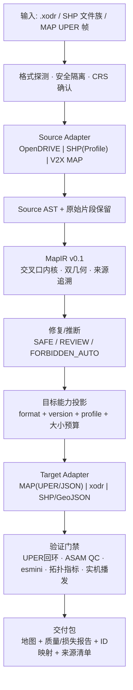

# 地图格式转换工厂：首批 OpenDRIVE / SHP / V2X MAP 落地方案

> 版本 v1.26（2026-08-14）· 见下方 v1.26 变更；以下为历史记录。
>
> **v1.26 变更（同日，正式 G8 双向车道保真闭环）**：① 新增来源 lane manifest、目标 occurrence/component、结构化 gate result、版本化 policy、sidecar、交付决策与机械校准流程；G8 使用 provenance 显式对应来源/目标 lane，并同时审计 source→target、target→source、端点、停止线、覆盖率与离群点，禁止相邻车道用“全局最近面”掩盖绑错。② 修复 MAP 跨 region 出口串绑、端点支持域压缩、SHP 非等距采样漂移、via G2 apron 冒充实测、taper 不可比区间、跨 span 错配、稀疏折线相对弯曲参考线的错误线性 `d(s)` 等真实缺陷；所有不可比区间显式 exclusion，来源 lane 仍进入完整 manifest 分母。③ 机械校准由 1298 项违规收敛到 0；calibration 8 文件/449 lanes 与 locked-validation 6 文件/320 lanes 均零 ceiling 违规，未提高或临时覆写阈值。候选 policy 经语义审查后激活为 version 1.0，语义 SHA256=`3409f658101c7550ffa1481a12f5ceade5173ac8d60a249f312b5caa71d58b15`。④ **终态实测**：金凤 7 路口 × MAP/SHP 两管道共 14 文件 G1–G8 与 esmini 全部 PASS；pytest 66/66；14 张统一视角拼图人工检查通过。⑤ 三轴状态严格分离：本版本完成的是技术门禁闭环；金凤 CRS 仍仅为 `internally-consistent`，因此 14 个样本的生产交付决策继续以 `crs_not_absolutely_verified` 为由 BLOCKED，禁止把 G8 PASS 等同于交付放行。⑥ **发布后独立复验与补正（同日）**：重跑 pytest、`closed_loop.py`、`closed_loop.py --no-regen` 与校准脚本，结论与上述一致（14/14 G1–G8 + esmini PASS、双 split 各 0 违规、56 个 sidecar 严格 JSON 且 policy hash 全一致、CLI 非 DELIVERABLE 退出码 2）。复验暴露 `scripts/calibrate_g8.py` 两个流程缺陷并已修复：policy 提升为 active 后该脚本会误报 `source_policy_not_draft` 且**删除候选证据文件**；现区分 `calibrate`/`verify` 两种模式，verify 模式对 active policy 做只读复验、绝不写删候选，且回归仍会 FAIL（新增 2 项测试，pytest 66→68）。draft policy 未入库但可从 active 无损复原（去 `calibration.promotion`、`lifecycle=draft`、`version=1.0-draft`），复原 SHA256 与 `promotion.source_policy_sha256` 实测一致。
>
> 版本 v1.25（2026-08-14）· 见下方 v1.25 变更；以下为历史记录。
>
> **v1.25 变更（同日，用户要求先解决“不能靠极小段拼接完成平滑”）**：v1.22 的 G7 仍有漏洞——它只约束段长中位、曲率翻转与宽松 jerk，实测仍放过普通道路 0.667m 的几何段；`fit_leg_refline` 的半成品 fallback 在无合格解时还会返回“相对最好但仍超限”的候选。现改为：① **普通 leg 最短段硬门禁 ≥3m**，紧凑 junction connecting road 也不得 <1m；同时 leg 约束来源顶点偏差 ≤1.5m、|κ|≤0.04（R≥25m）、|dκ/ds|≤0.0045、曲率变化符号翻转 ≤8 次/100m；② 候选搜索只有同时通过全部硬条件才允许停止，最终再次执行后置检查；无可行解抛 `ReflineFitError` 阻断，fallback 仅用于诊断，禁止交付；③ 修正 SHP 同名 ROADLINK 拼链的连接端切向计算，并以**完整 ROADLINK 为单位**识别是否绕过街角；删除最多静默裁 25m 源线的 `_trim_far_spikes`，不再通过删点“修漂亮”；node13 的坏尾段因此在 ROADLINK 边界停止，而不是裁源几何；④ G7 直接审计最终 xodr 的最短段、sharpness、flip 与 jerk；⑤ writer 为车道写入 `mapforge.source_lane` provenance，新增按来源 lane 对应比较的保真诊断及绑错故障注入测试，替代“到全路面最近距离”掩盖相邻车道错误的做法；⑥ Profile 对拍从脆弱的“XML 差异数 ≤8”改为语义契约：只允许救回源 `WIDTH=0`，已有宽度不得改写，边界传播只能落在受影响/相邻 section。**实测结果**：14/14 文件通过 XSD、planView、全网 G2、断面、换乘、新 G7 与 esmini；普通道路各文件最短段均 ≥3m（全局最坏约 3.2m），全量 pytest **44/44 PASS**。
>
> 版本 v1.24（2026-08-14）· 见下方 v1.24 变更；以下为历史记录。
>
> **v1.24 变更（同日，用户"全连接/默认连接填满空隙，路口需要支持这种模式，因为地图本来可能就有问题"）**：**转向补全模式 `--connect-mode`**（`ops/junction_fill.py`，两管道 + CLI 共用）。动机成立且有实锤：源车道拓扑确实会缺录/失配（IBD TOPO 上游缺录、MAP connectsTo 引用不存在的 node——NODE5 west lane2→20701 至今 skip=1），此时路口会缺转向、内部留空。三档：① **`data`（默认）**——仅源数据，"不发明拓扑"仍是默认立场，不改变既有交付行为；② **`default`**——按车道在断面中的位置补它**应有而缺失**的转向（最左→左转、最右→右转、其余→直行）；判"已有转向"用**几何分类**而非数据字段（字段正是可疑的那个）；③ **`full`**——全连接，每条进口车道 → 每个非掉头出口腿的每条车道，治整片缺录并把路口铺满行车带。补出的连接一律标 INFERRED（`stats.conn_filled`），几何走与数据连接**同一套** G2 回旋链，并受**曲率守卫**约束（|κ|>0.125 即 R<8m 判为不可行转向，丢弃并计 `conn_fill_skipped`）；掉头默认排除（`--allow-uturn` 打开）。**全量实测（14 文件）**：default 补 12 条 / 拒 7 条，full 补 759 条 / 拒 77 条，**两档门禁零降级**（XSD/planView/κ=0/断面台阶/换乘 0.0cm 全过）；esmini 独立行驶抽检 4 文件全 PASS（96–116 对换乘缝隙 0.0cm、零跳变）。pytest 升 37 项（新增三档行为门禁：data 档 conn_filled 必须为 0）。
>
> 版本 v1.23（2026-08-14）· 见下方 v1.23 变更。
>
> **v1.23 变更（同日，用户"补齐为啥不是路/验收和道路不一样"）**：**路口铺面材质与验收统一**。① **lane type 渲染逐类型隔离实测**（此前在一张拼图里目测，结论记反了）：生成 11 个单类型测试文件、顶视截帧、采中心像素——`driving/restricted/shoulder/parking/stop` = 沥青 (83,83,75)；**`none/border` = 浅灰 (125,125,113)**；`curb/sidewalk/biking` = 混凝土 (170,170,154)；`median` = 绿化 (70,139,88)。铺面此前用 `none`，故渲染成浅灰补丁——改用 **`restricted`**（沥青色，且规范语义正是"铺装路面但不可行车"），路口内部与进口道同材质无缝（实测 84,84,76 vs 83,83,75，差值仅光照）。② **铺面纳入验收**：`audit_file` 的断面台阶检查去掉"仅非 junction road"过滤，改为覆盖**所有** road——铺面也是交付路面，不因"不可行车"免检（实测 0.3–0.7cm，达标）；连接路单 section 天然无贡献。③ 关于"全连接/默认连接填满空隙"：**多边形铺面已 100% 覆盖路口内部**（截图实证无空隙），且全连接会**发明数据中不存在的转向**（违反"不发明拓扑"硬约束、下游会读出违法转向），故不采用；如需可行车全连接，另设显式开关并标 INFERRED。终态：七门禁 14/14 PASS、pytest 36 绿。
>
> 版本 v1.22（2026-08-14）· 基于《自动驾驶地图格式转换工厂：调研与落地方案》总体架构收敛而来，聚焦首批三格式的可执行方案。
> 开源/商业选型部分来自 2026-08-13 当日的在线调研，均附来源。
>
> **v1.22 变更（同日，用户质疑"是不是极小段拼接达到平滑？那会影响自动驾驶车辆"）**：**段长与曲率蛇行治理**——质疑成立，实测确认 SHP 侧曾是碎段拼接（中位段长 1.6–1.9m、50.3% 的段 <2m、node18 单路口 684 段）。① **判据先立**（`validate/smoothness.curvature_quality/curvature_audit`）：段长只是辅助指标，真正伤害规划/控制的是 **sharpness(dκ/ds) 高频变号**（方向盘微抖）与**侧向 jerk v³·dκ/ds**；leg 按 60km/h、conn 按 30km/h 计。② **曲率域段精简 + κ 去噪**（`refline_fit.simplify_planview`）：在 (s,κ) 曲线上中值+均值去噪后做 Douglas–Peucker 简化，重建为有物理长度的 line/arc/clothoid；优化目标 **先最少变号、再最少段数**；平滑窗**从小到大够用即止**（大窗优先会把真弯抹平）；短段吸收 `_absorb_short_segs` 每次合并都用对原始顶点偏差兜底——**不能在曲率图上直接删控制点**（那等于改 ∫κ ds，航向随即漂移，实测偏差爆到 30m）。③ **G2 成为无条件承诺**（`weld_g2`）：g2ify 的"解失控保持 G1"分支会留残差，简化时零长度阶跃被原样跳过 ⇒ 断差穿透（实测 8e-3~3.3e-2）；焊平后 14 文件 κ 断差回到 0.00e+00。④ 连接路：桥切口下限 3→8m（切口太小把 SolveG2 三段桥压成 1.6m 碎段）+ 最少段优先（整条转弯若能用一条 3 段 G2 链且偏差 ≤0.5m 就用它）。⑤ **走过但走不通的路**（诚实记档）：曲率剖面直接重建（离散曲率→去噪→RDP→clothoid 链 + Kabsch 刚体配准）——即使关闭短段合并，最好也只有 1.5–2.0m 偏差，因曲率误差经两次积分放大成位置误差；要压下去需非线性最小二乘精修，代码已删除不留死路。**成绩（14 文件全量）**：段数 3752→2089（−44%）、**<1m 段 7.8%→0.0%**、<2m 50.3%→3.1%、中位段长 2.00→4.20m；leg 蛇行 18–24→0–11.5 次/100m、leg jerk 667–1290→0–149。闭环升为**七门禁**（新增 G7 曲率品质）14/14 全 PASS，pytest 36 绿，视觉 14 张目检过。
>
> **v1.21 变更（同日，"MAP XML 转 xodr 也要达到同等效果"）**：**MAP 管道补齐到 SHP 同等横断面**。此前 MAP 侧是"常量宽度 + 单点实测放置 + 单 laneSection"，现改为：① **站点网格多 laneSection**（≈30m；相邻段共享站点边界 ⇒ 断面天然连续，无需事后调和）——金凤实测每路口 8→34 段；② **实测轮廓跟踪**：车道点列沿参考线投影成 (s,d) 轮廓、站点端点局部线性回归取值+斜率、边界=相邻实测中心的中点、宽度/laneOffset/median 全 Hermite + FC 限幅（与 SHP 侧同一套机制，`fc_clamp` 提到 `refline_fit` 共享）；③ 车道 `<speed>` 逐段落盘（node4 由 0→173 条）。**三个由此暴露并修掉的真问题**：（a）**按点列覆盖判定车道存在性**——MAP 车道点列覆盖范围不同（实测：进口 lane1/4 只覆盖近路口 272–336m 段 = 口部展宽车道；出口 lane1 只覆盖远端 0–160m = 下游才加出的车道），此前一律"最近值外推"把只存在于远端的出口车道摆进了路口口部、落进对向幅（重叠 2.9m）；改为覆盖外写 0 宽（相邻站点间自然锥形收放）后重叠降至 0.12m，并识别出 15 条展宽/加出车道；零宽端不写车道衔接（与 SHP 生灭车道同语义）。（b）**出口瞄准必须取 written 链**：median 被钳到 0 时写出堆叠整体外移，连接路瞄准点须跟随写出值而非原始实测（否则错开一个车道宽）；口部零宽的目标车道自动改瞄最近实存车道。（c）**`simplify_planview` 后必须统一 G2**：段精简/短段吸收会留 8e-3~3.3e-2 的 κ 残差（此前只在精简失败时才 G2 化，导致 SHP 侧 7/7 的 G3 回归）——改为精简后 `weld_g2` 焊平（不增段、护住段长中位；用 g2ify 会把 node18 中位段长从 3.9m 压到 2.9m 触发 G7），未精简的大阶跃仍走 g2ify 插过渡段再焊平。另修 esmini 探针起点：口部展宽车道在远端零宽，从零宽处起步会被归到邻道（量到的是探针错误而非地图缺陷），改用 `RM_GetLaneWidthByRoadId` 找到车道真正存在的最小 s 起步。**终态：七道门禁（+G7 曲率品质）14/14 全 PASS、pytest 36 绿、视觉扫描 14 张目检通过**。
>
> **v1.20 变更（同日，/goal"多截图多检查不自以为是"）**：**视觉全扫描协议 + Hermite 单调限幅**。① `scripts/visual_sweep.py`：14 文件 × 4 机位（动态顶视/两对角透视/低位沿路）odrviewer 无窗截帧拼图（out/preview/sweep/），逐张目检为常规验收环节——门禁数字全绿≠视觉合格，两者都过才算数。② 本轮目检结论：7+7 全部无空洞、无锯齿、无合成摆动；NODE5 双黄线 S 弯经源数据叠画核实为**数据本形**（源车道线自身交织换位的借道段）；叠画时发现的"边缘小钩子"经复核为**叠画脚本自身的索引拼接假象**（车道数变化处把不同物理边界按序号硬连），审计一对一匹配与 odrviewer 渲染均无此物——自检工具也要被自检。③ 预防性修复：轮廓 Hermite 全部加 **Fritsch–Carlson 单调限幅**（`_fc`，宽度/laneOffset/median 段内不过冲）。闭环六门禁 14/14 全 PASS、pytest 36 绿保持。
>
> **v1.19 变更（同日，用户"边缘不是道路形状/还有空洞/做到 SHP 的样子"）**：**实测轮廓跟踪横断面 + junction 铺面**。① 横断面从"标量宽度堆叠"（每车道仅 S/E 两值，边缘是合成的）升级为**实测轮廓跟踪**：每车道全程 (s,d) 投影轮廓、每 section 端点**局部线性回归**采样（中位数在扇形段有一阶偏差会撕开边界）、车道边界=相邻实测中心的中点、宽度/laneOffset/median 全 **Hermite（值+斜率）**写出——xodr 边缘逐点贴合 SHP 车道线实测形状（港湾/展宽按真实轮廓呈现）；交界调和（匹配车道两侧端点值/斜率/宽平均）+ 写出层硬连续（下段起值:=上段末值）。**排查中揪出 v1.18 埋的 bug**：衔接坡度上限误伤生车道锥形（born 路径 w0=0 落进钳制分支，3.35m 张开被钳到 0.93 而记账按 3.35 → 下段 2.4m 隐形台阶）——born 独立成支后断面台阶全归 0.000。② **junction 铺面**：esmini 实测 outline `<object>` 不渲染为面（替身盒）→ 改**铺面 road**（参考线沿多边形 PCA 主轴、单条 type=none 车道宽度轮廓逐站扫掠、无标线沥青面、不入拓扑不寻路）；SHP 侧用 **IBD 交叉口面实测多边形**（数据本义），MAP 侧连接路几何凸包 +2.5m（INFERRED）——路口内部不再露底。lane type 渲染实测记档：none/border=沥青、restricted=浅灰、median=绿化带。**闭环跑分六门禁 14/14 全 PASS（断面台阶全 0.000）**；pytest 36 绿（铺面计入路数断言）。
>
> **v1.18 变更（同日，/goal"全流程闭环+平滑达标"）**：**全网 G2 + 闭环跑分门禁全绿**。① `refline_fit.g2ify_planview`：line-arc/G1 spline 结点两侧开窗切除，**SolveG2（Bertolazzi–Frego 三段回旋线）精确重连**——两端位置/航向/曲率全匹配、下游零漂移（端点漂移实测 1e-10 量级）；短段（<1.25m，样条链常见）整段吞入过渡窗、右侧贪心跨段扩展、双趟迭代；挂入 `fit_leg_refline`（两管道 leg）与连接路中段/回退拟合。v1.13 起记档的"line-arc G1 设计点"（Δκ 至 0.1，v²Δκ 侧向加速度阶跃）就此消除——**14 文件参考线结点曲率断差全部 0.00e+00**。② 桥守卫升级：SolveG2 病态"猪尾巴"解（近退化端位姿下 |κ|≈1.8、R=0.55m 小回环，node18 实锤）——桥内 |κ|>0.5 拒绝 + 切口放大重试阶梯（×1/×2/×3）+ 次级纯 G2 合成回退（端点仍精确）。③ **`scripts/closed_loop.py` 闭环跑分**：再生成 14 文件 × 六道门禁（XSD / planView 位姿 / κ 连续 <1e-6 / 断面台阶 <5cm / 换乘 <1cm / esmini RM 独立行驶）——**全部 PASS**；G2 与台阶门禁锁入 pytest（36 绿）。odrviewer 截帧确认 node18 弯道全程顺滑。
>
> **v1.17 变更（同日，odrviewer 实证第二轮"不流畅+有空的"）**：**对向幅覆盖连续化 + median 全程 C1 样条**。诊断手段升级：headless odrviewer 截帧（`--headless --capture_screen`）直接拿 esmini 自家渲染定位——细脖子/轮廓鼓包 = 对向 span 覆盖开天窗（拼链空档、远端漏斗、2m 微 section 陡锥）。修复四件：① 对向 span **内部空档/重叠全部中点缝合**（对向幅物理连续，不得开天窗）；② **两端断面保持外推**（远端补到 s=0、路口端补到 L；`left_extended_m` 记账，APPROXIMATED）；③ **median 从"逐 span 常数+衔接"改为对向内边缘全程单调 C1 样条**（Fritsch–Carlson + Hermite 逐段写出；知识点：用**边缘**不用中心建样条——数据车道链几何连续，中心 d 与宽度在 span 界各自跳而边缘不跳）；④ leave 边界 6m 稀疏化（微 section 会把锥形压成陡坡）。审计器断面匹配先去重零宽车道的重复边界（消幻影台阶）。**终态：金凤 14/14 esmini 全 PASS——换乘缝隙 0.0cm、随机行驶零跳变（node18 也过）、断面台阶全 0**；odrviewer 顶视/透视截帧确认街道全宽连续、双黄+绿化 median、车道线平顺；pytest 36 绿。
>
> **v1.16 变更（同日，用户裁决"严格按 OpenDRIVE 定义，scenariogeneration 不好用就不用"）**：**双侧道路模型 + 自研规范级 writer**。① 道路模型重构为规范做法——一条街一条 leg road：参考线沿进口幅中心，进口车道挂右侧（-1..-n）、对向出口车道按实测横距挂左侧（+1..+n，行车逆 s）、两幅间实测间隙写 **median 车道**（宽可为 0、两端各测沿 s 插值）、中线双黄（solid solid）；进/出口链按端点位姿+方向自动配对成腿，配不上的退化单侧 road（合法形态）；出口连接路接 leg road 的 **END 接触点**。SHP 侧对向链边界投影到进口参考线合并断面（1.5m 吸附/8m 路口侧放宽）；MAP 侧出口（real 实测/mirror 镜像/real 无点列堆叠）并入 leg 左侧。② **弃用 scenariogeneration**（无车道 speed、凭空发空 profile、衔接自动推断冲突），自研 `adapters/opendrive/writer.py`：1.5 语义逐项对照 XSD（lane 子元素序 link→width+→roadMark→speed、左侧 id 降序、rule=RHT、junction/laneLink），**geoReference 落盘 PROJ 管线**（球面 eqc，CRS 硬约束 3），车道限速/标线原生写出，后处理补丁（_strip/_inject）废除。③ 三项消费级修复：**leg 参考线曲率封顶**（|κ|>1/30 的中段折角=数字化噪声——实锤 node4-west 链 s255-298 有 R=10m 级振荡微螺旋，双侧模型下 1−tκ→0 致车道中心驻点/回卷、esmini s 跳 80m；渐进滑动平均重拟合，偏差仍对原始顶点报告）；**衔接坡度上限 0.10 m/m**（断面重划分差量跨 section 传递消化，written 末宽链）；对向覆盖预算对齐进口长度（少留"全幅漏斗"）。④ 验证器/渲染器全面双侧化（smoothness 多段 width+左侧边界+contact-end 换乘、cross_edges_at 全断面、rm_check 车道锥形带豁免——左侧"出生点"逆行到头=并线，非缺陷）。**终态：金凤 14/14 XSD PASS、planView 0 违例、esmini 独立标尺换乘缝隙全 0.0cm、行驶 13/14 零跳变**（node18 出口幅横断面重划分带 ~12m 内横摆 1.1 m/m，面连续无缝，数据本义记档）；pytest 36 全绿。
>
> **v1.15 变更（2026-08-14）**：**odrviewer 实证驱动的表面连续性修复**（用户 esmini 顶视截图暴露"镂空+不平滑"）——① 生/灭车道 20m 锥形收放：数据按 Link 粒度瞬现/瞬失，直写会在外缘留 1.8–4.3m 矩形缺口（金凤 48 处，APPROXIMATED 记账）；② 断面重划分处匹配车道起宽与上段末宽衔接（Σ宽连续，node18 0.65m 外缘台阶闭合）；③ 变宽全部 smoothstep 化（两端零斜率，边缘 C1 无折角）+ laneOffset 样条单调限幅（Fritsch–Carlson，消过冲摆动）；④ 默认标线：中线实黄/车道间虚白/外缘实白（MARK_TYPE 权威枚举未消费前的通行画法，APPROXIMATED；junction 连接路不加）；⑤ 审计器升级多段 `<width>` 求值（旧读法只取第一段、外推报幻影缺口）。**esmini RoadManager 独立验证 14/14 PASS**（对齐 v3.6.0 真实 ABI：id_t=uint32/double 参数/出参取车道 id，旧 float 签名喂垃圾且致 DLL 段错误）：全部换乘缝隙 esmini 自算 0.0cm、随机行驶零跳变；两类非缺陷事件归类为消费策略——junctionSelector"借道"（随机挑中别车道的连接路）与"灭车道并线点"（车道收拢归零无后继，探针不并线按同 ID 硬映射）。新增 `scripts/xodr_topdown.py`（填充俯视渲染）、`scripts/xodr_diag.py`（接缝/斜率/张口/过冲定位）、`scripts/gen_all.py`（7 路口两主线批量再生）。查看建议：odrviewer 加 `--ground_plane`；junction 内部与中央分隔带的露底属车道带模型语义（非缺陷）。
>
> **v1.14 变更（2026-08-13）**：**换乘连续性构造性归零**——SHP 连接路两端 G2 桥精确对接进口/出口车道的文件语义堆叠位姿（中段保留实测几何）；laneOffset 升 C1 三次样条；新增虚拟行车验证器（`route_continuity`，按仿真器消费方式复算换乘路径）。金凤 7/7 实测：**换乘两端位置跳变 0.0cm、航向差 0.00°**（pytest 门禁 <1cm/<0.1°）。
>
> **v1.13 变更（同日）**：**平滑度审计器落地并修三缺陷**（`validate/smoothness.py`：曲率跳变/断面台阶/接缝闭合三层度量）——spline 档近重复顶点退化微回旋线（κ=22）熔断、参考线延伸至车道端点、濒死车道零收口（断面台阶全归 0）。记档两项表达极限：斜停止线 ±1.9m 纵向错位与口部车道扇形分离 ≤1m（xodr 相邻堆叠模型限制，连接路以真实几何吸收）；line-arc 交界为 G1 设计点（与 Town03 基线一致），G2 化列正式化项。
>
> **v1.12 变更（同日）**：**两条 xodr 主线打磨定稿**——方向 5：多 laneSection（同名跨车道数拼链，每源 Link 一段：S/E 线性变宽 + 分段 laneOffset 连续 + 跨段车道一对一衔接；金凤实测进口路 2→4 车道完整演化入模）；两管道逐车道限速写出（SHP MAX_SPEED / MAP vehicleMaxSpeed×0.072）；**CLI 默认 SHP 源切 Profile 引擎**——宽度阶梯实测从边界救回 WIDTH=0 脏数据（超集契约测试固化"引擎优于内置"）。真实数据验收：双向 7/7（+合帧）XSD 全 PASS、连续性 0 违例。
>
> **v1.11 变更（同日）**：**方向 6 出口路两级来源 + 全接缝平滑**——① 多节点 MAP 帧（相邻路口合帧）中，邻居节点"上游=本节点"的 inLink 即本路口**真实出口路**，优先直用（EXACT/TRANSFORMED）；镜像降为单节点帧兜底（INFERRED）。② 平滑：连接路起止位姿取路模型端部（消停止线折角）、SolveG2 传两端车道级曲率（κ/(1−tκ) 修正）——**全接缝 G2，实测曲率差 0.000000**。③ **5.7 拟合器落地 spiral 档**：稀疏链 G1 clothoid 顶点插值（Bertolazzi–Frego G1Hermite），修复抽稀长弦点列上缓和曲线被误拟为直线+圆角链（顶点偏差 1.69→0.00）；择优判据统一为对原始顶点偏差（抽稀保留点=真实路面点，弦垂距不受罚）。
>
> **v1.10 变更（同日）**：**方向 6（MAP→OpenDRIVE）junction 自动脑补落地**（`ops/map_to_xodr.py` 重写）——出口方向 = connectsTo remote 回查进口 upstreamNodeId、出口路 = 进口 Link 左偏镜像（INFERRED）、连接路 = 车道级 G2 clothoid、进口车道实测放置。金凤 7/7 connectsTo 覆盖 95/96（XSD 全 PASS、连续性 0 违例）；唯一 skip 为已知 ID 失配引用——**设计裁决：失配引用诚实 skip，不得用几何猜测掩盖数据错误**。手动 `--connect` 通道退役。
>
> **v1.9 变更（同日）**：**3.2 的 SHP Schema Profile 引擎实装**（`adapters/shp/profile_source.py` + `profiles/shp/*.yaml`）——用户改 YAML 字段映射即接新图商，双几何路线（A 车道中心线+宽度字段 / B 边界线+左右关系合成）、宽度四级阶梯（field→boundaries→spacing→default，非 field 记 APPROXIMATED）、可选层全降级；CLI `profile-init`/`profile-check`/`convert --profile`。证据：IBD YAML 与内置读取器产物去时间戳逐字节全等；边界推宽恒宽误差中位 14mm（变宽车道差异为数据真相）。字段别名词典/推断向导仍待第二家交付。
>
> **v1.8 变更（同日）**：**方向 5（SHP→OpenDRIVE）直转落地并修正一处架构违规**——此前 CLI 把 SHP→xodr 借道 SHP→MAP→xodr 实现（空口消息当中间表示，附录 D 抽稀/单一均宽/无 junction），已改为 `ops/shp_to_xodr.py` 直转：ROADCENTER 中心线同名拼链 + 偏差驱动升级档拟合、laneOffset 按车道实测横向位置、每车道真实宽度、完整 junction + 连接路实测几何 + laneLink + 前驱后继。金凤 7/7 路口 213 条连接路全实测几何，XSD 1.5M 全 PASS、连续性 0 违例。**架构裁决固化：MapNode（空口消息模型）不得客串富格式间的中间表示**；经 MAP 的 xodr 路径仅保留给"源本来就是 MAP"的还原场景。新增《接入指南-新图商SHP数据需求与Profile》（字段差异四步流程 + 数据需求分层表 + 最小可转集）。
>
> **v1.7 变更（同日）**：**定位澄清：mapforge 是纯离线工具**——"RSU 实机播发验证"从工具里程碑验收中移出，重定义为**交付级可选验收**（FusionTest 侧对交付包的消费场景，方案 8.1 门禁⑤/9 节协同项，不阻塞工具里程碑）；M0 验收口径改为离线闭环（UPER 回环 + 现网样例对拍 + 拓扑/连续性/XSD 门禁）——**按此口径 M0 宣告完成**。
>
> **v1.6 变更（同日）**：M0 四项无依赖作业完成（《M0作业报告-ASN编译与数据核验》）——消息层 ASN.1 提取编译通过 + UPER 回环 PASS（原 M0 前置彻底闭环）；7 路口 GeoJSON 落地；ID 台账草案生成（24 失配引用待人工裁决）；**CRS 核验：SHP↔MAP 同源同系（H0 全胜、多路口逐点重合），GCJ02 假设被否定，crs_integrity 升级 internally-consistent**；重要推论：金凤 MAP XML 即由 IBD SHP 生成（SHP→MAP 存量先例实锤）。
>
> **v1.5 变更（同日）**：Spike A/B/C 实施完成（《Spike报告-参考线拟合验证》）——**5.7 拟合路线验证通过**（Town03 真值回拍：类型零漏检、半径误差中位 6–15%；node16 端到端 XSD PASS + 连续性 0 违例；全局位姿优化确认为必需环节）；**重大数据发现：IBD 的 CURVATURE 字段核验不通过**（150 条批量核验与几何不相关），曲率先验降级、字段核验升级为强制门禁步骤；pyclothoids Windows wheel 实测可用。
>
> **v1.4 变更（同日）**：新增 7.5 自动化闭环与人工介入形态——技术闭环全自动成立；交付闭环冷启动仅三个人工决策点（皆为安全/运营红线而非技术欠缺），同站点再生成 100% 无人值守；人工介入按"决策文件契约 → 轻量标注页 → 不自研几何编辑器"三层收敛，人工介入率纳入质量报告。
>
> **v1.3 变更（同日）**：5.7 的实现文献与先例调研落档（《参考文献-参考线拟合与OpenDRIVE生成》，逐条在线验证）——pyclothoids(MIT)/Clothoids(BSD-2) 许可证已核可直接入库；junction 连接路证实 scenariogeneration `CommonJunctionCreator` 内部即 pyclothoids SolveG2→三段 spiral，现成可用；选型增补 JunctionArt(MPL-2.0) 参考实现；"MAP→OpenDRIVE 零先例"经三轮检索再确认（方向 6 首创性）。
>
> **v1.2 变更（同日）**：新增 5.7 参考线拟合与平滑度——解剖 CARLA Town03 确立"平滑"的技术定义（road 内多段参数几何 + G1/G2 连续，而非避免短段），确定两档拟合 Profile、**线形保真约束**（曲率域还原设计线形三元素、逼近样条防噪声假弯、IBD 实测曲率量化验收）与门禁；详见《评审-OpenDRIVE平滑度与参考线拟合路线》。
>
> **v1.1 变更（同日）**：消化 `F:\MapFactory` 新资料后的重新规划——IBD 规格 SHP 真实交付（44 图层，重庆金凤）、消息层标准送审稿 docx、TCI 一致性测试 ASN、7 个真实路口 MAP XML、既有 xml2xodr 内部链路、OpenDRIVE 1.4H/1.5M XSD。事实细节见《资料盘点-金凤示范区数据与标准资料》。主要影响：M0 前置依赖解除并重定义第一批工程作业；SHP Profile v1 落定为 IBD；MAP→OpenDRIVE 由 P2 上调 P1；写出版本策略覆盖 1.5；ID 台账清洗升为紧急作业；黄金测试集改以金凤 7 路口为主。

---

## 0. 摘要（一页结论）

**产品定义**：面向车路协同与自动驾驶的**语义地图编译工厂**——源格式 → 统一中间表示 MapIR → 目标格式/版本/Profile，每次转换强制输出质量报告、损失报告、ID 映射与来源清单。**首批以"交叉口"为第一公民**。

**首批三格式的本质**：这不是随机的三个格式，而是恰好覆盖了三个互不相通的生态：

| 格式 | 所属生态 | 数据模型 | 存在形态 |
|---|---|---|---|
| OpenDRIVE | 仿真 / HD 地图交换 | 参数化连续道路模型（参考线+多项式） | 文件（XML） |
| SHP | 测绘 / 图商交付 / GIS | 分层要素模型（几何+属性表），**无统一 Schema** | 文件族（.shp/.dbf/.prj…） |
| V2X MAP | 路侧广播 / 车路协同运行态 | 以交叉口为中心的 Node-Link-Lane-Connection 消息模型 | **空口消息**（ASN.1 UPER，有大小预算与播发周期） |

**六个转换方向的优先级结论**（详见第 3 节）：

- **P0**：SHP→MAP（量产主线）、OpenDRIVE→MAP（仿真/测试主线）、MAP→GeoJSON/SHP（验证回环+可视化）
- **P1**：OpenDRIVE→SHP（采样导出，简单）、SHP→OpenDRIVE（需曲线拟合，REVIEW 级）、**MAP→OpenDRIVE（v1.1 由 P2 上调：团队既有 xml2xodr"MAP 还原"链路证明业务需求真实存在，且现状产物无 junction/无高程/不可复现，替代价值明确）**
- ~~P2：MAP→OpenDRIVE~~（已上调 P1；"仅能出骨架"的信息量判断不变，定位为仿真可视化/场景底图级产物）

**关键判断**：

1. "SHP" 必须做成 **Schema Profile 机制**（按图商/项目定义映射模板）。~~第一版 Profile 必须基于一份真实交付样例定义，这是当前最大的外部依赖~~（v1.1：样例已在手——IBD 规格 44 图层真实交付，Profile v1 = ibd-smarteditor-v1，该外部依赖解除）。
2. V2X MAP 是唯一以"消息"存在的格式：转换器必须管理 **UPER 编码大小预算、region/node ID 分配台账、与 SPAT 的 phaseId 关联**——其中 phaseId 绑定属于 FORBIDDEN_AUTO（禁止自动推断），必须由配时表输入或人工标注。
3. 本团队独有优势：**FusionTest 已具备 RSU/OBU/MEC 实测能力**，feature 分支的感知消息 `map_location` 已引用 MAP 的 `region_id/node_id/upstream_node/lane_id`——转换工厂产物可以直接进"实机播发→终端解析→融合定位"的 HIL 验证闭环，这是市面上任何转换工具都不具备的交付标准。
4. 技术栈 Python 优先（与 FusionTest 团队栈一致），几何重活复用成熟 C/C++ 库（GDAL/PROJ、libOpenDRIVE/esmini）。
5. 调研双确认（2026-08）：**市面不存在任何 OpenDRIVE/SHP→MAP 的自动转换工具**——开源与商业均无，现有 MAP 制作全靠人工 GUI（美国 ConnectedVCS ISD、Commsignia Central、Yunex Map2x）；"车道级 SHP→OpenDRIVE"同样是开源空白；国内 V2X 厂商也几乎没有公开的 MAP 制作工具产品。**这两个自研模块就是产品的价值主张，且竞品压力小。**
6. **（v1.1）本地资料已到位并完成消化**：① IBD 规格车道级 SHP 真实交付（44 图层，重庆金凤，**含显式车道拓扑表**）——SHP Profile v1 的定义样例（原第一外部依赖解除）；② 消息层标准送审稿 docx（五消息全部 ASN.1 代码块在文中）——原 M0 前置"购买标准正文"解除，改为"从 docx 提取拼装 ASN.1"工程作业；③ 7 个真实路口 MAP XML（XER 风格播发快照，自带现网 phaseId 绑定结果，但 **ID 体系混乱实锤**，须先台账清洗）；④ TCI 一致性测试控制协议 ASN（非消息层本体，作核对参照 + FusionTest 侧资产）；⑤ 既有 xml2xodr 链路的经验与反面教训。**首批开发的外部依赖只剩：配时表获取形态、IBD 字段枚举权威文档。**

---

## 1. 范围与定位

### 1.1 首批范围

| 方向 | 内容 |
|---|---|
| 读 | OpenDRIVE 1.4–1.8（1.9 先保真解析不承诺语义）、SHP（Profile 驱动）、V2X MAP（**UPER 二进制 + XER 风格 XML 明文 + JSON 视图**，v1.1：现网工具链实际流通的是 XML 明文，必须一等公民支持） |
| 写 | V2X MAP（UPER + XML + JSON + GeoJSON 预览）、OpenDRIVE **1.5/1.6/1.7**（按消费者 Profile 选版，v1.1 增补 1.5）、SHP/GeoJSON |
| 暂不做 | Lanelet2、Apollo、SUMO、NDS 等（MapIR 设计时预留，见 4.6） |

> 版本依据（2026-08 调研）：OpenDRIVE 最新正式版为 1.9.0（2026-05 发布），但工具生态实际停留在 1.4–1.8——官方质检器 qc-opendrive 支持 1.5–1.8，RoadRunner 导入/导出 1.4–1.8，Python 写出器 scenariogeneration 对齐 1.7.1，CARLA/SUMO 事实基线 1.4。**输出默认 1.6/1.7，1.9 暂不作目标。**
> （v1.1）本地证据：仓库存有 VIRES 官方 OpenDRIVE 1.4H（2015）/1.5M（2019）XSD，既有 xml2xodr 链路输出 revMinor=5——**团队现有消费端基线是 1.4/1.5**，故写出目标增补 1.5 Profile（scenariogeneration 支持指定版本号；1.5 与 1.6 语义差异集中在 header/junction 细节，写出器按 Profile 降级），两份 XSD 纳入 validate/ 门禁资产。

### 1.2 "V2X MAP" 的定义（v1.1：假设已证实）

V2X MAP 指**中国 C-V2X 应用层标准的 MapData 消息**（T/CSAE 53-2020 / YD/T 3709 体系），UPER 编码，由 RSU 周期广播。v1.0 时为假设，v1.1 已被本地资料直接证实：

- `F:\MapFactory\v2x_map_xml\` 存有《基于LTE的车联网无线通信技术 消息层技术要求》**送审稿 docx**（YD/T 3709 定稿前文本）：MessageFrame 五消息（BSM/MAP/RSM/SPAT/RSI）、全部数据帧/数据元素定义与 ASN.1 代码块齐备，其 DF_Movement 释义明文"相位ID事实上也是MAP消息与SPAT消息的唯一关联"；
- 同目录 7 个重庆金凤真实路口的 MAP 消息 XML（MessageFrame>mapFrame 的 XER 风格单帧快照，region=500）；
- FusionTest feature/20260429 分支中，MEC 感知消息（msg_type 2011）的 `map_location` 字段为 `{lane_id, node:{node_id, region_id}, upstream_node:{node_id, region_id}}`——正是该体系 MAP 的 Link 标识方式；
- 公司业务为国内车路协同设备测试。

（v1.1 新增）**现网方言事实**（v2xmap adapter 的兼容目标，详见《资料盘点》三.3）：点列全部使用 position-LatLon 绝对坐标分支而非偏移编码；高程缺失或为占位值；movements 层可整体缺失；右转 phaseId=0 表示不受灯控；maneuvers 位串值带空白包裹。

标准基座（2026-08 核查）：消息定义在 **T/CSAE 53-2020 与 YD/T 3709-2020**（现行有效、未被代替），RSU 播发行为由 **T/CSAE 159-2020** 约束；消息层未单独国标化，而是被 GB/T 44417-2024（路侧设备）、GB/T 45315-2025（车载系统）以**引用行标**的方式纳入国标体系——暂无"新国标 MapData"重定义风险。

SAE J2735 MAP（最新 J2735_202409）/ ETSI MAPEM（TS 103 301 V2.2.1）作为后续导出 Profile 预留（第 10 节 M3）。三大体系同为 J2735 血统（中国用 phaseId、美欧用 signalGroup 作 MAP↔SPAT 关联键，几何同为"参考点+偏移点列"），**一套 MapIR 可同时导出三种目标**。**若实际还需支持某厂商私有地图消息（如 MEC 内部 hdmap 配置），作为额外 Profile 增补，不影响架构。**

### 1.3 与参考方案的关系

总体沿用参考方案的架构结论：自研 MapIR 内核 + 开源组件做适配与验证 + 商业工具做人工编辑，**不做两两直转**。本方案的增量在于：

- 参考方案几乎未覆盖 V2X MAP 消息——本方案第 2.3/5 节补齐该领域的模型、约束与算法；
- 将 MapIR 收敛为**交叉口优先的最小内核**（v0.1），避免第一阶段就背上全量 HD 地图模型的包袱；
- 给出与 FusionTest 测试体系的协同方式（第 9 节）。

---

## 2. 三种格式深度剖析与语义鸿沟

### 2.1 OpenDRIVE：参数化连续道路模型

- 参考线（line/arc/spiral/poly3/paramPoly3）+ 车道 offset/width 多项式 + laneSection 拓扑 + junction（incoming road → connecting road → laneLink）。
- **对生成 MAP 最有价值的是 junction**：lane-level 连接关系是显式的，`<laneLink from to>` 直接对应 MAP 的 `connectsTo`；signal/controller 元素可辅助 phase 关联（但工程实践中 xodr 里很少填好信号数据）。
- 必须按 `format+version+profile` 三元组管理（CARLA/RoadRunner/Apollo 方言不同）；1.7+ 版本先做"保真解析+扩展区保存"，不急于导出。

### 2.2 SHP：不是一种格式，是一个"规格族"

SHP 只规定了几何+属性表的容器，**车道级语义完全由交付方的图层划分和字段约定决定**。它在国内路侧生态有明确的标准背书（2026-08 调研）：**T/CITSA 25-2022《交通系统高精度地图服务技术规范》明文将 shp 与 xodr、DWG 并列为交付格式**；北京地标 DB11/T 2041-2022 将自动驾驶地图分为道路级路网、车道级路网、交通标志、交通标线、交通设施五个图层组。工程交付常见图层：车道中心线、车道边线、路口面、停止线、人行横道、标志标牌、信号灯（杆）等——**但没有任何图商公开字段级 Schema，交付实为项目制定制**，这正是必须做 Profile 机制的原因。

容器硬限制（影响高保真交付，验证与容错要针对性设计；**v1.1：右列为 IBD 真实交付中的实证**）：

| 硬限制 | IBD 交付实证（重庆金凤，smarteditor 导出） |
|---|---|
| DBF 字段名 ≤10 字符 | ZEBRA 层 `STOPLINE_R`（截断自 STOPLINE_REL）、`PROVINCE_L/R` |
| 无 NULL、类型贫乏 | `UPDOWN_DIR` 数值溢出写成 `****`；字段宽度全部虚标（C,100/150/254），DBF 空格填充导致 IBD_POSITION.dbf 达 470MB |
| .prj 不准是常态 | 全部 .prj 为自定义 WKT（"My geographic coordinate system"），无 EPSG 码，仅声称 WGS84 |
| 图层间引用靠字段外键 | 关系表借壳空几何 PolyLineZ 存纯属性（bbox 全 0） |
| 字段语义项目制约定 | 同名字段 `CENTRE_X/Y` 在 ARROW/SYMBOL/TEXT 层是投影米坐标、在 TRAFFIC_LIGHTS 层是经纬度——**字段语义必须按图层配置，值域探测不可省** |
| 无真曲线（折线） | IBD 的 LANE_POSITION/POSITION 表逐形点带 HEADING/CURVATURE/SLOPE/BANKING（独立密集采样层，~1 m 间距）。**（v1.5 核验）HEADING 与几何吻合可用；CURVATURE 与几何不相关（150 条核验 corr 中位 -0.005）不可作先验**，SLOPE/BANKING 按同等怀疑对待——实测姿态字段一律"逐字段核验通过后方可用"，拟合默认走纯几何路线（Spike-A 已证可行） |

单文件 2GB 上限（城市级分幅）、DBF 编码（GBK/LDID）问题同样在列（IBD 为 LDID=0x57 + GBK 中文）。

**设计结论：SHP 适配器 = 通用读写内核（GDAL/OGR）+ 版本化 Schema Profile（YAML 声明式映射）**。（v1.1）Profile v1 落定为 `ibd-smarteditor-v1`，以真实交付的 44 图层三层结构定义（道路级 ROADLINK/ROADCENTER/POSITION、车道级 LANE_LINK/LANE_TOPO_DETAIL/LANE_BOUNDARY/MARKLINK、对象层 30 个 OBJECT_*），完整字段清单见《资料盘点》二.3。示意（真实字段）：

```yaml
# profiles/shp/ibd-smarteditor-v1.yaml（节选示意，字段名为 IBD 真实字段）
profile: ibd-smarteditor-v1
crs_policy: {declared: "WGS84(度)+正常高(米,未声明)", trust: suspect,   # .prj 自定义 WKT 无 EPSG
             on_suspect: block_production}                              # 核验通过前禁止生产转换
units: {length: mm, speed: km/h, angle: deg}
layers:
  lane_center:   {file: IBD_LANE_LINK.shp, geometry: polyline_z,
                  fields: {lane_id: LANE_PID, link_ref: LINK_PID, seq: SEQ_NUM,
                           width: {field: WIDTH, unit: mm}, width_start: S_WIDTH, width_end: E_WIDTH,
                           max_speed: MAX_SPEED, succ: E_LANE_PID, pred: S_LANE_PID}}
  lane_topo:     {file: IBD_LANE_TOPO_DETAIL.dbf, table_only: true,
                  fields: {from: IN_PID, to: OUT_PID}}                  # 显式车道级拓扑
  junction_lane: {file: IBD_LANE_LINK_MERGE.shp,
                  fields: {junction_in: S_JUN_PID, junction_out: E_JUN_PID}}
  junction_area: {file: IBD_OBJECT_INTERSECTION_SURFACE.shp, geometry: polygon_z,
                  fields: {name: NAME, enter_links: {field: ENTER_ROAD, split: ";"},
                           leave_links: {field: LEAVE_ROAD, split: ";"}}}
  stop_line:     {file: IBD_OBJECT_STOPLINE.shp, fields: {lane_refs: {field: LANE_REL, split: ";"}}}
  signal_head:   {file: IBD_OBJECT_TRAFFIC_LIGHTS.shp,
                  fields: {cross_ref: CROSS_REL, lane_refs: {field: LANE_REL, split: ";"}}}
  arrow:         {file: IBD_OBJECT_ARROW.shp, fields: {maneuver: DIRECTION, lane_refs: LANE_REL}}
  pose_points:   {file: IBD_LANE_POSITION.shp, fields: {heading: HEADING, curvature: CURVATURE,
                           slope: SLOPE, banking: BANKING}}             # 逐形点姿态
```

未识别图层/字段全部进 MapIR 扩展区（PASSTHROUGH），不丢弃。

（v1.1）**IBD 对转换难度的实质影响**：`IBD_LANE_TOPO_DETAIL`（IN→OUT 显式车道接续）+ `IBD_LANE_LINK_MERGE`（路口内虚拟车道，带进出 junction 引用）+ 交叉口面 `ENTER_ROAD/LEAVE_ROAD` + 停止线/信号灯/箭头的车道引用，使 SHP→MAP 的关键环节（交叉口发现、connectsTo、maneuvers、停止线吸附）从"几何推断（INFERRED）"整体升级为"字段直读（EXACT/TRANSFORMED）"，几何推断降级为字段缺失时的兜底路径（见 5.1/5.3 修订）。

### 2.3 V2X MAP：以交叉口为中心的广播消息

消息层级（T/CSAE 53 体系）：

```text
MapData
└─ nodes: Node[]                    # 每个 Node ≈ 一个交叉口/端点
   ├─ id: {region, id}              # 全网唯一性靠运营台账保证
   ├─ refPos: Position3D            # 参考点，经纬度 1e-7°，高程 0.1 m
   └─ inLinks: Link[]               # 进入本节点的路段
      ├─ upstreamNodeId             # Link 由 (上游节点→本节点) 标识
      ├─ speedLimits / linkWidth / points（道路中线点串）
      ├─ movements: {remoteIntersection, phaseId}[]      # 路段级转向→相位
      └─ lanes: Lane[]
         ├─ laneID / laneWidth
         ├─ laneAttributes: {shareWith, laneType(车行/非机动/人行横道…)}
         ├─ maneuvers（转向能力位图）
         ├─ connectsTo: {remoteIntersection, connectingLane{lane, maneuver}, phaseId}[]
         └─ points: PositionOffsetLLV[]   # 相对 refPos 的偏移点串
```

工程约束（这是它区别于"文件格式"的地方）：

1. **坐标 = 参考点 + 偏移量**：refPos 为经纬度绝对位置（1e-7° 分辨率，J2735 同源设计），点列用 PositionOffsetLLV 偏移编码（OffsetLL-B12…B24 多档位宽，另有 position-LatLon 绝对分支），点数直接决定消息大小 → 需要按大小预算做**受控抽稀**（记录 APPROXIMATED + 容差）。（v1.1 实证：金凤 7 路口现网 XML **全部使用绝对坐标分支、无一使用偏移编码**——说明现网工具未做压缩，mapforge 的偏移编码输出是实打实的字节数增量价值；同时 reader 必须兼容绝对坐标方言。单位约定实证：laneWidth/linkWidth 1 cm、speed 0.02 m/s、elevation 0.1 m、经纬 1e-7°。）**T/CSAE 159-2020 附录 D（规范性）已给出抽点判据**：点取车道/路段中心线，Link 首点为上游进入路段的第一点、末点为停止线中心，任意相邻两点弦线与实际中心线的垂距必须小于给定误差——抽稀算法的验收标准现成可用。
2. **大小预算与拆分**：MAP 典型数百字节至 1 KB+，受单包约束；PC5 单帧确切上限无权威公开数值（2026-08 调研未证实），工程惯例是"多 Node 拆分 + 抽稀"处理大路口（美国 Mcity 有 child map 公开样例）。转换器必须把"编码后字节数"当成一等公民指标，预算可配置并用实链路标定。
3. **周期播发**：T/CSAE 159-2020 规定 MAP 播发周期 ≤1 s、优先级 Priority=16（五消息中最高）、AID=3618。MAP 是运行态基础设施，node/lane ID 一旦被 MEC/OBU 侧逻辑引用（如 FusionTest 的 `map_location`），**ID 稳定性就是兼容性**——重新生成地图不能随意重排 ID。
4. **phaseId 把 MAP 和 SPAT 焊在一起**：车道→相位的绑定错了，红绿灯语义全错。地图数据里没有配时信息，**必须外部输入**（中国信号机侧接口标准为 GA/T 1743-2020，见 5.4）。

### 2.4 语义鸿沟总表

| 能力 | OpenDRIVE | SHP（车道级交付） | V2X MAP |
|---|---|---|---|
| 几何精度 | 参数曲线（最高） | 折线（已采样） | 折线+偏移编码（受大小预算约束，最低） |
| 车道拓扑 | laneSection + junction laneLink（显式） | 靠字段外键（置信度取决于交付质量） | connectsTo（显式，但只覆盖路口关联区域） |
| 覆盖范围 | 连续路网 | 连续路网 | **只有交叉口及其进口道**（Link 通常几百米） |
| 交通规则 | signal/object（常缺失） | 标牌/停止线图层 | maneuvers/speedLimits/phaseId（面向运行态） |
| 信号相位 | controller（少见填写） | 无 | **核心字段 phaseId** |
| 高程 | 显式 elevation profile | PolylineZ（常缺失） | 参考点高程+offsetV（常置 0） |

**结论：三者之间不存在字段映射式转换，而是"结构重塑 + 范围裁剪 + 语义推断"。** 转换器的核心工作是第 5 节的几类算法，而不是格式解析本身。

---

## 3. 转换方向矩阵与优先级

| # | 方向 | 优先级 | 核心步骤 | 主要损失/风险点 | 必须人工介入 |
|---|---|---|---|---|---|
| 1 | SHP → MAP | **P0**（量产主线） | Profile 解析 → 交叉口发现 → 进口道归组 → Link/Lane 生成 → connectsTo 生成 → phase 绑定 → 抽稀+编码 | （v1.1）IBD 源大部分环节字段直读（EXACT）；风险集中在**坐标真伪核验**与脏数据容错；接续字段缺失的交付才走几何推断（REVIEW） | phaseId 绑定；node ID 分配确认 |
| 2 | OpenDRIVE → MAP | **P0**（仿真/测试主线） | junction 提取 → incoming/connecting/outgoing 车道链 → 参数曲线采样 → 结构重塑为 Node-Link-Lane → 抽稀+编码 | 范围裁剪（Link 长度截取策略）；xodr 无相位信息 | phaseId 绑定 |
| 3 | MAP → GeoJSON/SHP | **P0**（回环/可视化） | UPER/XML 解码 → 偏移量/绝对坐标还原 → 分层导出 | 基本无损（MAP 信息量最小） | 无 |
| 4 | OpenDRIVE → SHP | P1（**近零成本**） | GDAL ≥3.10 已内置 OpenDRIVE 矢量驱动（基于 libOpenDRIVE），`ogr2ogr` 一步转 SHP/GeoJSON/GPKG；工厂只需包一层图层映射与报告 | 参数曲线→折线（记录容差）；驱动的要素覆盖需实测 | 无 |
| 5 | SHP → OpenDRIVE | P1（**v1.8 直转已落地**） | **直转不过 MAP**：ROADCENTER 中心线拼链拟合参考线 → laneOffset 实测放置 + 每车道真实宽 → junction 重建（TOPO 两跳中间车道实测几何 → 连接路 + laneLink + 前驱后继）；写出用 scenariogeneration 固定几何 | 拟合误差实测 0.29–0.38m 峰值（升级档抓 5° 微折角）；connecting road 直接消费路口内车道几何（金凤 213/213，G2 合成 0）；**开源无车道级直转先例**不变；遗留：变宽/高程/多 laneSection/标线 | 复杂路口人工确认 |
| 6 | MAP → OpenDRIVE | **P1**（**v1.10 junction 脑补已落地**） | 进口路车道实测放置 → **junction 推断三件套：出口方向（connectsTo remote 回查 upstream）→ 出口路（进口 Link 左偏镜像）→ 连接路（车道级 G2 clothoid）+ Connection/laneLink** → 1.5 写出 | 出口路/连接路全 INFERRED（消息本就不含），定位仿真可视化/场景底图级；ID 失配引用诚实 skip 不猜测（金凤 95/96） | — |

方向 3 优先级为 P0 的原因：它是**其余所有方向的验证回环**（任何 →MAP 的输出立即可视化比对），成本极低、价值极高，应最先做。

（v1.1）方向 6 上调 P1 的依据：团队既有 xml2xodr 链路（"MAP 还原"，重庆金凤 + 长沙观沙岭两地在用）证明该方向业务需求真实存在；其现状产物**无 junction、无高程、依赖不可复现的私有魔改函数**——mapforge 以"connectsTo→junction/laneLink 完整直译 + 连续参考线 + 可复现"形成直接替代，且实现底座与方向 2 共享（结构重塑的逆向）。

---

## 4. MapIR v0.1：交叉口优先的裁剪内核

### 4.1 设计原则

- 参考方案的全量 MapIR 对象模型保留为长期目标；v0.1 只实现首批三格式所需子集，但**字段命名与长期模型对齐**，避免日后返工。
- 每个对象携带 Provenance；未解释数据一律进 ExtensionPayload，不丢弃。

### 4.2 对象模型子集

```text
MapIR v0.1
├─ MapHeader          # CRS、垂直基准、原点、来源、许可证、规则包版本
├─ RoadNetwork        # 连续路网骨架（服务方向 4/5）
│  ├─ Road / LaneGroup / Lane / LaneBoundary / CenterLine
├─ IntersectionSet    # 交叉口第一公民（服务方向 1/2/3）
│  ├─ Intersection {id, ref_point, area?}
│  ├─ Approach {intersection, upstream_intersection, direction}   # ≈ MAP Link
│  ├─ ApproachLane {type, share_with, width, maneuvers, points}
│  ├─ LaneConnection {from_lane, to_intersection, to_lane, maneuver, phase_ref}
│  ├─ Movement {approach, to_intersection, phase_ref}
│  ├─ StopLine / Crosswalk / SpeedRule
│  └─ PhaseBinding {phase_ref → 配时输入的绑定证据: manual|timing_table}
├─ Geometry           # 双表示
│  ├─ ParametricGeometry (line/arc/spiral/poly3/paramPoly3)   # 来自 xodr 时保留
│  ├─ SampledGeometry (3D 折线)
│  └─ authoritative = PARAMETRIC | SAMPLED，附 sampling_tolerance / fitting_error
├─ Provenance {source_format, source_version, profile, source_id, file_hash, rulepack_version, status}
├─ IdMap {source_id ↔ mapir_uuid ↔ target_id(region/node/lane)}
└─ ExtensionPayload   # 未解释的原始片段（PASSTHROUGH）
```

`status` 枚举沿用参考方案八态：EXACT / TRANSFORMED / APPROXIMATED / INFERRED / EXTENSION / PASSTHROUGH / DROPPED / FAILED。

### 4.3 坐标内核

- MapHeader 强制记录：水平 CRS（EPSG 或 proj 管线）、垂直基准（椭球高/正常高）、单位、本地原点（xodr 的 geoReference 或 SHP 的 .prj）；
- **CRS 缺失时停止生产转换**，允许用户指定或给出候选，绝不静默按 WGS84 处理；
- 路侧生态多坐标系并存是标准认可的现实（T/CITSA 25-2022：CGCS2000 或 GCJ-02，另兼容公安 P-GIS/WGS84；北京 DB11/T 2041 要求 CGCS2000）——每个 Profile 必须显式声明坐标系，混用来源时逐图层核对；
- 所有变换走 PROJ 管线并记录管线字符串（可复现）；
- 对疑似经过非线性偏转处理的数据源（见 12.1 合规）打 `crs_integrity=suspect` 标记并阻断进入 MAP 生产线。

（v1.1）本地实证与首个数据作业：

- IBD SHP 的 .prj 是无 EPSG 的自定义 WKT（仅声称 WGS84），IBD_VERSION.COORD_SYS=84 同样只是声称；金凤 MAP XML 坐标亦未标注坐标系；
- 既有 xml2xodr 代码存在 GCJ02/BD09 纠偏开关（location_type），证明**现场数据是火星坐标的可能性真实存在**——"CRS 可疑即停"不是过度设计；
- 局部平面投影选型可沿用其思路：以路口 refPos 为原点的 `+proj=sterea +ellps=GRS80` 斜球面切面（但须走规范 CRS 管线记录，禁止 lxml 后处理注入 geoReference——既有代码已产出双 geoReference 脏文件）；
- ~~M0 第一个数据作业：同路口 SHP↔MAP XML 叠合核验坐标真伪~~（v1.6 已完成）：**三路口三假设叠合判定 SHP 与 MAP 同源同系（H0 中位距离 0.00 m、node4/17 逐点重合），GCJ02 错配假设被数据否定**——`crs_integrity` 升级为 `internally-consistent`，生产链路内 SHP↔MAP 互转无坐标系错配风险；遗留"绝对为真 WGS84"的实测控制点/权威影像校验（M1 前完成），核验结论已具备写入两侧 Profile crs_policy 的条件。

### 4.4 ID 管理（MAP 特有的运营问题）

- `region_id/node_id` 分配来自**版本化的分配台账文件**（YAML/DB），转换任务只消费不发明；
- 同一路口重新生成时，lane ID 分配采用**稳定排序规则**（按进口道方位角+横向位置），并输出与上一版本的 ID diff 报告——这是保证 FusionTest 回归数据可比性的关键；
- IdMap 以 Parquet 交付，支持 `source_id → mapir → (region,node,lane)` 双向查询。

（v1.1）**存量现状实锤，台账清洗升为紧急作业**：金凤 7 个现网 MAP XML 中 region 三种取值混用（500=重庆区划前缀 / 21901 / 3）、小场地号（1–23）与 5 位码（2xxxx）两套 node 编号并存甚至同文件混用、**交叉引用失配**（node17 引用邻居 (500,16)，node16 文件自称 (500,21801)；node13 引用 (21901,3)，node3 自称 (3,3)）。→ M0 增加"**存量 ID 台账清洗**"作业：从 7 个 XML 提取全部 (region,node) 引用 → 唯一化裁决 + 引用修复建议（人工确认，属 FORBIDDEN_AUTO 的 node ID 重分配）→ 登记为 `ledger/jinfeng-2026.yaml` 初始台账。这也是"只消费台账不发明"原则的第一次实战。

### 4.5 修复与推断分级（具体化到本场景）

| 级别 | 本场景实例 |
|---|---|
| SAFE（自动） | 去重复点、闭合毫米级间隙、折线方向统一、DBF 编码修复、停止线吸附到车道端点（阈值内） |
| REVIEW（自动+复核） | 车道接续推断、connectsTo 几何推断、SHP→xodr 曲线拟合、路口面缺失时由停止线聚类生成 |
| FORBIDDEN_AUTO（禁止自动） | **phaseId 绑定**、通行方向翻转、转向能力（maneuvers）与标牌冲突时的裁决、node ID 重分配 |

### 4.6 为后续格式预留

Lane/LaneBoundary 建模对齐 Lanelet2 的"左右边界+中心线"习惯；RegulatoryRef 预留 Lanelet2 RegulatoryElement 与 Apollo signal/stop_sign 的映射位。不为它们写代码，只保证模型不封死。

---

## 5. 关键算法设计（技术护城河所在）

### 5.1 交叉口发现与切分

- xodr 源：junction 元素直接映射为 Intersection；ref_point 取 junction 内 connecting road 几何质心（或 laneLink 汇聚点），可配置。
- SHP 源：优先用路口面图层；缺失时由停止线聚类 + 车道中心线端点汇聚推断（REVIEW 级，输出置信度）。（v1.1）IBD 源走直读：INTERSECTION_SURFACE 提供路口面 + NAME + ENTER_ROAD/LEAVE_ROAD 进出 Link 列表，ROADCENTER.IS_JUNC 标记路口内路段——EXACT 级。

### 5.2 进口道归组与 Link 生成

- 从 Intersection 沿上游回溯车道中心线，按"上游交叉口/端点"归组为 Approach（= MAP Link，携带 upstreamNodeId）；
- Link 截取长度策略可配置（固定长度 / 到上游路口 / 到属性突变点），截取即范围裁剪，记 TRANSFORMED；
- 孤立端点（路网边界）生成虚拟 Node（台账中登记专用 ID 段）。

### 5.3 车道级 connectsTo

- xodr：junction 的 `<connection incomingRoad connectingRoad><laneLink from to>` 链路直接展开为 `incoming lane → outgoing lane`，maneuver 由 connecting road 几何方位角变化判别（直/左/右/掉头）——EXACT/TRANSFORMED；
- SHP（v1.1 按数据完备度分层）：
  - **IBD 直读路径（EXACT/TRANSFORMED）**：LANE_TOPO_DETAIL 的 IN_PID→OUT_PID 显式接续 + LANE_LINK_MERGE 路口内虚拟车道（S_JUN_PID/E_JUN_PID）直接展开出 `incoming lane → junction lane → outgoing lane` 链；maneuver 优先取 ARROW 层地面箭头（DIRECTION × LANE_REL），虚拟车道几何方位角判别兜底；
  - **推断兜底路径（INFERRED，人工复核队列）**：交付缺接续字段时按"进口车道转向属性 × 出口车道方位"几何推断——保留该路径以支持 IBD 之外的图商交付；
- 相邻路口互引（remoteIntersection）由台账解析。

### 5.4 phaseId 绑定（FORBIDDEN_AUTO）

- 输入通道一：**标准化配时模板**（定义一个简单的 CSV/YAML：进口方位 × 转向 → phaseId），由信号机配时表人工整理；
- 输入通道二：轻量 Web 标注页（GeoJSON 预览上点选车道→填相位），M2 实现；
- 输入通道三（后期自动化）：对接信号机信息发布接口直接获取相位方案——中国为 GA/T 1743-2020（GA/T 2151-2024 扩展），美国为 NTCIP 1202（V2X-Hub SPaT Plugin 有开源参照）；即便自动获取，车道级绑定仍需人工确认后落库；
- 未绑定 phase 的信控路口输出 MAP 时：默认阻断（安全红线），可显式降级为"无相位 MAP"并在损失报告记 DROPPED(phase)。

（v1.1）现网样例佐证与方言约定：金凤 7 路口 XML 的 phaseId 取值集合 {0,1,2,9,10,17,18,25,26}——每进口两相位、编号间隔 8（north 1/2、east 9/10、south 17/18、west 25/26），左转用每对第一个、直行用第二个，**右转一律 phaseId=0（现网"不受灯控"表达习惯）**。约定：① "phaseId=0=无灯控"写入 v2xmap Profile 方言语义（读入时归一化为"无 phase 绑定"而非相位 0）；② 7 路口的现网绑定结果作为回归基线纳入黄金测试集；③ IBD 的 TRAFFIC_LIGHTS.LANE_REL（灯头↔车道硬件关联）可作配时表绑定时的辅助校验层，但**不构成 phaseId 来源**（FORBIDDEN_AUTO 不变）。

### 5.5 抽稀与大小预算

- 抽稀判据直接采用 T/CSAE 159-2020 附录 D：相邻两点弦线与实际中心线垂距 < 容差（Douglas–Peucker 的距离阈值即映射该判据），并满足端点约束（Link 首点=上游进入第一点、末点=停止线中心；IBD 的 STOPLINE.LANE_REL 使末点判据可字段级实现）；
- 偏移量位宽自适应选择（B12→B24 逐级），refPos 选取使偏移量整体最短；（v1.1）现网 XML 全用绝对坐标分支未做压缩——偏移编码是 mapforge 的直接字节数优势项，同时输出端提供"绝对坐标分支"兼容开关以对齐现网消费端习惯；（v1.6 实测基线）金凤 7 路口整帧 UPER：绝对分支 678–1373 B/路口、**逐点最小档偏移分支 483–911 B，整体省 32%**（档位分布以 LL2/LL3 为主），双模式编码回环全 PASS——单路口帧量级与偏移收益以此为基线，见 `out/uper_size_report.md`；
- 编码后字节数超预算时按序降级：放宽容差重抽 → 拆分 nodes 多帧 → 报错；每步记录进损失报告；
- 预算默认值待 M0 用实际 RSU 链路实测标定（FusionTest 环境的优势；调研未找到权威单帧上限数值，故不硬编码）。

### 5.6 验证回环

每次 →MAP 输出自动执行：UPER 编码→解码→几何还原→与 MapIR 比对（XY 偏差、拓扑同构、字段一致），这是转换正确性的第一道门禁（不依赖外部设备）。

### 5.7 参考线拟合与平滑度（v1.2 新增，服务方向 5/6 的 →xodr 写出）

**评审结论**（标杆解剖 CARLA Town03，数据见《评审-OpenDRIVE平滑度与参考线拟合路线》）：折线源可以生成平滑 OpenDRIVE。短段本身不是充分判据——成熟地图中也可能存在有设计意义的短原语——但**生成器用 0.x–2.xm 碎段承载较大曲率变化来追逐折线噪声，属于禁止的“假平滑”**。xml2xodr 式“每两点一条独立 road”还是更严重的 road 级 G0 拼接，同样必须否决。正确构成是：**一条 Link/车道链 = 一条 road，planView 内是少量有物理意义的参数几何，段间全程 G2，pred/succ 与 junction 拓扑完整**；当前生成 Profile 对普通 leg 另设最短段 ≥3m 的硬门禁，junction connecting road ≥1m。

- **分段策略**：按曲率特征分段（直/弧/过渡），两类源统一走**纯几何路线**（折线离散曲率估计；Spike-A 在 Town03 真值上验证：类型零漏检、半径误差中位 6–15%）。（v1.5 修订）IBD 实测姿态字段（HEADING/CURVATURE/SLOPE/BANKING）**必须逐字段核验通过后才可作先验**——实测核验结论：HEADING 可用（与几何吻合），CURVATURE 不可用（与几何不相关），SLOPE/BANKING 待核验；IBD 的实际优势改为 LANE_POSITION 密集点源（~1 m 间距）。**全局位姿优化（起点位姿+各弧曲率整体最小二乘）为必需环节**——无它则链化传播累计漂移达米级（Spike-A 实测 34 m→<1 m）。
- **两档几何 Profile**：默认 `paramPoly3-spline`（分段三次样条，G2 易保证，scenariogeneration 原生支持，M1 落地）；精修 `line-arc-spiral`（RoadRunner 风格、兼容最保守，G1/G2 clothoid 插值用 Bertolazzi–Frego 算法——**pyclothoids(MIT)+底层 Clothoids(BSD-2)，许可证已核（v1.3），可直接依赖**，M2 提供）。
- **端点约束**：Link 接缝强制位置+航向连续并对齐 contactPoint；junction 内 connecting lane 由进出口端点位姿构造 G2 过渡曲线——**（v1.3 证实）scenariogeneration `CommonJunctionCreator` 内部即用 pyclothoids SolveG2 生成三段 spiral 连接路，直接复用不自研**；点稀的掉头/转弯车道同走此合成生成路径。
- **实现文献**：分段识别用弧长-航向角图法（Camacho-Torregrosa 2015：直线=水平线/圆弧=斜线/缓和曲线=抛物线）、段数最少化用最优圆弧样条框架（Maier 2014）、预平滑用 GCV 平滑样条（scipy make_smoothing_spline，Reinsch 1967 一脉）——完整清单与实现路线映射见《参考文献-参考线拟合与OpenDRIVE生成》。
- **误差控制**：（v1.25）leg 参考线对来源顶点最大偏差硬上限 1.5m；该值不是车道交付精度，车道位置由来源横距写入 laneOffset/width，并由来源 lane provenance 对应保真另行审计。候选还必须同时满足最短段、|κ|、|dκ/ds| 和翻转密度；不存在同时合格的候选就阻断，禁止无界放宽偏差或交付 fallback。
- **线形保真（平滑必须符合实际）**：平滑与保真是双目标——分段检测在曲率域按**道路设计线形三元素**进行（直线 κ≈0 / 圆曲线 κ 常数 / 缓和曲线 κ 线性，对应公路/城市道路路线设计规范 JTG D20 / CJJ 193 的设计构成），拟合即逆向还原设计元素；**用逼近样条（带平滑权重）禁止插值样条**——插值会把 cm 级量化噪声放大成曲率振荡假弯；曲率低于噪声可解释水平一律归零拟直，不臆造弯道（Spike-B 实证：金凤稀疏点列的微弯被正确判直）。（v1.5 修订）量化验收基准 = **几何自洽对比**（拟合 κ(s) vs 源折线离散曲率 + 横向偏差带 + Town03 类真值回拍集），实测姿态字段仅在核验通过后加入验收（IBD CURVATURE 已核验不通过，见《Spike报告》）；每条 road 输出曲率图 + 横向偏差分布进质量报告供人工复核。
- **门禁**：planView 位置/航向连续（<1mm / <0.001rad）→ 全网曲率连续（|Δκ|<1e-6）→ G7 曲率品质（leg 最短段 ≥3m、|dκ/ds|≤0.0045、翻转≤8/100m；connecting road 最短段 ≥1m）→ 来源 lane 对应保真诊断 → esmini 加载/独立行驶；ASAM QC 仍是工程化待接入项。
- **高程**：IBD 源用 SLOPE/BANKING 拟合 elevation/superelevation profile；MAP 源默认平面并显式声明（金凤实测高程为占位值）。

---

## 6. 开源与商业选型（2026-08-13 调研）

三个方向（V2X MAP 标准与工具、OpenDRIVE 生态、SHP/高精地图与合规）均为 2026-08-13 当日在线核查结果，关键来源集中列于 6.5。

### 6.0 内部资产清单（v1.1 新增，优先级高于外部选型）

| 资产 | 位置 | 用途 |
|---|---|---|
| 消息层标准送审稿 docx（五消息 ASN.1 代码块全） | `v2x_map_xml/*.docx` | **消息层本体 ASN.1 的提取来源**（M0 第一工程作业：逐段提取拼装 → pycrate 编译） |
| TCI 一致性测试控制协议 ASN v1.0.1 | `v2x_map_xml/*.asn` | 同源子类型/取值约束核对参照；**FusionTest 侧一致性测试资产**（不承担 MAP codec） |
| 金凤 7 路口 MAP XML（XER 风格播发快照） | `v2x_map_xml/map*.xml` | 黄金测试集原料、存量 ID 台账来源、现网 phase 绑定回归基线、XML 方言兼容样本 |
| IBD 规格 SHP 交付（44 图层） | `shp_0222-0326/` | SHP Profile v1（ibd-smarteditor-v1）定义样例；SHP↔MAP 同路口对拍数据 |
| xml2xodr 既有链路 | `v2x_map_xml/xml2xodr/` | 单位换算表/局部投影选型/车道对齐重建雏形；反面教训清单（见《资料盘点》四） |
| OpenDRIVE 1.4H/1.5M 官方 XSD | 仓库根目录 | validate/ XSD 门禁资产；1.5 写出 Profile 的校验基准 |
| RSI 消息样例 | `v2x_map_xml/xml2xodr/rsi - 副本.txt` | RSI 结构参照（非首批范围，留档） |

### 6.1 跨方向核心结论

1. **空白点双确认**：全网及 GitHub 检索未发现任何"OpenDRIVE/SHP → V2X MAP（CSAE/J2735/MAPEM）"自动生成工具——开源、商业均无，现有 MAP 制作全部依赖人工 GUI（美国 ConnectedVCS ISD Creator、Commsignia Central、Yunex Map2x）；"车道级 SHP → OpenDRIVE"同样没有开源直转先例（SUMO netconvert 仅道路级）。**这两个自研模块就是工厂的核心价值。**
2. **两条"免开发"通道**：GDAL ≥3.10 官方内置 OpenDRIVE 只读驱动（基于 libOpenDRIVE），`ogr2ogr` 一步完成 xodr→SHP/GeoJSON/GPKG；USDOT jpo-geojsonconverter 已实现 MAP/SPaT→GeoJSON（ProcessedMap 模型），数据模型可直接借鉴。
3. **三大 MAP 体系同根**（J2735 血统）：中国 phaseId ↔ 美欧 signalGroup，几何同为"参考点+偏移点列"——一套 MapIR 同时导出 CSAE MAP / J2735 MAP / ETSI MAPEM 成立，验证了架构选择。美国正演进向 J2945/A RGA（MAP 下一代），架构预留输出插槽即可。
4. **消息层标准格局稳定**：T/CSAE 53-2020 + YD/T 3709-2020 定义消息、T/CSAE 159-2020 约束播发（≤1s、Priority 16、AID 3618、附录 D 抽点判据）；国标以引用行标方式落地（GB/T 44417-2024 / GB/T 45315-2025）。

### 6.2 采用清单

| 角色 | 选型 | 许可证 | 语言 | 活跃度(2026-08) | 说明 |
|---|---|---|---|---|---|
| MAP ASN.1 编解码（主线） | pycrate | LGPL-2.1 | Python | 持续发版 | UPER 全支持；已有公开项目证明可编译 YD/T 3709 的 asn |
| MAP 编解码（性能/交叉验证线） | asn1c（mouse07410 维护线） | BSD-2 | C | 事实维护线 | USDOT asn1_codec 同源；必要时生成 C 扩展 |
| 标准 ASN.1 文本 | （v1.1）**从手头送审稿 docx 提取拼装** + TCI asn 与 7 路口 XML 双向核对；发布级交付前购正式版 YD/T 3709-2020 做差异核对 | — | — | — | GitHub `xuanxuanblingbling/cv2x` 仅作第三方核对（无许可证，不得商用） |
| OpenDRIVE 解析+拓扑 | libOpenDRIVE（自建 pybind11 绑定）+ lxml 直读 junction/laneLink | Apache-2.0 | C++ | push 2026-08 | 唯一具备 lane 级 RoutingGraph 的独立解析库；官方无 Python 绑定 |
| 几何交叉验证 | esmini RoadManager（esminiRMLib） | MPL-2.0 | C++（含 Py 绑定） | push 2026-08 | s,t↔xyz 查询、xodr 加载烟雾测试 |
| xodr 写出 | scenariogeneration.xodr | MPL-2.0 | Python | 0.16.6（2026-07） | Python 侧唯一活跃 writer，对齐 OpenDRIVE 1.7.1 |
| xodr 质检门禁 | asam-qc-opendrive + qc-framework | MPL-2.0 | Python/C++ | push 2026-03 | 22 个 checker，覆盖 1.5–1.8，pip 可装 |
| GIS 基础 | GDAL 3.13 + GeoPandas 1.1（pyogrio 引擎）+ Shapely 2.1 + pyproj 3.7 | MIT/BSD | C++/Python | 活跃 | 全宽松许可；pyogrio 较 fiona 提速 5–20x |
| xodr→GIS | GDAL XODR 驱动（≥3.10 内置） | MIT | C++ | 官方维护 | OpenDRIVE→SHP/GeoJSON/GPKG 免开发 |
| MAP→GeoJSON 模型参考 | usdot jpo-geojsonconverter | Apache-2.0 | Java | 活跃 | 借鉴其 ProcessedMap 模型，自研 Python 实现 |
| 人工制图参照 | ConnectedVCS Tools（ISD Creator） | Apache-2.0 | Java/JS | 活跃（FHWA 推介中） | 美国事实标准 MAP 绘制工具；其 mapencoder 是 J2735 编码参考实现 |
| 播发/信号机对接参照 | V2X-Hub（MAP/SPaT Plugin） | Apache-2.0 | C++ | 活跃 | NTCIP 1202 对接与播发架构参照 |
| ETSI 线（M3 期） | vanetza（内置 TS 103 301 asn） | LGPLv3 | C++ | 活跃 | MAPEM 输出底座；ETSI Forge 提供免费官方 asn |
| 测试样例数据 | Mcity-J2735-MAP | 无 LICENSE | 数据 | 低 | 7 个真实路口 MAP 样本（含大图拆 child map 实例），仅测试参照 |
| （v1.3）参考线/连接路曲线核 | pyclothoids + Clothoids（Bertolazzi–Frego） | MIT + BSD-2（已核） | Python/C++ | 活跃 | G1Hermite/SolveG2 clothoid 插值；scenariogeneration junction creator 的底层依赖，全链无 GPL |
| （v1.3）junction 生成参考实现 | JunctionArt（UCSC ADL） | MPL-2.0 | Python | SAE IJ CAV 2023 | 控制线+入射位姿驱动 3–7 路口/环岛自动生成，ops/ 交叉口生成的参考 |
| 离线对拍 | CommonRoad Scenario Designer；imap（daohu527） | GPL-3.0；Apache-2.0 | Python | v0.8.5 2025-09；2026-07 | GPL 件仅进程隔离对拍不入产品（crdesigner 兼作 xodr 双向 roundtrip 对拍器）；imap 备 Apollo 方向 |

### 6.3 明确不依赖（调研排除项）

| 工具 | 结论 |
|---|---|
| Safe FME | **无 OpenDRIVE 读写器**（社区 Idea 挂起多年）；只可承担 GIS 侧清洗预处理。FME Form 永久授权约 £9.5k（参考价） |
| MathWorks RoadRunner | OpenDRIVE 1.4–1.8 导入导出闭环，但 **SHP 只能作描图参考——官方明言矢量数据不自动转换**；定位为人工精修工作台（约 £8.5k/席，2021 参考价，独立于 MATLAB） |
| SUMO netconvert | 唯一开源"SHP 进/xodr 出"链路，但**道路级**（单向、无车道加宽、输出 1.4）——仅原型兜底 |
| Trian3DBuilder | 唯一具备 GIS→OpenDRIVE 产线的商业软件（1.6–1.8 双向导入导出，路网可出 SHP；约 €9.9k 起，旧价）——需要三维场景/复杂人工建模时再选购 |
| Apollo 工具链 | Apollo 用**修改版 OpenDRIVE**（点列边界、简化 junction），标准 xodr 不能直喂；modules/v2x 是车端 proto，无 MAP ASN.1 编解码 |

### 6.4 商业格局（竞品判断）

- 国内 V2X 厂商（星云互联、万集、金溢、华砺、大唐高鸿/中信科智联、百度、高德/四维）均有 MAP 播发生态与标准话语权，但**公开可查的独立"MAP 制作工具/数据服务"产品几乎为零**（仅金溢有第三方 RSU 配路网教程佐证）——工具化空间大，竞品压力小。
- 国外公开证据最充分的商用 MAP 编辑器：Commsignia Central（地图 GUI 创建 MAP/TIM 并一键下发）、Yunex Map2x；均为**人工绘制**，不做格式自动转换。
- 信号机对接界面：中国 GA/T 1743-2020（+GA/T 2151-2024 扩展）；美国 NTCIP 1202。

### 6.5 关键来源

- 标准：T/CSAE 159-2020 全文（tianyancha 公开 PDF）；YD/T 3709-2020 现行状态（std.samr.gov.cn）；GB/T 44417-2024（openstd.samr.gov.cn）；T/CITSA 25-2022 全文（its-china.org.cn）；DB11/T 2041-2022（北京规自委）；SAE J2735_202409（saemobilus）；ETSI TS 103 301 V2.2.1 + ETSI Forge asn（forge.etsi.org/rep/ITS/asn1/is_ts103301）；ASAM OpenDRIVE 1.9.0（asam.net）
- 政策：自然资规〔2022〕1 号（gk.mnr.gov.cn）；自然资发〔2024〕139 号（gov.cn）；上海 2025 测绘安全导则（ghzyj.sh.gov.cn）
- 开源：github.com/pageldev/libOpenDRIVE；github.com/esmini/esmini；github.com/pyoscx/scenariogeneration；github.com/asam-ev/qc-opendrive；gdal.org/en/stable/drivers/vector/xodr.html；github.com/pycrate-org/pycrate；github.com/mouse07410/asn1c；github.com/usdot-fhwa-stol/connectedvcs-tools；github.com/usdot-jpo-ode/jpo-geojsonconverter；github.com/usdot-fhwa-OPS/V2X-Hub；github.com/riebl/vanetza；github.com/mcity/Mcity-J2735-MAP；github.com/xuanxuanblingbling/cv2x；github.com/daohu527/imap；github.com/CommonRoad/commonroad-scenario-designer
- 商业：mathworks.com/products/roadrunner.html（1.4–1.8）；community.safe.com/ideas/new-reader-writer-opendrive-28563（FME 无 ODR）；triangraphics.de（Trian3DBuilder 8.1/9.0）；commsignia.com/products/infrastructure-device-managment

---

## 7. 总体架构与技术栈

### 7.1 流水线



### 7.2 技术栈

| 层 | 选择 | 理由 |
|---|---|---|
| 语言 | Python 3.11+ 为主 | 与 FusionTest 团队栈一致；性能热点后置优化 |
| 几何 | shapely 2.x + numpy + pyproj（PROJ） | 成熟；抽稀/缓冲/拓扑判定齐备 |
| GIS IO | GDAL/OGR（pyogrio + geopandas） | SHP/GeoJSON/GPKG 一站式，编码与 .prj 容错好 |
| OpenDRIVE | 读：libOpenDRIVE（Apache-2.0，自建 pybind11 绑定）+ lxml 直读 junction/laneLink 拓扑；几何交叉验证用 esmini RoadManager；写：scenariogeneration.xodr（MPL-2.0，1.7.1） | 唯一"成熟解析+lane 级 RoutingGraph"的独立库 + 唯一活跃维护的 Python writer；读写分离 |
| ASN.1 | pycrate 编译标准 .asn（UPER） | 纯 Python，LGPL-2.1（库引用可用）；性能不够时换 asn1c（BSD-2，mouse07410 维护线）生成 C 扩展 |
| 内核模型 | pydantic v2 数据类 + JSON Schema | 序列化/校验免费得到；protobuf 化留到平台期 |
| CLI/服务 | typer CLI 先行；FastAPI 服务后置 | 先工具链后平台 |
| 验证 | 自研指标 + ASAM QC/esmini（容器隔离） + GPL 工具一律进程隔离 | 许可与复现性 |

### 7.3 代码结构草案（独立仓库 `mapforge/`）

```text
mapforge/
├─ mapir/            # model / geometry / crs / provenance / idmap
├─ adapters/
│  ├─ opendrive/     # reader(1.4-1.6) + writer + profile 方言
│  ├─ shp/           # OGR 内核 + Schema Profile 引擎
│  └─ v2xmap/        # asn/ (标准文本编译产物) + codec + geojson 视图
├─ profiles/         # shp/*.yaml, v2xmap/*.yaml, opendrive/*.yaml（版本化）
├─ ops/              # junction_discovery / approach / connect_infer / simplify / budget / repair
├─ validate/         # roundtrip / topo_metrics / size_budget / asam_qc / esmini_load
├─ report/           # loss / quality / preview_geojson / id_diff
├─ ledger/           # region/node ID 分配台账读写
├─ cli.py            # mapforge convert / validate / preview / diff
└─ tests/golden/     # 黄金测试集（第 11 节）
```

### 7.4 转换任务描述（对齐参考方案的 job JSON）

```json
{
  "source": {"uri": "data/siteA/lane_shp/", "format": "shp", "profile": "vendorX-lane-v1",
             "crs": {"horizontal": "EPSG:4547", "vertical": "normal-height"}},
  "targets": [
    {"format": "v2x-map", "standard": "csae53-2020", "encoding": "uper",
     "region_id": 110, "node_ledger": "ledger/siteA-2026Q3.yaml",
     "size_budget_bytes": 1100},
    {"format": "opendrive", "version": "1.6", "profile": "generic"}
  ],
  "aux_inputs": {"signal_timing": "siteA-phase-binding.csv"},
  "policy": {"repair": "safe", "phase_binding": "required",
             "geometry_tolerance": {"xy_meter": 0.05, "z_meter": 0.10}}
}
```

---

### 7.5 自动化闭环与人工介入形态（v1.4 新增）

**结论：技术闭环全自动成立；交付闭环在"新站点冷启动"时有且仅有三个人工决策点——它们是安全/运营红线（FORBIDDEN_AUTO），不是技术欠缺；同站点再生成可 100% 无人值守。人工介入形态三层收敛，不开发地图编辑器。**

**（1）两级闭环**

- **技术闭环（全自动）**：源解析 → MapIR → 算法（发现/归组/connectsTo/拟合/抽稀）→ 写出 → 验证回环（UPER 编解码比对、拓扑指标、XSD/ASAM QC/esmini、大小预算）→ 交付包+报告。全链无人工；IBD 源关键环节皆字段直读（EXACT），几何环节皆确定性算法。
- **交付闭环（可上 RSU/进仿真）**：在技术闭环之上需要三份**人工维护的输入资产**：① 配时绑定表（phaseId，安全红线）；② ID 台账（region/node 分配与清洗裁决，运营红线）；③ CRS 核验结论（首次人工核验，写入 Profile 后同源数据复用）。

**（2）冷启动 vs 再生成——自动化率的真实差异**

| 场景 | 人工动作 | 自动化程度 |
|---|---|---|
| 新站点首次（冷启动） | 填 3 份结构化文件（配时表 CSV / 台账 YAML / CRS 结论）；非 IBD 源另有推断复核 | 数据处理全自动，人工=填文件而非改图 |
| **同站点再生成**（改图重发/换目标版本/回归） | **无**——三份资产沉淀复用，id-diff 自动输出 | **100% 无人值守，可进 CI** |
| 陌生图商 SHP 交付 | + Profile 向导确认字段映射；connectsTo 推断项复核 | 半自动（推断项进复核队列） |

关键设计：**人工输入资产化**——配时表/台账/CRS 结论/复核裁决全部为版本化文件（进 git），一次投入反复复用；质量报告新增"**人工介入率**"指标（本次转换待人工决策条数），IBD 源目标趋零。

**（3）人工介入形态三层（逐层够用才升级）**

- **L1 决策文件契约 + 报告可视化（M0–M1，零 GUI，闭环不依赖 GUI）**：复核队列输出决策清单文件，人工填 `decision` 字段后流水线读回；预览用交付包自带 GeoJSON（QGIS/kepler.gl 即开即用）+ 静态 HTML 质量报告（曲率图/叠合图）。示意：

```yaml
# review-queue/siteA-2026Q3.yaml（流水线生成 → 人工填 decision → 流水线读回）
- id: RQ-0012
  kind: connects_to_inferred        # REVIEW 级推断项
  at: {node: 18, link: west, lane: 2}
  proposal: {to_lane: 2, maneuver: left, confidence: 0.82}
  preview: preview/RQ-0012.geojson
  decision: null                    # accept / reject / 替代值
- id: RQ-0013
  kind: phase_binding_missing       # FORBIDDEN_AUTO 红线项
  at: {node: 18, movement: west→south}
  decision: null                    # 必填，否则按 8.2 红线阻断交付
```

- **L2 轻量 Web 标注/确认页（M2，5.4 已排期）**：单页应用，GeoJSON 底图上点选车道 → 绑相位/确认推断/裁决 ID；**只做"点选-绑定-确认"，无几何编辑**；产物仍是 L1 的同一决策文件（GUI 是效率优化，不是闭环前提）。
- **L3 几何修改：不自研编辑器**。源数据线形错误回源头修（图商工具/QGIS/RoadRunner），工厂保持"编译器"边界——脏数据治理放在入口门禁（红线阻断+报告精确定位），不做出口手修。竞品调研（6.4）表明"人工 GUI 绘图"正是 ConnectedVCS/Commsignia/Yunex 的产品形态——本工厂的差异化恰是把人工从"画图"压缩成"填三份文件"。

## 8. 质量门禁与验证体系

### 8.1 分格式验证链

| 输出 | 门禁链 |
|---|---|
| V2X MAP | ① UPER 编解码回环（5.6）→ ② 拓扑指标（下表）→ ③ 大小预算 → ④ 交叉解码（商用/开源解码器 + **现网 XML 样例对拍**——v1.7：金凤 7 路口回读全等已构成离线生态兼容证据）→ ⑤ 实机播发验证（**交付级可选**，FusionTest 侧执行：RSU 播发→终端解析→MEC `map_location` 匹配率；工具为纯离线，此项不阻塞工具里程碑） |
| OpenDRIVE | ① XSD（1.4H/1.5M 用仓库内 VIRES 官方文件，1.6+ 用 ASAM 发布件）→ ② ASAM Quality Checker → ③ esmini 加载 + 截图 → ④（目标为 CARLA 时）CARLA 加载烟雾测试 |
| SHP/GeoJSON | ① OGR 回读校验 → ② 图层/字段完整性（对照 Profile）→ ③ 拓扑自检（悬挂点/自相交） |

### 8.2 MAP 核心指标与红线

指标：connectsTo 完整率（每条进口车道的每个允许转向都有连接）、phase 引用完整率、Link upstream 引用有效率、refPos/偏移还原误差（≤1 个编码分辨率）、**附录 D 弦距合规率**、编码字节数、与源数据的 XY 偏差分布、车道宽度异常数、孤立 Lane 数；实机门禁另查播发参数合规（周期 ≤1 s、AID=3618、Priority=16）。

安全红线（默认阻断交付）：

```text
信控路口 phase 缺绑 = 0        转向方向错误 = 0
无效 node/lane 引用 = 0        CRS 未确认/疑似偏转进入生产 = 0
编码超预算未处理 = 0
```

### 8.3 交付包固定结构

```text
result/
├─ map.uper  map.json  map.geojson        # MAP 三视图
├─ map.xodr                                # （如有该目标）
├─ quality-report.json  loss-report.json
├─ id-mapping.parquet   id-diff.json       # 与上一版本的 ID 变化
├─ provenance-manifest.json  conversion-config.yaml
└─ logs/
```

---

## 9. 与 FusionTest 的协同（差异化优势）

1. **实机验证闭环（交付级可选，FusionTest 侧执行）**：转换工厂输出 MAP 交付包 → FusionTest 部署链路下发 RSU 播发 → OBU/测试终端收包解码比对 → MEC 融合输出的 `map_location`（lane_id/node/upstream_node）与地图真值比对。市面转换工具止步于"文件合法"，我们能交付"链路上真实可用"。（v1.7 边界澄清：**mapforge 是纯离线工具，此闭环是 FusionTest 对交付包的消费场景**，作为交付增值项与差异化卖点存在，不属于工具功能，也不阻塞工具里程碑；工具侧的生态兼容证据由离线手段提供——现网样例对拍 + 交叉解码。）
2. **精度评估复用**：feature 分支已有 `report/renderers/precision_map_renderer.py` 与感知精度分析体系，MAP 的 GeoJSON 视图可直接作为底图/真值输入。
3. **ID 稳定性契约**：FusionTest 的回归用例引用 node/lane ID；工厂的 id-diff 报告成为"换图"时评估回归影响面的依据。
4. **工程边界**：转换工厂独立仓库（产品属性），FusionTest 通过交付包消费；不要塞进测试框架仓库。
5. （v1.1）**TCI 资产反哺**：手头《消息层协议一致性测试控制消息》ASN v1.0.1（TciMsgLayerFrame，TS↔DUT 控制协议）不属于转换工厂范围，但正是 FusionTest 可消费的设备一致性测试协议资产——移交测试框架侧评估（pycrate 同样可编译）。

---

## 10. 实施路线图

| 里程碑 | 周期(参考) | 内容 | 验收标准 |
|---|---|---|---|
| **M0 内核打通** | 4–6 周 | （v1.6 进度标注）① 消息层 ASN.1 提取编译 **✅ 完成**（163 定义 + UPER 回环 PASS）；② MapIR v0.1（雏形：refline_fit/xml_reader/planview_check 已立）；③ v2xmap reader **XML 方言✅ + UPER 双载体✅**（XML→ASN 全量值映射完成，7 路口整帧编码回环 PASS，绝对/偏移双模式）+ MAP→GeoJSON **✅**；④ 7 路口解码 **✅** + ID 台账草案 **✅**（裁决待项目方）；⑤ 坐标核验 **✅**（同源同系，绝对校验遗留 M1）；⑥ OpenDRIVE 读 **✅ M0 级**（直读 planView/lanes/junction，line/arc/spiral 求值，Town03 验证）；⑦ 交叉口重塑 **✅ 初版**（Town03 junction 422：connectsTo laneLink 直译 18 条零丢弃 + maneuver 几何判别 + 附录 D 抽稀 + UPER 回环 PASS；Link 上游回溯拼接等正式化项见 M0 报告⑥）；⑧ CLI 骨架 **✅**（mapforge preview/encode/decode/validate-xodr 四命令可用） | （v1.7 离线口径）金凤 7 路口 XML 全部解码 **✅** → 整帧重编码 UPER 回环（绝对/偏移双模式）**✅** → Town03 junction→MAP 端到端 **✅** → 连续性/XSD 门禁 **✅** → 台账草案与坐标核验落档 **✅**。**M0 完成**。（原"RSU 实机播发"移为交付级可选验收，见 8.1⑤/9 节；GeoJSON 叠影像目检待人工顺手做） |
| **M1 SHP 量产主线** | +6–8 周 | SHP Profile 引擎 + **ibd-smarteditor-v1**（样例已在手，v1.0 的"等真实交付"风险解除）；SHP→MAP 全流水线（IBD 直读路径优先）；phase 绑定模板；损失/质量报告；黄金集 v1（金凤 7 路口 SHP↔MAP 对拍为核心）；MAP→OpenDRIVE 初版（替代 xml2xodr，junction 完整生成） | 金凤片区 ≥10 路口从 IBD SHP 批量生成 MAP，全部过 8.2 红线，与现网 7 路口 XML 对拍（拓扑同构/phase 一致/几何偏差在容差内）；FusionTest 环境回归通过 |
| **M2 双向补全+门禁** | +8 周 | OpenDRIVE→SHP、SHP→OpenDRIVE 初版（利用 IBD 逐点曲率/坡度拟合）；ASAM QC+esmini 门禁接入；id-diff；phase 标注页；REST 服务化 | xodr→SHP→xodr 往返几何偏差 ≤5 cm；ASAM QC 零 error；复核队列可用 |
| **M3 生态扩展** | 按需 | J2735/MAPEM 导出 Profile；OpenDRIVE 1.7–1.9 解析补齐；Lanelet2/Apollo 适配启动；多租户/权限 | 对齐参考方案阶段 C |

（v1.1）**前置依赖状态：原唯一前置"购买标准正文提取 ASN.1"已解除**（送审稿 docx 在手，提取拼装转为 M0 内部作业；发布级交付前购正式版核对差异）。SHP Profile 样例已在手（IBD）。**仍开放的外部输入：配时表获取形态（M1 需要）、IBD 字段枚举权威文档（M1 前索取，当前值域反推可开工）。**

---

## 11. 黄金测试集（交叉口优先）

（v1.1）**基底改为金凤示范区真实数据**：7 个现网路口 MAP XML（凤苑路/凤阁路/含金路 × 金剑路/金坪路/金玥路，均为标准十字、每进口 2–4 车道、带现网 phase 绑定）+ 同区域 IBD SHP——天然覆盖下表前两行基线场景，并支持 **SHP↔MAP 同路口对拍**（回归判定的黄金标准）。Mcity J2735 样例降为 J2735 出口（M3）的参照。新增两个由真实数据暴露的场景（表末）。

| 场景 | 重点验证 |
|---|---|
| 标准十字（每向 2–3 车道）——金凤 7 路口现成 | 基线：归组/connectsTo/phase |
| T 字、五岔、环岛 | 非常规拓扑、优先权 |
| 相邻双路口（<300 m） | remoteIntersection 互引、Link 截取 |
| 左转待转区 / 掉头专用道 | maneuver 判别、虚拟车道 |
| 潮汐/可变车道 | 属性时变（扩展区保存） |
| 非机动车道+人行横道+安全岛 | laneType/shareWith、行人相位 |
| 主辅路出入口 | 非信控汇入的 Link 建模 |
| 高架下路口（Z 重叠） | 高程、平面投影混淆 |
| 超大路口（编码超预算） | 抽稀降级链、分帧 |
| 缺失 .prj / GBK 编码 DBF 的 SHP | 容错与阻断策略 |
| 厂商扩展字段 | PASSTHROUGH 与降级报告 |
| （v1.1）ID 混乱存量（region 混用/编号两套/引用失配——金凤实况） | 台账清洗、引用修复建议、FORBIDDEN_AUTO 卡点 |
| （v1.1）XML 方言容错（绝对坐标分支、movements 缺失、位串带空白、phaseId=0、占位高程 500） | reader 归一化与损失报告 |

回归判定不看"字节相同"，看：拓扑同构、connectsTo 集合相等、phase 绑定相等、几何偏差在容差内、编码大小在预算内。

---

## 12. 合规与风险

### 12.1 测绘合规（中国，需法务确认）

- 车道级地图的采集/编辑/发布受测绘法规约束（导航电子地图制作甲级资质、地图审核等）；转换工厂应定位为**技术工具**，数据处理放在具备资质的主体/合规环境内进行，商业模式上优先与图商/有资质单位合作交付。
- 坐标基准问题（GCJ-02 偏转与车路协同真实坐标需求之间的矛盾）是行业性合规议题：工厂在技术上做到"坐标系元数据显式化、来源留痕、绝不静默变换"，具体采用何种基准由项目合规结论决定。
- 政策事实（2026-08 调研，来源见第 6 节）：2022 年自然资规〔2022〕1 号文认定智能网联汽车传感器采集空间数据属**测绘活动**；**2024 年自然资发〔2024〕139 号文要求数据处理及地图制作由具有导航电子地图制作资质的单位承担**（全国甲级资质单位约 19 家），数据境内存储，非资质单位不得接触原始采集数据；高精地图应用试点城市为北京/上海/广州/深圳/杭州/重庆（2022 起），上海 2025 年仍在细化审图与安全管理细则；GCJ-02 的法规依据是 GB 20263-2006，官方不提供逆变换。
- **商业模式结论**：转换工厂定位为向**资质图商、示范区建设方/集成商**提供工具与产线，数据处理放在其合规环境内执行——这同时圈定了目标客户画像（高精地图试点 6 城 + 车路云一体化试点 20 城的建设方、集成商与 19 家资质图商）。

### 12.2 其他风险

| 风险 | 应对 |
|---|---|
| ~~SHP 无统一 schema，首个 Profile 无样例可依~~（v1.1 已解除：IBD 交付在手） | 残余风险转为"IBD 字段枚举无权威定义"——值域反推先行，向交付方索取规格文档；别家图商交付仍按 Profile 机制扩展 |
| 配时数据获取难、格式杂 | 标准化配时输入模板 + 人工标注页兜底；把 phase 绑定做成显式交付物；（v1.1）金凤 7 路口现网绑定结果作回归基线 |
| 标准演进 | 中国消息层暂无重定义风险（国标以引用 YD/T 3709 方式落地）；跟踪 YD/T 3709 修订、美国 J2945/A RGA、OpenDRIVE 1.9 工具链跟进度；适配器带 version/profile 维度，标准文本纳入配置管理 |
| （v1.1 新增）手头 docx 为送审稿，与 YD/T 3709-2020 发布稿可能有细节差异 | 开发按送审稿先行（与现网 XML 实例吻合）；发布级交付前购正式版做一次差异核对并记录 |
| 许可证（CommonRoad 为 GPL-3.0；pycrate/vanetza 为 LGPL） | GPL 件只以独立进程/容器调用或仅作测试对照；LGPL 件以库形式引用、不修改其源码；建立依赖许可证清单；（v1.1）xml2xodr 为内部代码仅吸收思路重写实现，其手写 GCJ02 脚本不入库 |
| node/region ID 运营混乱（v1.1：已实锤，见 4.4） | ID 台账先行，工厂只消费台账；id-diff 强制输出；**M0 完成金凤存量清洗建初始台账** |
| MAP 大小预算无权威数值 | M0 在 FusionTest 实链路标定，写入 Profile 默认值；（v1.1）现网未用偏移编码——预算标定同时对比"绝对/偏移"两种编码的实际字节差 |
| （v1.1 新增）SHP/MAP 坐标真伪未证（声称 WGS84，xml2xodr 存在纠偏开关） | M0 第一数据作业核验；核验前 crs_integrity=suspect，禁止进 MAP 生产线 |

---

## 13. 待决问题（v1.1 更新状态）

| # | 问题 | v1.1 状态 |
|---|---|---|
| 1 | MAP 标准版本口径 | **基本解决**：按手头消息层送审稿（=YD/T 3709 体系）开发，与现网 XML 实例吻合；遗留：发布稿差异核对、是否需二阶段（T/CSAE 157）扩展与 J2735 出口仍待项目方表态 |
| 2 | SHP 交付样例 | **解决**：IBD 规格真实交付在手（Profile v1 = ibd-smarteditor-v1）；遗留：向交付方索取 IBD 字段枚举权威文档 |
| 3 | 配时数据形态 | **仍开放**（M1 需要）：信号机导出表/人工抄录？金凤 7 路口现网 phaseId 可作过渡基线 |
| 4 | ID 台账 | **半解决**：存量在用已证实（region=500 体系），但混乱实锤（三种 region、双编号、引用失配）——M0 做清洗建初始台账，**清洗裁决规则需项目方确认**（哪套编号为准） |
| 5 | 部署形态 | 仍开放：先内部 CLI 工具链（推荐）还是服务化平台 |
| 6 | OpenDRIVE 来源 | **新线索**：本地存在"MAP 还原→xodr"自建链路（金凤+长沙两地），消费端基线 1.4/1.5——xodr 的主要消费方是谁（仿真？可视化？第三方工具？）待确认，决定 1.5 与 1.6/1.7 写出 Profile 的优先次序 |
| 7 | （新增）MAP XML 生成方 | 现网 XML 快照由哪个平台/工具导出、现网 XML→UPER 编码器是什么——影响 v2xmap 输出的兼容性目标 |
