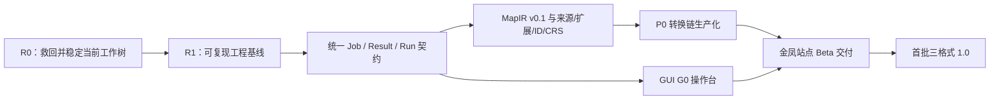

# mapforge 遗留工作全面规划

> 审计日期：2026-08-14
>
> 依据：`HANDOFF.md`、`docs/地图格式转换工厂-首批三格式方案.md`、`docs/资料盘点-金凤示范区数据与标准资料.md`、同事会话 `00c43254-348f-4581-b5b7-31a63b57618b.jsonl`、Claude memory、当前工作树与实测结果。
> 本文用于接管和排期，不替代 `docs/地图格式转换工厂-首批三格式方案.md` 的方案权威地位。若本文与权威方案发生冲突，以权威方案和项目硬约束为准。

> **执行进展（2026-08-14，v1.26）**：R0-02、R0-03 与 R0-04 的技术工作已完成。正式 G8 policy 已激活，金凤 14 文件 G1–G8 + esmini 全绿，pytest 66/66，14 张统一视角拼图人工检查通过；校准集 8 文件/449 lanes 与锁定验证集 6 文件/320 lanes 均零 ceiling 违规。技术门禁与交付放行严格分离：CRS 仍仅 `internally-consistent`，因此 14 个交付决策继续 BLOCKED。当前工作尚未拆分提交或配置 remote，R0-01/恢复点仍未完成，故 R0 整体仍不能标记完成。下文 §2 保留最初接管审计快照，阅读时以本进展说明和 `HANDOFF.md` 最新断点为准。

## 1. 执行摘要

mapforge 已经不是“从零开始”的项目：金凤真实数据上的 SHP/MAP XML → OpenDRIVE 原型闭环已经建立，14 个输出通过现有七项闭环门禁和 esmini 抽检；MAP 编解码、交付包、Profile、ID 继承、曲线平滑等也已有可运行骨架。

但当前状态仍应定义为：

**可演示、可继续工程验证的原型，不是可生产交付版本。**

主要原因不是某一个算法，而是四类欠账叠加：

1. 当前工作树包含 v1.24、未完成的 v1.25 和 GUI 方案三组混合未提交改动；没有 Git remote，恢复点脆弱。
2. 全量回归为 **37 通过、1 失败**；v1.25 的“车道保真/尖刺修复”只完成了半套实现，尚未形成可信门禁。
3. 统一 MapIR、来源/损失/扩展、版本化目标 Profile、结构化运行结果等核心契约尚未落地；GUI 和完整交付链都被这些契约阻塞。
4. 首批三格式的能力矩阵没有闭合。部分路径是金凤特化原型，部分仍缺失；文档中“六方向已具备”的表达高于当前真实能力。

建议按以下关键路径推进：

其中，**第一优先级不是继续扩功能，而是完成 R0：把同事做到一半的 v1.25 收口、让测试全绿、拆分和保存当前改动。**

## 2. 当前基线与证据

### 2.1 仓库状态

| 项目 | 2026-08-14 实测状态 | 结论 |
|---|---|---|
| 当前分支 | `feature/xodr-smoothness-g2` | 与 `main` 当前均指向 `9868ea7` |
| 最近提交 | `9868ea7`：道路铺装改为 `restricted` 并增加 section 门禁 | 可视为最后一个完整提交基线，约等于 v1.23 |
| 工作树 | 10 个已修改文件、5 个未跟踪文件 | 混有 v1.24、半成品 v1.25、GUI 文档/线框，不能直接视为一个可发布版本 |
| Git remote | 无 | 没有异机备份或协作回退点 |
| Python | `.venv` 为 3.10.10 | 不满足项目规定的 Python 3.11+ |
| 依赖声明 | 无 `pyproject.toml`、锁文件或 CI | 环境不可复现 |

当前未提交内容的逻辑分组如下：

1. **v1.24 连接补全**：`data/default/full`、`--allow-uturn`、曲率保护、相关 CLI 和测试。
2. **v1.25 未完成几何保真改造**：参考线偏差容限、尖刺裁剪、车道保真检查及测试调整。
3. **GUI G0 方案**：`docs/GUI方案-mapforge控制台.md`、`docs/gui_g0_wireframes.html`。
4. **仓库协作规则**：未跟踪的 `AGENTS.md`。

这些改动必须分开验证和提交，不能以“当前能跑”替代版本边界。

### 2.2 实测质量状态

| 检查 | 结果 | 解读 |
|---|---|---|
| `pytest tests -q` | **1 失败，37 通过** | 当前工作树不能标为回归全绿 |
| 失败项 | `test_profile_engine_supersedes_builtin` | Profile 宽度差异数由预期上限 8 变为 10；应改为语义验收，不能只把阈值调到 10 |
| `scripts/closed_loop.py` 重新生成并检查 | **14/14 文件、现有七项门禁全部通过** | SHP/MAP → xodr 主链没有整体失效 |
| esmini | 14/14 通过 | 仅证明现有样本可加载，不等于来源车道几何忠实 |
| 新增车道保真门禁 | 尚未进入闭环报告 | v1.25 的核心目标还没有成为发布门槛 |

现有七项门禁全绿与单元测试失败并不矛盾：前者主要验证输出可用性、拓扑和 OpenDRIVE 加载，后者暴露了 Profile 语义回归；两者都必须通过。

### 2.3 同事会话恢复出的最后现场

同事在 v1.24 之后发现，已有曲率/分段门禁仍会漏过一种“视觉上不自然、但统计门禁可通过”的参考线：node18 road10 曾出现约 60 m 曲率摆动、11 次符号翻转，以及 0.80/1.07/1.09 m 的短段；源线本身并无相同问题。

随后开始 v1.25：

- 为 `fit_leg_refline` 增加偏差容限和曲率候选逻辑；
- 在 `shp_to_xodr.py` 增加连接角检查和远端尖刺裁剪；
- 新建 `mapforge/validate/lane_fidelity.py`；
- 放宽部分旧的拟合偏差测试并新增车道保真测试；
- 修改 Profile 对拍测试。

会话在全量验证返回之前因认证错误中断，用户最后明确要求写交接文档。故这些内容只能判定为**半成品实验改动**，不能判定为 v1.25 已完成。

## 3. 能力矩阵：实际状态与缺口

| 路径/能力 | 当前真实状态 | 生产化缺口 |
|---|---|---|
| SHP → OpenDRIVE | 金凤真实数据原型可运行，现有门禁通过 | v1.25 几何保真收口；多站点/Profile；高程、标线、车道类型；1.6/1.7 输出 |
| MAP XML → OpenDRIVE | 7 个路口原型可运行，现有门禁通过 | 来源车道对应保真；版本/Profile；更完整语义映射和损失报告 |
| SHP → MAP XML/UPER | 有原型，但依赖 `--like` 模板借用位置及相位/ID | 新站点配时表输入、正式台账、CRS 确认、尺寸预算和阻断交付 |
| OpenDRIVE → MAP | 有轻量解析原型 | `poly3/paramPoly3`、多 `laneSection`、`laneOffset`、多车道宽度、真实高程/拓扑；正式 libOpenDRIVE 方案 |
| MAP XML ↔ UPER/XER 风格 XML | 已有骨架和金凤样本 | 标准版本化、字节预算、解码后几何/ID 语义回环、正式标准差异核对 |
| OpenDRIVE → SHP | 未形成正式实现 | MapIR、Profile 驱动写出、GDAL/GeoPandas、字段/扩展保真 |
| MAP → SHP | 只有预览向 GeoJSON，不是正式 SHP 交付 | MapIR + SHP Profile、来源/损失/扩展、ID/CRS 合规 |
| MapIR | 仅有 `crs_probe.py`，无统一模型 | model/geometry/provenance/idmap/extensions 全部待建 |
| 交付包 | 有 M1 骨架 | 目录哈希、真实 CRS/PROJ、全部红线、稳定 ID diff、Parquet、尺寸/UPER 语义回环 |
| GUI | 有方案和五屏线框 | 后端契约尚缺；无可运行实现 |

在上述矩阵闭合前，不应继续对外使用“六方向完整转换”或“生产级工厂”的表述。

## 4. P0：先救回并完成当前半成品（R0）

建议工作量：**3–5 个有效开发日**，不含外部资料等待。

### R0-01 保存与拆分恢复点

目标：把当前混合工作树转成可回退、可审核的历史。

动作：

1. 在任何继续改算法之前，保存当前状态的只读快照（备份分支、Git bundle 或补丁均可）。
2. 配置受控 remote 或其他异机备份；在此之前不做历史重写。
3. 按“v1.24 连接补全 / v1.25 几何保真 / GUI 文档线框 / 协作规则”拆分提交。
4. 每个提交附对应测试结果，不把测试放宽与算法变更混成无法解释的一次阈值调整。

验收：任一逻辑组均可独立回退；工作树中不再存在来源不明的功能改动。

### R0-02 修复当前唯一回归失败（已完成）

`test_profile_engine_supersedes_builtin` 不能继续使用“XML 宽度差异元素数 ≤ N”作为核心契约。当前 10 处差异主要集中在 road13（凤苑路），另有 road11，并包含两处 `laneOffset` 变化，最大 `a` 差约 0.43 m；差异会在 Hermite 段间传播。

应改为：

- 逐条验证 Profile 对指定来源车道的覆盖/救援规则确实生效；
- 对应输出车道宽度、laneOffset、适用道路和来源字段应有明确期望；
- 验证无关道路不变；
- 若输出变化是预期修复，生成可审查的语义差异摘要，而非简单提高计数阈值。

验收：测试表达 Profile 业务契约，且全量 pytest 全绿。

### R0-03 完成或撤回 v1.25 参考线改造（已完成）

当前实现必须先解决以下问题：

1. `_join_angle` 应比较连接点两侧的端点切向，现实现取点方向疑似偏离真实连接切向；补充 enter/leave、反向线、短线和接近 180° 的单元测试。
2. `_trim_far_spikes` 不能静默删除最多 25 m 来源几何。任何裁剪必须：
   - 有异常识别证据；
   - 记录裁剪前后长度、端点变化和来源索引；
   - 进入损失/来源状态，使用八态枚举中的合适状态；
   - 对无法证明为异常的数据 fail closed，而不是自动“修漂亮”。
3. `fit_leg_refline` 的容差梯度要有 Profile 级硬上限；不能随着 `base_dev` 无界放大。
4. 所有返回路径（包括 fallback）必须统一经过最大曲率、曲率变化、最短段和来源偏差硬检查；不能把“不合格但相对最好”的候选直接交付。
5. 若无法在来源保真和曲率门禁间同时满足，输出 `FAILED`/阻断状态和诊断报告，不得静默牺牲来源几何。

验收：构造的尖刺、回头、短段、平滑源线等回归样本全部通过预期路径；任何不合格 fallback 都被阻断。

### R0-04 把车道保真升级为 G8 正式门禁（已完成）

现有 `lane_fidelity.py` 是“源点到全部输出车道面的最近距离”，相邻错误车道可能掩盖映射错误，而且只做单向距离、只覆盖 node18 SHP 路径。

G8 至少需要：

- 使用来源 lane ID / laneLink / provenance 对应到目标 lane，而非全局最近车道；
- 同时计算 source→target 与 target→source，避免多画、错画或串 lane；
- 记录 median、p95、max、端点误差、停止线误差、覆盖率和离群点位置；
- 阈值进入版本化 Profile，先以七路口基线和已知格式误差校准，禁止随测试失败临时放宽；
- 覆盖 7 个 SHP 路口和 7 个 MAP 路口；
- 进入 `closed_loop` JSON、质量报告和最终交付阻断逻辑。

验收：14 个真实样本通过 G1–G8；故意调错 lane 映射、裁掉端点、横向平移和新增错误车道时，G8 必须稳定失败。

完成证据：active policy 下 14/14 G8 PASS；G8 manifest/components/faults/delivery/calibration 契约测试通过；
全量 pytest 66/66，closed-loop（含再生成）与 `--no-regen` 均为 G1–G8 + esmini PASS。

### R0-05 补齐 v1.24 连接补全的安全边界

需要补齐：

- 更新 `junction_fill.py` 和 `map_to_xodr.py` 已过时的模块说明；
- 为 `data/default/full`、`allow_uturn`、非法 mode、SHP 与 MAP 两条路径增加对称测试；
- `data` 保持默认；
- `default` 的每一条推断连接记录依据、来源 lane 和目标 lane；
- `full` 只能作为仿真/审查模式，默认带 `REVIEW_REQUIRED`，未经人工批准不得进入生产交付；
- 推断结果必须进入 per-object provenance、loss 和质量报告，不能只留在 `stats.conn_filled`。

验收：缺失转向能解释、能追踪、能撤回；`full` 不可能被误当作真实交通组织直接交付。

### R0 完成定义

R0 只有同时满足以下条件才算完成：

- 全量 pytest 通过；
- 14 个真实输出通过 G1–G8；
- 14 个输出 esmini 加载通过；
- 完成 14 个输出的统一视角可视抽检，重点检查路口连接、蛇形、短段、发卡和停止线端点；
- v1.24/v1.25/GUI 文档分别形成清晰提交；
- `HANDOFF.md` 写明准确版本、提交号、测试数和未完成项。

## 5. P0：建立可复现工程基线（R1）

建议工作量：**3–5 个有效开发日**。可与 R0 后半段部分并行，但发布必须在 R0 之后。

### R1-01 Python 与依赖

- 建立 Python 3.11/3.12 受支持矩阵；本地 `.venv` 升到 3.11+。
- 增加 `pyproject.toml`，区分 core、GIS、UPER、OpenDRIVE QA、GUI、dev extras。
- 锁定经过验证的依赖版本，并记录 GDAL/PROJ 等系统依赖。
- 移除或隔离已放弃的 `scenariogeneration` 写出依赖，防止文档和环境继续误导。
- 增加许可证清单；遵守 GPL 进程隔离、LGPL 动态依赖和无许可证代码不复用约束。

### R1-02 测试可移植性

- 去除测试中的 `F:\MapFactory` 绝对路径。
- 建立可提交的最小 `tests/golden/`，真实大数据仍只读且不入库。
- 将 `tests/test_golden_jinfeng.py` 对 `scripts/m1_shp_to_map.py` 的导入迁回正式包 API。
- 新增 CLI 集成测试、畸形 XML、错误 Profile、CRS 缺失、ID/phase 红线和多 OpenDRIVE 版本测试。

### R1-03 自动化与发布卫生

- CI 至少运行 lint/type、unit、portable golden 和 XSD；真实数据闭环可作为受控本地/自托管任务。
- 增加 `git diff --check`、文档版本一致性检查和生成物污染检查。
- 定义版本号来源，避免 `HANDOFF`、README、方案正文和报告各自报不同版本。

R1 验收：在一台新机器上按文档可建立环境并通过可移植测试；本地真实数据门禁有一条命令可重现。

## 6. P0：统一运行契约与 MapIR v0.1（R2 前置）

建议工作量：**8–12 个有效开发日**。

不建议一次性重写所有适配器。采用“先契约、再逐路径迁移”的绞杀式改造：旧转换核先封装到统一结果，随后将语义逐步搬入 MapIR。

### 6.1 `ConversionJob` / `ConversionResult`

建立稳定、可版本化的机器接口：

- `ConversionJob`：source、source format/profile、target format/version/profile、CRS 声明、ledger、phase table、连接模式、容差、输出策略。
- `ConversionResult`：status、artifacts、quality、loss、provenance、id diff、gate results、warnings、blocked reasons、timings。
- 每次运行写入 `out/runs/<run_id>/`，包含 `job.json`、`result.json`、日志、报告和产物清单。
- CLI 与未来 GUI 只调用同一服务层，不在 GUI 中复制转换逻辑。

### 6.2 MapIR v0.1 最小闭环

按“交叉口第一公民”优先建立：

- header：schema version、source/target profile、CRS 与完整 PROJ pipeline；
- intersection/node/link/lane/connection/movement/signal group；
- 几何与端点角色（上游进入第一点、停止线中心末点）；
- region/node/lane ID 及 ledger 引用；
- 每对象 provenance、八态转换状态和 loss item；
- 未识别图层、字段和扩展的原样 PASSTHROUGH 容器；
- 稳定对象键与 source↔MapIR↔target ID 映射。

### 6.3 迁移顺序

1. 先让 SHP→MAP 和 MAP→OpenDRIVE 产出/消费最小 MapIR；
2. 再迁移 SHP→OpenDRIVE，复用相同车道与连接语义；
3. 最后强化 OpenDRIVE 读取并接入 MapIR；
4. 每迁移一条路径，都保持旧实现对拍，差异必须进入报告。

验收：同一 MapIR 可以驱动至少 MAP 和 OpenDRIVE 两个 writer；未知字段可回带；ID/phase/CRS 红线在服务层统一阻断。

## 7. P0：首批站点核心链生产化（R2）

建议工作量：**15–25 个有效开发日**，高度受外部资料到位时间影响。

### 7.1 SHP → MAP：移除 `--like` 的生产依赖

- 定义配时表 CSV/YAML 输入契约；`phaseId` 只能从此输入或带审计记录的人工标注取得。
- 建立 region/node/lane ledger 消费接口；禁止生成新 ID。
- 缺 phase、缺 ledger、ID 冲突、CRS 未确认一律 `BLOCKED`。
- 将当前 `--like` 降级为兼容/迁移工具，并明确其来源继承报告。
- 执行 T/CSAE 159-2020 附录 D 抽稀、端点语义和尺寸预算；记录每次抽稀损失。

### 7.2 MAP XML / UPER

- 固化 T/CSAE 53-2020 / YD/T 3709 对应的 ASN.1 版本和 Profile。
- UPER 回环不能只验证“能解码”，要验证 region/node/lane/connection/phase 和点列语义。
- 执行周期 ≤1 s、Priority=16、AID=3618 的交付检查；实机播发仍由 FusionTest 负责。
- 增加大小预算、超限诊断和可解释简化顺序。

### 7.3 交付包与红线

修复/补齐 `report/deliver.py`：

- 对目录源生成稳定 manifest 和逐文件 SHA256；
- CRS 不能统一硬编码为“声称 WGS84/内部一致”；必须来自探测、人工确认和 PROJ 记录；
- 同时检查 phase、ledger、引用完整性、尺寸预算、UPER 语义回环和 G1–G8；
- `id-diff` 比较稳定来源对象及 ledger，而非只比较目标输出；
- 输出 JSON + CSV + Parquet（若产品确需）；
- 任何 BLOCKED 不允许通过界面或 CLI 强制改绿，只能补充合规输入后重跑。

R2 验收：在金凤资料到齐的前提下，不借用旧 MAP 模板也能生成可审计交付包；缺任一红线输入时稳定阻断，并清楚说明所缺材料。

## 8. P1：OpenDRIVE 正式化

建议工作量：**10–18 个有效开发日**。

### 8.1 Reader

- 支持 `line/arc/spiral/poly3/paramPoly3`；
- 完整处理多 `laneSection`、`laneOffset`、分段宽度、道路/车道前后继；
- 处理 elevation、superelevation、lane marking 和 lane type；
- 评估并接入 libOpenDRIVE；若保留轻量解析器，必须明确支持边界并对超界输入 fail closed；
- 为 1.4–1.8 建版本化读取 Profile 和样例矩阵。

### 8.2 Writer

- 将现有自写 1.5 writer 抽象为 1.5/1.6/1.7 目标 Profile；
- 恢复真实 SLOPE/BANKING/高程能力，不能长期输出全平面近似而不报告；
- 依据来源输出道路类型、标线和车道类型，默认近似必须标记；
- XSD、asam-qc-opendrive、esmini、消费者加载和 G8 共同作为门禁；
- 为不同下游消费者保留兼容 Profile，不在 writer 中散落特判。

验收：目标版本由 job 明确选择；每个受支持版本有 XSD、QC、加载和往返样例；不支持的结构有确定失败信息。

## 9. P1/P2：补齐格式矩阵

建议工作量：**12–20 个有效开发日**，需先确认产品是否真的要求六方向全闭合。

优先顺序：

1. OpenDRIVE → MapIR → SHP/GeoJSON；
2. MAP → MapIR → SHP；
3. SHP Profile 双向字段和扩展回带；
4. 三格式 roundtrip 的语义指标，而非文本相等。

正式 SHP 写出必须使用版本化 Profile，保留未知层/字段，写清 CRS 和单位；GeoJSON 只作为预览或调试载体，不能冒充正式 SHP 交付。

在确认下游只需要少数主路径时，可将非关键方向降到 P2，避免为了“矩阵对称”延误生产主链。

## 10. P1：GUI 路线

现有 GUI 方向已经有明确用户决策：

- 单机本地部署，只监听 `127.0.0.1`；
- G0 优先服务转换操作员；
- phase/ID/CRS 红线可在 GUI 中补充人工依据，但绝不自动填充，且 BLOCKED 不能强制改绿；必须记录谁、何时、依据。

### G0：操作台

必须在 `ConversionJob`、`ConversionResult`、run directory 和结构化 gate JSON 就绪后实施：

1. 首页/任务概览；
2. 数据源与 CRS 确认；
3. 转换向导；
4. 地图预览；
5. 质量/损失/门禁仪表盘。

同时完成预览 GeoJSON 标准化、SHP 缓存和 UTF-8 统一。先由用户审阅 `docs/gui_g0_wireframes.html`，再进入实现，避免在尚未确认的信息架构上写前端。

> **会话恢复补录（`516d0bd7-6af0-4429-94d2-f011b6aa7a69`）**：五屏线框文件已经生成并在提交 `952dd6f` 中保存，但原会话在尝试发布在线 Artifact 时因 403 认证错误中断；项目方尚未完成线框审阅，交接同步也未在该会话内完成。在线 Artifact 不是验收条件，可直接本地打开 HTML 完成评审。
>
> **GUI-01 状态（2026-08-14）：COMPLETED（信息架构评审）。** 五屏已逐页形成“接受/修改/延期”裁决，G8、红线、`full REVIEW_REQUIRED`、G7 阈值和待建后端边界已写回 `docs/GUI方案-mapforge控制台.md`，线框已修订为 v0.2。该完成状态只代表设计评审收口；GUI-02 仍阻塞于正式 G8、统一 ConversionJob/ConversionResult、run 目录、结构化 gate JSON 和统一预览入口（B1–B4）。

### G1：交付与红线工作台

- phase/ID/CRS 决策台；
- Profile 字段映射器；
- 交付包、id-diff、来源和损失报告查看/导出。

### G2：规模化

- 批量回归、历史任务、对比；
- ledger 查看和差异；
- 站点/Profile 管理。

GUI 不是红线规则的第二套实现；所有判定都由后端服务返回。外部 Artifact 页面发布此前受组织策略/网络阻断，不应列为 G0 的完成条件。

## 11. 文档与声明清理

R0/R1 阶段必须同步修复以下漂移：

- `HANDOFF.md` 标题版本仍是 v1.22，但正文已包含 v1.24；
- 权威方案正文仍有“scenariogeneration 写出”、旧 M1/M2 路线和旧 ID 决策；
- `README.md` 仍指向 v1.16/旧测试数；
- `docs/交接文档-mapforge.md` 仍称 v1.22/36 tests，且错误写出铺装应为 `type=none`，实际 v1.23 已改为 `restricted`；
- M0/M1 报告的“唯一剩余工作/下一步”已经过时；
- GUI 方案中“后端已完整具备/六方向”的描述需要按能力矩阵降级；
- Claude memory 只记录到 v1.7，应在版本收口后更新，不能让旧记忆继续充当事实源。

文档更新规则：每次正式版本只保留一个版本事实源；README、HANDOFF 和报告引用它，不重复手写测试数字和能力声明。

## 12. 外部输入与决策台账

这些事项不是靠继续编码可以消除的，应尽快指派业务 owner：

| 编号 | 待输入/决策 | 影响 | 建议责任方 | 阻塞里程碑 |
|---|---|---|---|---|
| E-01 | 正式配时表及 phaseId 来源格式 | 信控路口不能生产 MAP | 交通/信控业务方 | R2 |
| E-02 | region/node/lane 台账正式版及变更流程 | ID 不得发明，需稳定兼容 | 数据治理/项目方 | R2 |
| E-03 | 金凤绝对 WGS84 控制点或权威底图核验 | 当前只能内部一致，不能证明绝对坐标 | 测绘/数据提供方 | R2 |
| E-04 | IBD 枚举、SLOPE/BANKING 等正式字段说明 | SHP 语义与高程无法完全还原 | IBD 数据提供方 | R2/R4 |
| E-05 | 下游 OpenDRIVE 消费器及 1.5/1.6/1.7 优先级 | 决定兼容 Profile 和门禁 | 仿真/下游系统方 | R3/R4 |
| E-06 | 现网 MAP 生成工具、ASN.1/codec 版本 | 需要解释现网 XML/UPER 差异 | V2X/RSU 提供方 | R2 |
| E-07 | YD/T 3709 最终文本与送审稿差异 | 标准版本合规 | 标准/合规负责人 | R4 |
| E-08 | 是否需要 SAE J2735 及何时支持 | 控制首批范围 | 产品负责人 | R4 规划 |
| E-09 | 是否必须首版闭合全部六方向 | 决定格式矩阵投入 | 产品负责人 | R3 排期 |

在 E-01/E-02/E-03 未满足时，可以继续做离线算法验证，但不能把产物标为生产可交付。

## 13. 统一质量与发布门槛

任何“完成”必须对应可机器验证的 DoD：

### 代码门槛

- Python 3.11+ 受支持环境全量测试通过；
- 无未解释阈值放宽；新算法必须带失败样本测试；
- CLI、服务层和 GUI 使用同一契约；
- 无硬编码工作区绝对路径；
- 许可证和依赖来源可审计。

### 数据门槛

- CRS 已确认并记录 PROJ pipeline；可疑即阻断；
- phaseId 有配时表或人工标注依据；禁止自动推断；
- ID 只消费 ledger；每次重生成有 id-diff；
- 未识别内容进入 PASSTHROUGH，不静默丢弃；
- 每对象有八态转换状态、来源和损失。

### 几何/格式门槛

- 现有 G1–G7 加 G8 车道对应保真全部通过；
- T/CSAE 159 附录 D、停止线端点语义和大小预算通过；
- OpenDRIVE XSD、asam-qc、esmini/目标消费者通过；
- UPER 解码后的语义回环通过；
- 14 个金凤样本只是最低黄金集，还需可移植合成边界样本。

### 交付门槛

- delivery manifest、SHA256、quality/loss/provenance/id-diff 齐全；
- 周期、Priority、AID 检查齐全；
- 任何 BLOCKED 原因都会阻止生成“可交付”状态；
- FusionTest 实机 HIL 作为跨仓验收，不把硬件协议栈写回本仓。

## 14. 里程碑与建议工期

以下为一名熟悉现代码的全职工程师、已有 AI 辅助情况下的粗略有效开发日，**不包含外部资料等待、采购、组织审批和真实 RSU 排期**：

| 里程碑 | 范围 | 建议工作量 | 退出条件 |
|---|---|---:|---|
| R0 稳定恢复点 | v1.24/v1.25 收口、G8、回归、拆分提交 | 3–5 日 | pytest 全绿，14/14 G1–G8，清晰提交/HANDOFF |
| R1 可复现 Alpha | Python 3.11、依赖、portable tests、CI | 3–5 日 | 新环境可复现，真实闭环一键执行 |
| R2 契约与 MapIR Alpha | Job/Result/Run、MapIR v0.1、两条主链迁移 | 8–12 日 | 同一 MapIR 驱动 MAP/XODR，红线统一阻断 |
| R3 金凤 Beta | SHP→MAP 去 `--like`、交付包、正式门禁 | 15–25 日 | 资料齐全时可生成可审计站点交付包 |
| R4 OpenDRIVE + GUI G0 | reader/writer 版本化、操作台 | 20–33 日 | 目标版本/QC/消费者通过，GUI 调用统一后端 |
| R5 首批 1.0 | 格式矩阵补齐、GUI G1、外部标准差异 | 20–35 日 | 产品确认范围内的方向与交付门槛全部闭合 |

总量约 **69–115 个有效开发日**。若首版只锁定三条核心路径（SHP→MAP、MAP→OpenDRIVE、OpenDRIVE→MAP）并延后完整 SHP 反向写出和 GUI G1，可显著缩短首个可交付 Beta；若必须同时支持三种 OpenDRIVE 写出版本、完整六方向和全 GUI，则应按上界或多人协作估算。

## 15. 可直接进入任务系统的优先 Backlog

| ID | 优先级 | 工作项 | 依赖 | 验收摘要 |
|---|---|---|---|---|
| S0-01 | P0 | 保存当前工作树恢复点并配置备份 | 无 | 可独立回退，无来源不明改动 |
| S0-02 | P0 | Profile 回归改为语义契约 | S0-01 | pytest 全绿且无简单放宽阈值 |
| S0-03 | P0 | 修正 `_join_angle` 与候选硬门禁 | S0-01 | 端点切向/失败路径测试齐全 |
| S0-04 | P0 | 取消静默尖刺裁剪或补齐证据/损失 | S0-03 | 无未报告来源几何删除 |
| S0-05 | P0 | G8 车道映射双向保真 | S0-03 | 14 个真实样本 + 故障注入通过 |
| S0-06 | P0 | v1.24 连接模式安全与对称测试 | S0-01 | full 不可误交付，推断可追踪 |
| S0-07 | P0 | 14 输出视觉验收、拆分提交、HANDOFF | S0-02..06 | R0 DoD 全部满足 |
| FND-01 | P0 | Python 3.11 + `pyproject` + 锁定依赖 | S0-07 | 新环境可安装 |
| FND-02 | P0 | portable golden + CI | FND-01 | 无绝对路径，CI 全绿 |
| FND-03 | P0 | 统一 ConversionJob/Result/Run | FND-01 | CLI 返回稳定结构化结果 |
| IR-01 | P0 | MapIR v0.1 模型/几何/来源/扩展/ID | FND-03 | schema + roundtrip tests |
| IR-02 | P0 | SHP→MapIR→MAP | IR-01 | 语义对拍、PASSTHROUGH、红线 |
| IR-03 | P0 | MAP→MapIR→OpenDRIVE | IR-01 | 14 样本 G1–G8 |
| DEL-01 | P0 | phase table + ledger 正式输入 | IR-02,E-01,E-02 | 不依赖 `--like` 生成 MAP |
| DEL-02 | P0 | CRS 决策与 PROJ provenance | IR-01,E-03 | 可疑 CRS 阻断 |
| DEL-03 | P0 | delivery/redline/id-diff/size/UPER 回环 | DEL-01,DEL-02 | 可审计交付包 |
| ODR-01 | P1 | 完整 OpenDRIVE reader | IR-01,E-05 | 声明结构均有测试或明确阻断 |
| ODR-02 | P1 | 1.5/1.6/1.7 writer profiles | ODR-01,E-05 | XSD+QC+消费者通过 |
| SHP-01 | P1/P2 | MapIR→SHP Profile writer | IR-01,E-04,E-09 | 字段/扩展/CRS 保真 |
| GUI-01 | P0 | **已完成：审阅并裁决 G0 五屏线框** | 线框 v0.2 已落盘 | GUI 方案已记录逐屏裁决、G8/红线与待建边界 |
| GUI-02 | P1 | G0 五屏操作台 | GUI-01、S0-05、FND-03；B2–B4 | 本地 127.0.0.1、统一后端、G1–G8/红线状态一致 |
| GUI-03 | P1 | G1 红线/Profile/交付台 | DEL-03,GUI-02 | 决策有身份、时间、依据 |
| DOC-01 | P0 | 版本/能力/路线文档统一 | S0-07 | README/HANDOFF/权威方案一致 |
| EXT-01 | P0 | 外部输入台账与 owner 落实 | 无 | E-01..09 均有责任人与状态 |

## 16. 当前明确不算完成的事项

为避免下一轮交接再次高估进度，以下事项应明确标记为未完成：

- v1.25 未完成、未全量回归、未提交；
- 当前 pytest 未全绿；
- 车道保真不是可信正式门禁；
- MapIR 未建立；
- Python 3.11+ 可复现环境未建立；
- CRS 只有内部一致性，没有绝对 WGS84 现场核验；
- phase table 正式输入和 ledger 流程未建立；
- SHP→MAP 仍依赖 `--like`；
- OpenDRIVE reader 不支持完整标准结构；writer 只有 1.5 原型；
- asam-qc-opendrive 未接入；
- OpenDRIVE→SHP、MAP→正式 SHP 未完成；
- 生产级 PASSTHROUGH、对象级 provenance/loss/idmap 未完成；
- GUI 只有文档和线框，无运行实现；
- Artifact 在线版本更新未确认，且受组织策略/网络条件影响；
- Git remote/异机备份未配置；
- FusionTest 的 RSU 实机 HIL 尚未成为本项目已完成证据。

## 17. 接管后的第一周建议顺序

1. 第一天：保存恢复点；给现有三个改动组划边界；修复 Profile 语义测试。
2. 第二至三天：修正连接角、尖刺处理和 fit fallback 硬门禁；完成 G8 映射设计与故障注入。
3. 第四天：跑 14 个真实样本 G1–G8、esmini 和统一视觉抽检；只修有证据的问题。
4. 第五天：拆分提交 v1.24/v1.25/GUI 文档；统一 README/HANDOFF/方案状态；建立 Python 3.11 工程化分支。

若 R0 在第一周没有全绿，不应启动 GUI 实现或扩充格式矩阵；先把半成品变成可信基线，后续架构工作才有可靠对照物。
